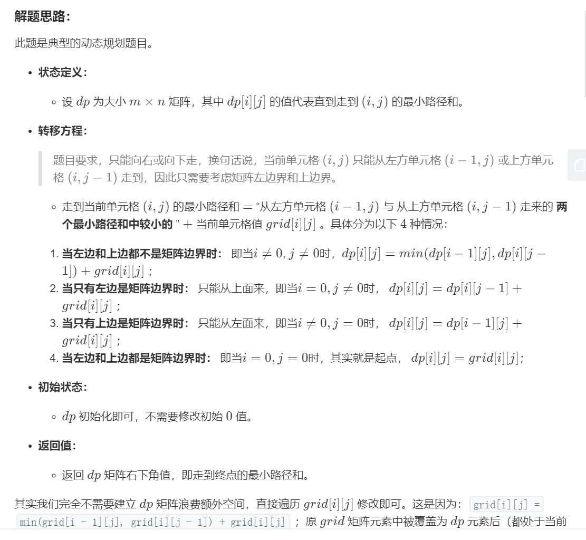
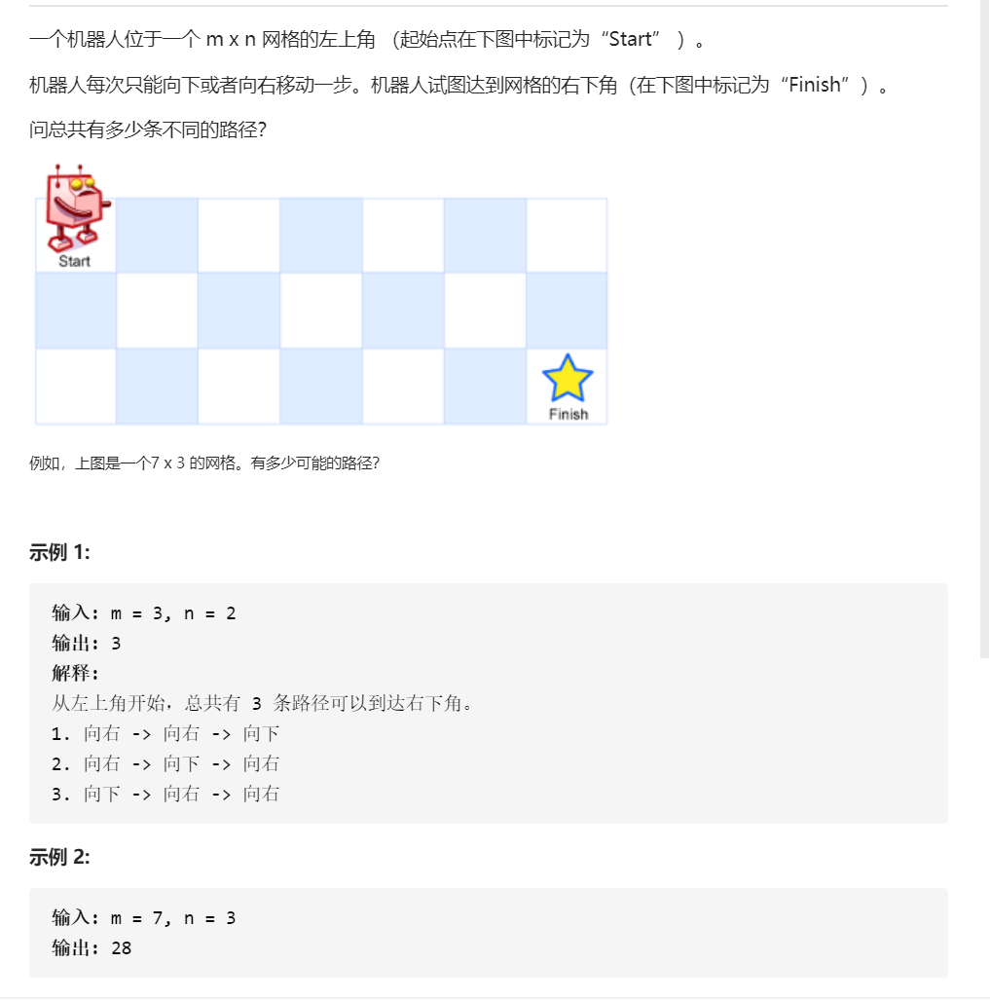
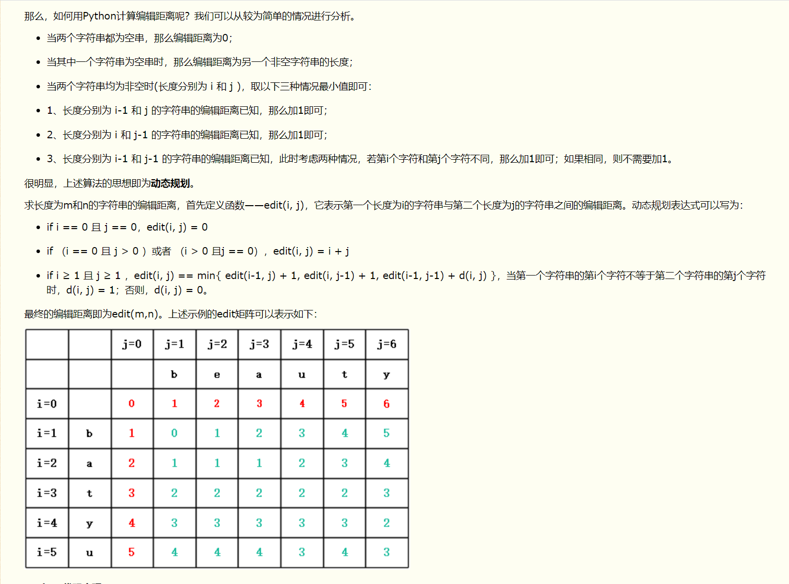

# 动态规划问题

必考题

**解题思路**：状态定义，转移方程，初始条件，返回值

## 解题思路

[递归和迭代参考这个解释](https://baijiahao.baidu.com/s?id=1635388976060265522&wfr=spider&for=pc)

[这个讲的太清楚了](https://www.zhihu.com/question/23995189)

一言以蔽之：大事化小，小事化了。　　

将一个大问题转化成几个小问题；　　
求解小问题；　　
推出大问题的解。

如何设计DP算法　　
下面介绍比较通用的设计DP算法的步骤。　　
首先，把我们面对的局面表示为x。这一步称为设计状态。　　
对于状态x，记我们要求出的答案(e.g.最小费用)为f(x).我们的目标是求出f(T).找出f(x)与哪些局面有关（记为p），写出一个式子（称为状态转移方程），通过f(p)来推出f(x).[阮行止](https://www.zhihu.com/question/23995189/answer/613096905)

目前见到的动态规划问题有两种，因此先确定是哪种问题~

- 选择一个解决方案，求**最大/最小的函数值**
- 弄清做某事的**方案，数量**或者事件发生的**概率**

每个阶段只有一个状态->递推；

每个阶段的最优状态都是由上一个阶段的最优状态得到的->贪心；

每个阶段的最优状态是由之前所有阶段的状态的组合得到的->搜索；

每个阶段的最优状态可以从之前某个阶段的某个或某些状态直接得到而不管之前这个状态是如何得到的->动态规划。

**[判断性继承思想](https://www.luogu.com.cn/blog/pks-LOVING/junior-dynamic-programming-dong-tai-gui-hua-chu-bu-ge-zhong-zi-xu-lie)**

动态规划五部曲

- 确定dp数组（dp table）以及下标的含义
- 确定递推公式
- dp数组如何初始化
- 确定遍历顺序
- 举例推导dp数组


还有一个很重要的，对比递归，大量重复子问题中间结果的保存，dp可以有效的节省存储空间。

动态规划问题树，总结的非常全面


综上其实动态规划大可分为如下几类问题
常见关键词：求。。方法数，集合数，路径数，返回。。长度，最少，最多，最大，最小，最长，最短。。。 

-最优方法（路径）数/目标和：青蛙跳台，背包问题，机器人移动路径问题，
- 最优路径和：最大子序和，机器人最小路径和
- 背包问题有一维和二维

**解题思路才是最关键的，而不是刷了多少题**
今天看到一个问题，其实大部分问题都可以归为完全背包问题或者0|1背包问题，寻找到子问题是关键。

## 最大子序和问题

给定一个整数数组 nums，找到一个具有最大和的连续子数组（子数组最少包含一个元素），返回其最大和。

示例:

输入: [-2,1,-3,4,-1,2,1,-5,4],
输出: 6
解释:连续子数组[4,-1,2,1] 的和最大，为6。

dp[i]和dp[i-1]差一个nums[i]

找出状态转移方程：$d p[i]=\max \{n u m s[i], d p[i-1]+n u m s[i]\}$


```r
class Solution:
    def maxSubArray(self,nums:List[int])->int:
        if len(nums)==0:
            return 0
        if len(nums)==1:
            range nums[0]

        res=nums[0]
        for i in range(1,len(nums)):
            nums[i]=max(nums[i],nums[i]+nums[-1])

            res=max(res,num[i])
        return res
```

这一种写法比较直观
```r

from typing import List


class Solution:
    def maxSubArray(self, nums: List[int]) -> int:
        size = len(nums)
        if size == 0:
            return 0
        dp = [0 for _ in range(size)]

        dp[0] = nums[0]
        for i in range(1, size):
            dp[i] = max(dp[i - 1] + nums[i], nums[i])
        return max(dp)


```

## 最长上升子序列

给定一个无序的整数数组，找到其中最长上升子序列的长度。

示例:

输入: [10,9,2,5,3,7,101,18]
输出: 4
解释: 最长的上升子序列是 [2,3,7,101]，它的长度是 4。
说明:

可能会有多种最长上升子序列的组合，你只需要输出对应的长度即可。
你算法的时间复杂度应该为 O(n2) 。
**进阶: 你能将算法的时间复杂度降低到 O(n log n) 吗?**


解题思路：枚举

给个时间复杂度为$O(n^2)$

```r
class Solution:
    def lengthOfLIS(self, nums: List[int]) -> int:
        if nums==[]: return 0
        length=len(nums)
        # 暂存子序列长度，1 个字符显然是长度为 1 的上升子序列
        dp=[1 for _ in range(length)]
        for i in range(length):
            for j in range(0,i):
                if nums[i]>nums[j]:
                    # 状态：dp[i] 表示以 nums[i] 结尾的「上升子序列」的长度
                    # 当nums[i]前面存在小于nums[i]的nums[j],
                    # 则暂存在dp[j]+1就是当前nums[i]的最长增长子序列的长度
                    dp[i]=max(dp[i],dp[j]+1)
        return max(dp)
```


## 最短路径和问题

给定一个包含非负整数的 m x n 网格，请找出一条从左上角到右下角的路径，使得路径上的数字总和为最小。

说明：每次只能向下或者向右移动一步。

示例:

输入:
[
  [1,3,1],
  [1,5,1],
  [4,2,1]
]
输出: 7
解释: 因为路径 1→3→1→1→1 的总和最小。



二维的动态规划

i横向,j纵向
```r
class Solution:
    def minPathSum(self, grid: [[int]]) -> int:
        for i in range(len(grid)):
            for j in range(len(grid[0])):
                if i == j == 0: continue
                elif i == 0:  grid[i][j] = grid[i][j - 1] + grid[i][j]
                elif j == 0:  grid[i][j] = grid[i - 1][j] + grid[i][j]
                else: grid[i][j] = min(grid[i - 1][j], grid[i][j - 1]) + grid[i][j]
        return grid[-1][-1]
```

## 爬楼梯问题

斐波那契数列：只需要考虑最后到达最后一阶实现的几种情况

题目一般有2种，可以爬2阶或者3阶，思路一样，递归+DP，但是要注意时间复杂度。。

或者爬1阶，2阶

假设你正在爬楼梯。需要 n阶你才能到达楼顶。

每次你可以爬 1 或 2 个台阶。你有多少种不同的方法可以爬到楼顶呢？

注意：给定 n 是一个正整数。

示例 1：

输入： 2
输出： 2
解释： 有两种方法可以爬到楼顶。
1.  1 阶 + 1 阶
2.  2 阶
示例 2：

输入： 3
输出： 3
解释： 有三种方法可以爬到楼顶。
1.  1 阶 + 1 阶 + 1 阶
2.  1 阶 + 2 阶
3.  2 阶 + 1 阶


```r
class Solution:
    def climbStairs(self, n: int) -> int:
        res = [0] * 46
        res[0] = 1
        res[1] = 2
        
        for i in range(2,n):
            res[i] = res[i-1] + res[i-2]
        return res[n-1]
```

画个图发现就是二叉树的遍历

## 不同路径


解题思路:与爬楼梯的思路一致

令 dp[i][j] 是到达 i, j 最多路径

状态转移方程：dp[i][j] = dp[i-1][j] + dp[i][j-1]

**注意，对于第一行 dp[0][j]，或者第一列 dp[i][0]，由于都是在边界，所以只能为 1**

时间复杂度：O(m*n)

空间复杂度：O(m∗n)
```r
class Solution:
    def uniquePaths(self, m: int, n: int) -> int:
        d = [[0]*n for _ in range(m)]
        for i in range(m):
            d[i][0] = 1 # 从（0,0）出发，边界上的点只能一直向右走或者向下走，所以到边界上的点只有一种走法
        for j in range(n):
            d[0][j] = 1
        for i in range(1,m):
            for j in range(1,n):
                d[i][j] = d[i-1][j]+d[i][j-1]
        return d[-1][-1]
        
```


**优化**：因为我们每次只需要 dp[i-1][j],dp[i][j-1]

因此可以考虑降空间复杂度，减少一个数组

>当前点为上面点加左边点，那么计算第二行时可以直接在第一行计算，及当前点加左边点就ok了，当前点原来值表示上一行的上面点的值。所以实际一行数组重复计算就完事了。


这个思路太强了，不好想~

```r
class Solution:
    def uniquePaths(self, m: int, n: int) -> int:
        cur = [1] * n 
        for i in range(1, m):
            for j in range(1, n):
                cur[j] += cur[j-1] #等号右边分别是该位置上边的值和左边的值
        return cur[-1]


```
## 最长回文字符串


给定一个字符串 s，找到 s 中最长的回文子串。你可以假设 s 的最大长度为 1000。

示例 1：

输入: "babad"
输出: "bab"
注意: "aba" 也是一个有效答案。
示例 2：

输入: "cbbd"
输出: "bb"


- 动态规划法

学习weiwei思路，很快就理解了，这里写下我的总结

动态规划：填dp表、当前ij状态、过去ij状态、如何联合得到输出、边界条件

定义状态：题目让我们求什么，就把什么设置为状态
题目求s中最长的回文子串，那就判断所有子串是否为回文子串，选出最长的
因此：dp[i][j]表示s[i:j+1]是否为回文子串（这里+1是为了构造闭区间）

状态转移方程：对空间进行分类讨论（当前ij状态、过去ij状态 如何联合得到输出）
当前ij状态：头尾必须相等（s[i]==s[j]）
过去ij状态：去掉头尾之后还是一个回文（dp[i+1][j-1] is True）
边界条件：只要是找过去ij状态的时候，就会涉及边界条件（即超出边界情况处理）
当i==j时一定是回文
j-1-(i+1)<=0,即j-i<=2时，只要当s[i]==s[j]时就是回文，不用判断dp[i+1][j-1]
dp[i][j] 为截取的子串

初始状态：这里已经直接判断j-i<=2的情况了，因此用不到初始状态，可以不设

输出内容：每次发现新回文都比较一下长度，记录i与长度

优化空间提速

[：_Breiman](https://leetcode-cn.com/problems/longest-palindromic-substring/solution/5-zui-chang-hui-wen-zi-chuan-dong-tai-gu-p7uk/)

```r

class Solution:
    def longestPalindrome(self, s: str) -> str:
        
        size = len(s)
        # 特殊处理
        if size == 1:
            return s
        # 创建动态规划dynamic programing表
        dp = [[False for _ in range(size)] for _ in range(size)]
        # 初始长度为1，这样万一不存在回文，就返回第一个值（初始条件设置的时候一定要考虑输出）
        max_len = 1
        start = 0
        for j in range(1,size):
            for i in range(j):
                # 边界条件：
                # 只要头尾相等（s[i]==s[j]）就能返回True
                if j-i<=2:
                    if s[i]==s[j]:
                        dp[i][j] = True
                        cur_len = j-i+1
                # 状态转移方程 
                # 当前dp[i][j]状态：头尾相等（s[i]==s[j]）
                # 过去dp[i][j]状态：去掉头尾之后还是一个回文（dp[i+1][j-1] is True）
                else:
                    if s[i]==s[j] and dp[i+1][j-1]:
                        dp[i][j] = True
                        cur_len = j-i+1
                # 出现回文更新输出
                if dp[i][j]:
                    if cur_len > max_len:
                        max_len = cur_len
                        start = i

        return s[start:start+max_len]


```

- 双指真法

```r
class Solution:
    def longestPalindrome(self, s: str) -> str:
        n = len(s)
        dp = [[False] * n for _ in range(n)]
        ans = ""
        # 枚举子串的长度 l+1
        for l in range(n):
            # 枚举子串的起始位置 i，这样可以通过 j=i+l 得到子串的结束位置
            for i in range(n):
                j = i + l
                if j >= len(s):
                    break
                if l == 0:
                    dp[i][j] = True
                elif l == 1:
                    dp[i][j] = (s[i] == s[j])
                else:
                    dp[i][j] = (dp[i + 1][j - 1] and s[i] == s[j])
                if dp[i][j] and l + 1 > len(ans):
                    ans = s[i:j+1]
        return ans


```


## 回文子字符串数量

题目链接：https://leetcode-cn.com/problems/palindromic-substrings/

给定一个字符串，你的任务是计算这个字符串中有多少个回文子串。

具有不同开始位置或结束位置的子串，即使是由相同的字符组成，也会被视作不同的子串。

示例 1：

输入："abc" 输出：3 解释：三个回文子串: "a", "b", "c"

示例 2：

输入："aaa" 输出：6 解释：6个回文子串: "a", "a", "a", "aa", "aa", "aaa"

提示：

输入的字符串长度不会超过 1000 。


动规五部曲：

1.确定dp数组（dp table）以及下标的含义
布尔类型的dp[i][j]：表示区间范围[i,j] （注意是左闭右闭）的子串是否是回文子串，如果是dp[i][j]为true，否则为false。

2.确定递推公式
在确定递推公式时，就要分析如下几种情况。

整体上是两种，就是s[i]与s[j]相等，s[i]与s[j]不相等这两种。

当s[i]与s[j]不相等，那没啥好说的了，dp[i][j]一定是false。

当s[i]与s[j]相等时，这就复杂一些了，有如下三种情况

情况一：下标i 与 j相同，同一个字符例如a，当然是回文子串
情况二：下标i 与 j相差为1，例如aa，也是回文子串
情况三：下标：i 与 j相差大于1的时候，例如cabac，此时s[i]与s[j]已经相同了，我们看i到j区间是不是回文子串就看aba是不是回文就可以了，那么aba的区间就是 i+1 与 j-1区间，这个区间是不是回文就看dp[i + 1][j - 1]是否为true。

```r
class Solution:
    def countSubstrings(self, s: str) -> int:
        dp = [[False] * len(s) for _ in range(len(s))]
        result = 0
        for i in range(len(s)-1, -1, -1): #注意遍历顺序，这个真的额是重点
            for j in range(i, len(s)):
                if s[i] == s[j]:
                    if j - i <= 1: #情况一 和 情况二
                        result += 1
                        dp[i][j] = True
                    elif dp[i+1][j-1]: #情况三
                        result += 1
                        dp[i][j] = True
        return result
```

## 最大乘积和

这个题一开始我想的很简单，就类似与最大上升子序和来做了，结果。。。==

给你一个整数数组 nums ，请你找出数组中乘积最大的连续子数组（该子数组中至少包含一个数字），并返回该子数组所对应的乘积。

 

示例 1:

输入: [2,3,-2,4]
输出: 6
解释: 子数组 [2,3] 有最大乘积 6。
示例 2:

输入: [-2,0,-1]
输出: 0
解释: 结果不能为 2, 因为 [-2,-1] 不是子数组。

解题思路

首先假设存在某个最大乘积，然后对数组遍历，在经过每个元素的时候，有以下四种情况：

**如果该元素为正数：**

- 如果到上一个元素为止的最大乘积也是正数，那么直接乘上就好了，同样的最大乘积也会变得更大
- 如果到上一个元素为止的最大乘积是负数，那么最大乘积就会变成该元素本身，且连续性被断掉


**如果该元素为负数：**

- 如果到上一个元素为止的最大乘积也是负数，那么直接乘上就好了，同样的最大乘积也会变得更大
- 如果到上一个元素为止的最大乘积是正数，那么最大乘积就会不变，且连续性被断掉

以上四种情况中说到的最大乘积都是临时最大乘积，每遍历新的元素都需要进行比较来确定真正的最大乘积。

**如果细心的话就可以发现，如果要得到乘以当前元素以后的最大乘积，需要记录最大乘积，也要记录最小乘积，因为最小值可能翻身变最大值。**


对对对对。。。需要用两个记录两个值。。

负负为正
负正为负

但是看成是动态规划问题挺不好想的，只能多看几遍了

时间复杂度是O(n)

```r
class Solution:
    def maxProduct(self, nums: List[int]) -> int:
        if not nums: return 
        res = nums[0]
        pre_max = nums[0]
        pre_min = nums[0]
        for num in nums[1:]:
            cur_max = max(pre_max * num, pre_min * num, num)#pre_max:之前的最大值
            cur_min = min(pre_max * num, pre_min * num, num)#pre_min:之前的最小值，num:当前值
            res = max(res, cur_max)
            pre_max = cur_max
            pre_min = cur_min
        return res

```

## 比特位计数

给定一个非负整数 num。对于 0 ≤ i ≤ num 范围中的每个数字 i ，计算其二进制数中的 1 的数目并将它们作为数组返回。

示例 1:

输入: 2
输出: [0,1,1]  ** 返回0，1，2三个数的二进制种的1的数目**
示例 2:

输入: 5
输出: [0,1,1,2,1,2]


对于所有的数字，只有两类：

奇数：二进制表示中，奇数一定比前面那个偶数多一个 1，因为多的就是最低位的 1。
          举例： 
         0 = 0       1 = 1
         2 = 10      3 = 11
偶数：二进制表示中，偶数中 1 的个数一定和除以 2 之后的那个数一样多。因为最低位是 0，除以 2 就是右移一位，也就是把那个 0 抹掉而已，所以 1 的个数是不变的。
           举例：
          2 = 10       4 = 100       8 = 1000
          3 = 11       6 = 110       12 = 1100
另外，0 的 1 个数为 0，于是就可以根据奇偶性开始遍历计算了。


```r
class Solution:
    def countBits(self, num: int) -> List[int]:
        ret = [0, 1, 1]
        for n in range(3, num+1):
            ret.append(ret[-1]+1) if n & 1 == 1 else ret.append(ret[n//2])
        return ret[0:num+1]
```


## 买卖股票专题

**买卖股票的最佳时机 I**

交易限制在一次了

给定一个数组，它的第 i 个元素是一支给定股票第 i 天的价格。

如果你最多只允许完成一笔交易（即买入和卖出一支股票），设计一个算法来计算你所能获取的最大利润。

注意你不能在买入股票前卖出股票。

示例 1:

输入: [7,1,5,3,6,4]
输出: 5
解释: 在第 2 天（股票价格 = 1）的时候买入，在第 5 天（股票价格 = 6）的时候卖出，最大利润 = 6-1 = 5 。
     注意利润不能是 7-1 = 6, 因为卖出价格需要大于买入价格。
示例 2:

输入: [7,6,4,3,1]
输出: 0
解释: 在这种情况下, 没有交易完成, 所以最大利润为 0。

**分析：**第一题，相对简单，只能有一次交易。刚看到第一反应可能是遍历两次，找出所有的利润，选个最大的，意料之中，复杂度O（n^2）肯定超时。**在一次遍历中，可以记录最小值，同时记录对应的利润即可。**

```r
class Solution:
    def maxProfit(self, prices):
        """
        :type prices: List[int]
        :rtype: int
        """
        if len(prices)<2:
            return 0
        profit = 0 #最初的利润是0
        minprice = prices[0]
        for i in prices:
            minprice = min(i,minprice)
            profit = max(i-minprice,profit) #找到最小的价格和最大的价格做差，与当前利润进行比较
        return profit
```

动态规划实现
```r
class Solution:
    def maxProfit(self, prices: List[int]) -> int:
        n = len(prices)
        if not n or n < 2:
            return 0
        dp = [[0,0] for i in range(n)]
        dp[0][0] = 0
        dp[0][1] = -prices[0]

        for i in range(1,n):
            dp[i][0] = max(dp[i-1][0],dp[i-1][1]+prices[i])
            dp[i][1] = max(dp[i-1][1],-prices[i])
        return dp[n-1][0]

```

**买卖股票的最佳时机 II**

无限次交易

给定一个数组，它的第 i 个元素是一支给定股票第 i 天的价格。

设计一个算法来计算你所能获取的最大利润。你可以尽可能地完成更多的交易（多次买卖一支股票）。

注意：你不能同时参与多笔交易（你必须在再次购买前出售掉之前的股票）。

示例 1:

输入: [7,1,5,3,6,4]
输出: 7
解释: 在第 2 天（股票价格 = 1）的时候买入，在第 3 天（股票价格 = 5）的时候卖出, 这笔交易所能获得利润 = 5-1 = 4 。
     随后，在第 4 天（股票价格 = 3）的时候买入，在第 5 天（股票价格 = 6）的时候卖出, 这笔交易所能获得利润 = 6-3 = 3 。
示例 2:

输入: [1,2,3,4,5]
输出: 4
解释: 在第 1 天（股票价格 = 1）的时候买入，在第 5 天 （股票价格 = 5）的时候卖出, 这笔交易所能获得利润 = 5-1 = 4 。
     注意你不能在第 1 天和第 2 天接连购买股票，之后再将它们卖出。
     因为这样属于同时参与了多笔交易，你必须在再次购买前出售掉之前的股票。
示例 3:

输入: [7,6,4,3,1]
输出: 0
解释: 在这种情况下, 没有交易完成, 所以最大利润为 0。


分析：**不限制交易次数，其实看起来比还要简单，可以直接一次遍历，把后一项大于前一项时，两者差值相加即可。**

```r
class Solution:
    def maxProfit(self, prices):
        """
        :type prices: List[int]
        :rtype: int
        """
        if not prices:
            return 0
        temp = prices[0]
        profit = 0
        for i in prices:
            if i > temp:
                profit = profit + i - temp
            temp = i
        return profit
```

**买卖股票的最佳时机 III**

给定一个数组，它的第 i 个元素是一支给定的股票在第 i 天的价格。

设计一个算法来计算你所能获取的最大利润。你最多可以完成 两笔 交易。

注意: 你不能同时参与多笔交易（你必须在再次购买前出售掉之前的股票）。

示例 1:

输入: [3,3,5,0,0,3,1,4]
输出: 6
解释: 在第 4 天（股票价格 = 0）的时候买入，在第 6 天（股票价格 = 3）的时候卖出，这笔交易所能获得利润 = 3-0 = 3 。
     随后，在第 7 天（股票价格 = 1）的时候买入，在第 8 天 （股票价格 = 4）的时候卖出，这笔交易所能获得利润 = 4-1 = 3 。
示例 2:

输入: [1,2,3,4,5]
输出: 4
解释: 在第 1 天（股票价格 = 1）的时候买入，在第 5 天 （股票价格 = 5）的时候卖出, 这笔交易所能获得利润 = 5-1 = 4 。   
     注意你不能在第 1 天和第 2 天接连购买股票，之后再将它们卖出。   
     因为这样属于同时参与了多笔交易，你必须在再次购买前出售掉之前的股票。
示例 3:

输入: [7,6,4,3,1] 
输出: 0 
解释: 在这个情况下, 没有交易完成, 所以最大利润为 0。

**分析**：此题加深了难度，限制了建议次数不大于2。最开始的想法是二分，遍历所有值作为二分点，分成左右两部分，分别求利润再求和，最后取最大，时间复杂度O(N^2)，结果在倒数第二个评测时超时。优化一下，可以先从前往后遍历，按照 I中的思路，将遍历到的每个值对应的最大利润存在一个列表中，然后从后往前遍历，在求此时的最大利润时，同时加上数组中的对应值，再取最大，即为所求。


```r
class Solution:
    def maxProfit(self, prices):
        """
        :type prices: List[int]
        :rtype: int
        """
        if len(prices)<2:
            return 0
        minprice = prices[0]
        maxprice = prices[len(prices)-1]
        profit1 = 0
        profit2 = 0
        profit = 0
        a = []
        for m in range(0,len(prices)):
            profit1 = max(profit1,prices[m]-minprice)
            minprice = min(prices[m],minprice)
            a.append(profit1)
        for n in range(len(prices)-2,-1,-1):
            maxprice = max(prices[n],maxprice)
            profit2 = max(profit2,maxprice-prices[n])
            profit = max(profit,a[n]+profit2)
        return profit

```

## 完全平方数

这题没想起来怎么转，知道想起找零钱的那个题。

给定正整数 n，找到若干个完全平方数（比如 1, 4, 9, 16, ...）使得它们的和等于n。你需要让组成和的完全平方数的个数最少。

示例 1:

输入: n = 12
输出: 3 
解释: 12 = 4 + 4 + 4.
示例 2:

输入: n = 13
输出: 2
解释: 13 = 4 + 9.

感觉有点像coin那个题

dp[i]表示i最少可以由几个平方数构成。

初试化$dp=[0,1,2,⋯,n]$，长度为n+1，最多次数就是全由1构成。

遍历dp，对于i，遍历区间[2,n+1)：

遍历所有平方数小于i的数j，遍历区间$[1,int(\sqrt{i})+1)$：
$dp[i]=min(dp[i],dp[i-j*j]+1)$。始终保存所有可能情况中的最小值。
返回dp[n]

因此时间复杂度是：O(n\sqrt{n})
空间复杂度：O(n)

```r
class Solution:
    def numSquares(self, n: int) -> int:
        dp=[i for i in range(n+1)]
        for i in range(2,n+1):
            for j in range(1,int(i**(0.5))+1):
                dp[i]=min(dp[i],dp[i-j*j]+1)
        return dp[-1]
```


## 找零钱问题

给定不同面额的硬币 coins 和一个总金额 amount。编写一个函数来计算可以凑成总金额所需的最少的硬币个数。如果没有任何一种硬币组合能组成总金额，返回 -1。

 

示例 1:

输入: coins = [1, 2, 5], amount = 11
输出: 3 
解释: 11 = 5 + 5 + 1
示例 2:

输入: coins = [2], amount = 3
输出: -1


```r
class Solution:
    def coinChange(self, coins: List[int], amount: int) -> int:
        dp=[float('inf')]*(amount+1)
        dp[0]=0
        for i in range(1,amount+1):
            for coin in coins:
                if i>=coin:
                    dp[i]=min(dp[i],dp[i-coin]+1)
        return dp[-1] if(dp[-1]!=float('inf')) else -1
```

目前的时间复杂度O(amount*len(coins))


有么有更快的方法？
有的，回溯算法+dbf

可以查查，理解下~


找零钱问题是背包问题的一个例子


## 单词切分

给定一个非空字符串 s 和一个包含非空单词列表的字典 wordDict，判定 s 是否可以被空格拆分为一个或多个在字典中出现的单词。

说明：

拆分时可以重复使用字典中的单词。
你可以假设字典中没有重复的单词。
示例 1：

输入: s = "leetcode", wordDict = ["leet", "code"]
输出: true
解释: 返回 true 因为 "leetcode" 可以被拆分成 "leet code"。
示例 2：

输入: s = "applepenapple", wordDict = ["apple", "pen"]
输出: true
解释: 返回 true 因为 "applepenapple" 可以被拆分成 "apple pen apple"。
     注意你可以重复使用字典中的单词。
示例 3：

输入: s = "catsandog", wordDict = ["cats", "dog", "sand", "and", "cat"]
输出: false


**解题思路**


1. 初始化 $d p=[\text { False, } \cdots, \text { False], 长度为 } n+1 . n \text { 为字符串长度。 } d p[i] \text { 表示 } s \text { 的前 } i$ 位是否可以用 wordDict 中的单词表示。
2. 初始化 $d p[0]=T r u e,$ 空字符可以被表示
3. 遍历字符串的所有子串，遍历开始索引 $i,$ 遍历区间 $[0, n)$
。遍历结束索引 $j,$ 遍历区间 $[i+1, n+1)$
- 若 $d p[i]=$ True 且 $s[i, \cdots, j)$ 在 wordlist 中: $d p[j]=T r u e_{\circ}$ 解释: $d p[i]=$ True i兄明 $s$ 的前 $i$ 位可以用 $w o r d D i c t$ 表示, 则 $s[i, \cdots, j)$ 出现在 $w o r d D i c t$ 中，说明 $s$ 的前 $j$ 位可以 表示。
4. 返回 $d p[n]$


问题不难，就是没想到用动态规划

```r
class Solution:
    def wordBreak(self, s: str, wordDict: List[str]) -> bool:       
        n=len(s)
        dp=[False]*(n+1)
        dp[0]=True
        for i in range(n):
            for j in range(i+1,n+1):
                if(dp[i] and (s[i:j] in wordDict)):
                    dp[j]=True
        return dp[-1]
```

## 打家劫舍专题

你是一个专业的小偷，计划偷窃沿街的房屋。每间房内都藏有一定的现金，影响你偷窃的唯一制约因素就是相邻的房屋装有相互连通的防盗系统，如果两间相邻的房屋在同一晚上被小偷闯入，系统会自动报警。

给定一个代表每个房屋存放金额的非负整数数组，计算你在不触动警报装置的情况下，能够偷窃到的最高金额。

示例 1:

输入: [1,2,3,1]
输出: 4
解释: 偷窃 1 号房屋 (金额 = 1) ，然后偷窃 3 号房屋 (金额 = 3)。
     偷窃到的最高金额 = 1 + 3 = 4 。


```r
class Solution:
    def rob(self, nums: List[int]) -> int:
       prev = 0
       curr = 0
    
     # 每次循环，计算“偷到当前房子为止的最大金额”
       for i in nums:
        # 循环开始时，curr 表示 dp[k-1]，prev 表示 dp[k-2]
        # dp[k] = max{ dp[k-1], dp[k-2] + i }
           prev, curr = curr, max(curr, prev + i)
        # 循环结束时，curr 表示 dp[k]，prev 表示 dp[k-1]

       return curr

```

或者另一种写法,即动态规划，

```r

class Solution:
    def rob(self, nums):
        if not nums:
            return 0
        if len(nums)==1:
            return nums[0]
        sumList = [nums[0]]      #存放盗窃的每一个房间的最大收益
        sumList.append(max(nums[0], nums[1]))
        for i in range(2,len(nums)):
            sumList.append(max(sumList[i-2]+nums[i], sumList[i-1]))
        return sumList[-1]
```


问题2：环形房屋

你是一个专业的小偷，计划偷窃沿街的房屋，每间房内都藏有一定的现金。这个地方所有的房屋都围成一圈，这意味着第一个房屋和最后一个房屋是紧挨着的。同时，相邻的房屋装有相互连通的防盗系统，如果两间相邻的房屋在同一晚上被小偷闯入，系统会自动报警。

给定一个代表每个房屋存放金额的非负整数数组，计算你在不触动警报装置的情况下，能够偷窃到的最高金额。

示例 1:

输入: [2,3,2]
输出: 3
解释: 你不能先偷窃 1 号房屋（金额 = 2），然后偷窃 3 号房屋（金额 = 2）, 因为他们是相邻的。
示例 2:

输入: [1,2,3,1]
输出: 4
解释: 你可以先偷窃 1 号房屋（金额 = 1），然后偷窃 3 号房屋（金额 = 3）。
     偷窃到的最高金额 = 1 + 3 = 4 。

解题思路：可以开辟2个队列保存结果嘛,第一个队列保存从[0,n-1]的结果，第二个队列保存从[1,n]的结果

```r
class Solution(object):
    def rob(self, nums):
        if not nums:
            return 0
        n = len(nums)
        if n<=2:
            return max(nums)
        dp1 = [0 for _ in range(n)]
        dp2 = [0 for _ in range(n)]
        # 初始化两个dp数组，dp1是计算的是[1,end],dp2计算的是[0,end-1],这个比较好想
        dp1[0] = 0
        dp1[1] = nums[1]
        dp2[0] = nums[0]
        dp2[1] = max(nums[0],nums[1])
        # 按照【打家劫舍 I】的转移方式执行两遍
        for i in range(2,n):
            dp1[i] = max(dp1[i-1],dp1[i-2]+nums[i])
        for i in range(2,n-1):
            dp2[i] = max(dp2[i-1],dp2[i-2]+nums[i])
        return max(dp1[-1],dp2[-2])
```

进阶题

在上次打劫完一条街道之后和一圈房屋后，小偷又发现了一个新的可行窃的地区。这个地区只有一个入口，我们称之为“根”。 除了“根”之外，每栋房子有且只有一个“父“房子与之相连。一番侦察之后，聪明的小偷意识到“这个地方的所有房屋的排列类似于一棵二叉树”。 如果两个直接相连的房子在同一天晚上被打劫，房屋将自动报警。

计算在不触动警报的情况下，小偷一晚能够盗取的最高金额。

示例 1:

输入: [3,2,3,null,3,null,1]

     3
    / \
   2   3
    \   \ 
     3   1

输出: 7 
解释: 小偷一晚能够盗取的最高金额 = 3 + 3 + 1 = 7.
示例 2:

输入: [3,4,5,1,3,null,1]

     3
    / \
   4   5
  / \   \ 
 1   3   1

输出: 9
解释: 小偷一晚能够盗取的最高金额 = 4 + 5 = 9.


哎，这个小偷太能想了==


```r

# Definition for a binary tree node.
# class TreeNode:
#     def __init__(self, x):
#         self.val = x
#         self.left = None
#         self.right = None

class Solution:
    def rob(self, root: TreeNode) -> int:
        return self.helper(root)[1]
    
    # helper函数返回一个节点为根的最大值 = [当前节点不参与计算的最大收益，当前节点的最大收益(参与/不参与)]
    def helper(self, root):
        if root is None:
            return [0, 0]
        left_amount = self.helper(root.left)
        right_amount = self.helper(root.right)
        withoutRoot = left_amount[1] + right_amount[1]
        withRoot = root.val + left_amount[0] + right_amount[0]
        return [withoutRoot, max(withRoot, withoutRoot)]


```

## 编辑距离

>给你两个单词word1 和word2，请你计算出将word1转换成word2 所使用的最少操作数。

你可以对一个单词进行如下三种操作：

插入一个字符
删除一个字符
替换一个字符

示例1：

输入：word1 = "horse", word2 = "ros"
输出：3
解释：
horse -> rorse (将 'h' 替换为 'r')
rorse -> rose (删除 'r')
rose -> ros (删除 'e')
示例2：

输入：word1 = "intention", word2 = "execution"
输出：5
解释：
intention -> inention (删除 't')
inention -> enention (将 'i' 替换为 'e')
enention -> exention (将 'n' 替换为 'x')
exention -> exection (将 'n' 替换为 'c')
exection -> execution (插入 'u')

解题思路：



```r

class Solution:
    def minDistance(self, word1: str, word2: str) -> int:
        dp = [[0] * (len(word2)+1) for _ in range(len(word1)+1)] # 二维数据的定义
        for i in range(len(word1)+1):
            dp[i][0] = i # word2不存在的时候
        for j in range(len(word2)+1):
            dp[0][j] = j #word1不存在的时候
        for i in range(1, len(word1)+1):
            for j in range(1, len(word2)+1):
                if word1[i-1] == word2[j-1]: #两个词的长度一样的时候
                    dp[i][j] = dp[i-1][j-1]
                else:
                    dp[i][j] = min(dp[i-1][j-1], dp[i-1][j], dp[i][j-1]) + 1
        return dp[-1][-1]

```

## 鸡蛋掉落

- 背包问题


给你 k 枚相同的鸡蛋，并可以使用一栋从第 1 层到第 n 层共有 n 层楼的建筑。

已知存在楼层 f ，满足 0 <= f <= n ，任何从 高于 f 的楼层落下的鸡蛋都会碎，从 f 楼层或比它低的楼层落下的鸡蛋都不会破。

每次操作，你可以取一枚没有碎的鸡蛋并把它从任一楼层 x 扔下（满足 1 <= x <= n）。如果鸡蛋碎了，你就不能再次使用它。如果某枚鸡蛋扔下后没有摔碎，则可以在之后的操作中 重复使用 这枚鸡蛋。

请你计算并返回要确定 f 确切的值 的 最小操作次数 是多少？

 
示例 1：

输入：k = 1, n = 2
输出：2
解释：
鸡蛋从 1 楼掉落。如果它碎了，肯定能得出 f = 0 。 
否则，鸡蛋从 2 楼掉落。如果它碎了，肯定能得出 f = 1 。 
如果它没碎，那么肯定能得出 f = 2 。 
因此，在最坏的情况下我们需要移动 2 次以确定 f 是多少。 
示例 2：

输入：k = 2, n = 6
输出：3
示例 3：

输入：k = 3, n = 14
输出：4


思路：此题来源是Google的算法面试题，是一个典型的动态规划问题。

首先，根据题设，我们可以知道的是，鸡蛋在某一楼层摔破和没有摔破，可以提供的信息是：没有摔破，表示需要往上层找，直到找到一个摔破的楼层；谁摔破了需要往下层找，知道找到一个没有摔破的楼层。

令二维数组dp[K][Step], K表示鸡蛋个数，Step表示第几次摔落。dp[i][j] 表示 i 个鸡蛋经过 j 次摔落最多可以确定多少层楼。

显然 j <= N。求d[i][j]：

- 当第j次摔落，鸡蛋不破，我们可以继续往上确定 dp[i][j -1] 层

- 当第j次摔落，鸡蛋破了，我们最多只能确定 dp[i -1][j -1] 层

状态方程 d[i][j] = dp[i-1][j -1] + (dp[i][j -1] + 1) 最后的1表示本层
[「小布归来了」](https://blog.csdn.net/weixin_42077402/article/details/96475104)


```r
class Solution(object):
    def superEggDrop(self, K, N):
        # 构建二维数组dp
        dp = [[0 for _ in range(N + 1)] for _ in range(K + 1)]
        for i in range(1, K + 1):
            for step in range(1, N + 1):
                dp[i][step] = dp[i - 1][step - 1] + (dp[i][step - 1] + 1)
                if dp[K][step] >= N:
                    return step
        return 0

``` 

## 整数拆分

给定一个正整数 n，将其拆分为至少两个正整数的和，并使这些整数的乘积最大化。返回你可以获得的最大乘积。

示例 1: 输入: 2
输出: 1
解释: 2 = 1 + 1, 1 × 1 = 1。

示例 2:
输入: 10
输出: 36
解释: 10 = 3 + 3 + 4, 3 × 3 × 4 = 36。
说明: 你可以假设 n 不小于 2 且不大于 58。


这道题拿到很容易去想拆成3个还是4个，以下题解参考代码随想录

动规五部曲，分析如下：

确定dp数组（dp table）以及下标的含义
dp[i]：分拆数字i，可以得到的最大乘积为dp[i]。

dp[i]的定义讲贯彻整个解题过程，下面哪一步想不懂了，就想想dp[i]究竟表示的是啥！

确定递推公式
可以想 dp[i]最大乘积是怎么得到的呢？

其实可以从1遍历j，然后有两种渠道得到dp[i].

一个是j * (i - j) 直接相乘。

一个是j * dp[i - j]，相当于是拆分(i - j)，对这个拆分不理解的话，可以回想dp数组的定义。

那有同学问了，j怎么就不拆分呢？

j是从1开始遍历，拆分j的情况，在遍历j的过程中其实都计算过了。

那么从1遍历j，比较(i - j) * j和dp[i - j] * j 取最大的。

递推公式：dp[i] = max(dp[i], max((i - j) * j, dp[i - j] * j));

dp的初始化
不少同学应该疑惑，dp[0] dp[1]应该初始化多少呢？

有的题解里会给出dp[0] = 1，dp[1] = 1的初始化，但解释比较牵强，主要还是因为这么初始化可以把题目过了。

严格从dp[i]的定义来说，dp[0] dp[1] 就不应该初始化，也就是没有意义的数值。

拆分0和拆分1的最大乘积是多少？

这是无解的。

这里我只初始化dp[2] = 1，从dp[i]的定义来说，拆分数字2，得到的最大乘积是1，这个没有任何异议！

确定遍历顺序
确定遍历顺序，先来看看递归公式：dp[i] = max(dp[i], max((i - j) * j, dp[i - j] * j));

dp[i] 是依靠 dp[i - j]的状态，所以遍历i一定是从前向后遍历，先有dp[i - j]再有dp[i]。

枚举j的时候，是从1开始的。i是从3开始，这样dp[i - j]就是dp[2]正好可以通过我们初始化的数值求出来。

创建数组dp，长度是n+1，dp[i]表示数字i拆分后加数最大乘积；将前两个数字初始化为0，因为零和1都不能拆分。
```r
class Solution:
    def integerBreak(self, n: int) -> int:
        dp = [0] * (n + 1)
        for i in range(2, n + 1):
            for j in range(i):
                dp[i] = max(dp[i], j * (i - j), j * dp[i - j])
        return dp[n]
```

## 分割等和子集

题目描述：

给定一个只包含正整数的非空数组。是否可以将这个数组分割成两个子集，使得两个子集的元素和相等。

注意:
每个数组中的元素不会超过 100
数组的大小不会超过 200

示例 1:
输入: [1, 5, 11, 5]
输出: true
解释: 数组可以分割成 [1, 5, 5] 和 [11].
示例 2:
输入: [1, 2, 3, 5]
输出: false
解释: 数组不能分割成两个元素和相等的子集.

解题思路：
参考代码随想录：
如果要是能拆分成两个等和子集，说明和等于“数组之和除以2”

target=sum(ALL)//2动规五部曲分析如下：

确定dp数组以及下标的含义
01背包中，dp[i] 表示：容量为j的背包，所背的物品价值可以最大为dp[j]。

套到本题，dp[i]表示 背包总容量是i，最大可以凑成i的子集总和为dp[i]。

确定递推公式
01背包的递推公式为：dp[j] = max(dp[j], dp[j - weight[i]] + value[i]);

本题，相当于背包里放入数值，那么物品i的重量是nums[i]，其价值也是nums[i]。

所以递推公式：dp[j] = max(dp[j], dp[j - nums[i]] + nums[i]);

dp数组如何初始化
在01背包，一维dp如何初始化，已经讲过，

从dp[j]的定义来看，首先dp[0]一定是0。

如果如果题目给的价值都是正整数那么非0下标都初始化为0就可以了，如果题目给的价值有负数，那么非0下标就要初始化为负无穷。

这样才能让dp数组在递归公式的过程中取的最大的价值，而不是被初始值覆盖了。

本题题目中 只包含正整数的非空数组，所以非0下标的元素初始化为0就可以了。


举例推导dp数组
dp[i]的数值一定是小于等于i的。

如果dp[i] == i 说明，集合中的子集总和正好可以凑成总和i，理解这一点很重要。

```r
class Solution:
    def canPartition(self, nums: List[int]) -> bool:
        taraget = sum(nums)
        if taraget % 2 == 1: return False
        taraget //= 2
        dp = [0] * 10001
        for i in range(len(nums)):
            for j in range(taraget, nums[i] - 1, -1):
                dp[j] = max(dp[j], dp[j - nums[i]] + nums[i])
        return taraget == dp[taraget]

```

## 最长公共子序列

问题描述：

给定两个字符串A和B，返回两个字符串的最长公共子序列，并记录最长公共子序列的长度。例如，两个字符串A、B分别为“1A2C3D4B56”和“B1D23CA45B6A”，则“123456”和“12C4B6”都是最长公共子序列，且最长公共子序列长度为6。（最长公共子序列可能不唯一，但长度唯一。）


难点在于想明白两种情况。

np.zero()好用的

## 最长重复子数组

给两个整数数组 A 和 B ，返回两个数组中公共的、长度最长的子数组的长度。

示例 1:

输入:
A: [1,2,3,2,1]
B: [3,2,1,4,7]
输出: 3
解释:
长度最长的公共子数组是 [3, 2, 1]。


1 <= len(A), len(B) <= 1000
0 <= A[i], B[i] < 100


```r
# 动态规划
class Solution:
    def findLength(self, A: List[int], B: List[int]) -> int:
        #dp[i][j] = longest(A[:i],B[:j])
        res = -float('inf')
        dp = [[0 for j in range(len(B)+1)] for i in range(len(A)+1)]
        for i in range(1,len(A)+1):
            for j in range(1,len(B)+1):
                if A[i-1] == B[j-1]:
                    dp[i][j] = dp[i-1][j-1] + 1
                else:
                    dp[i][j] = 0
                res = max(dp[i][j],res)
        return res

```