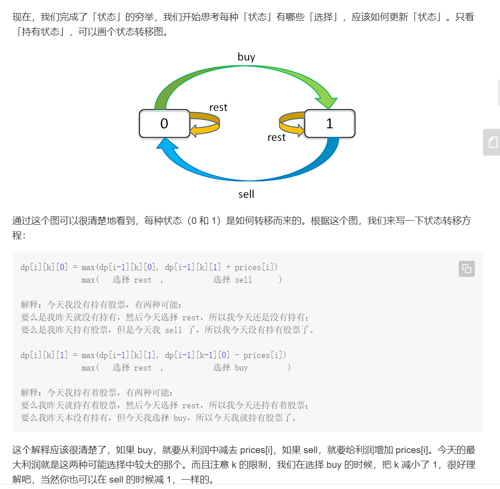
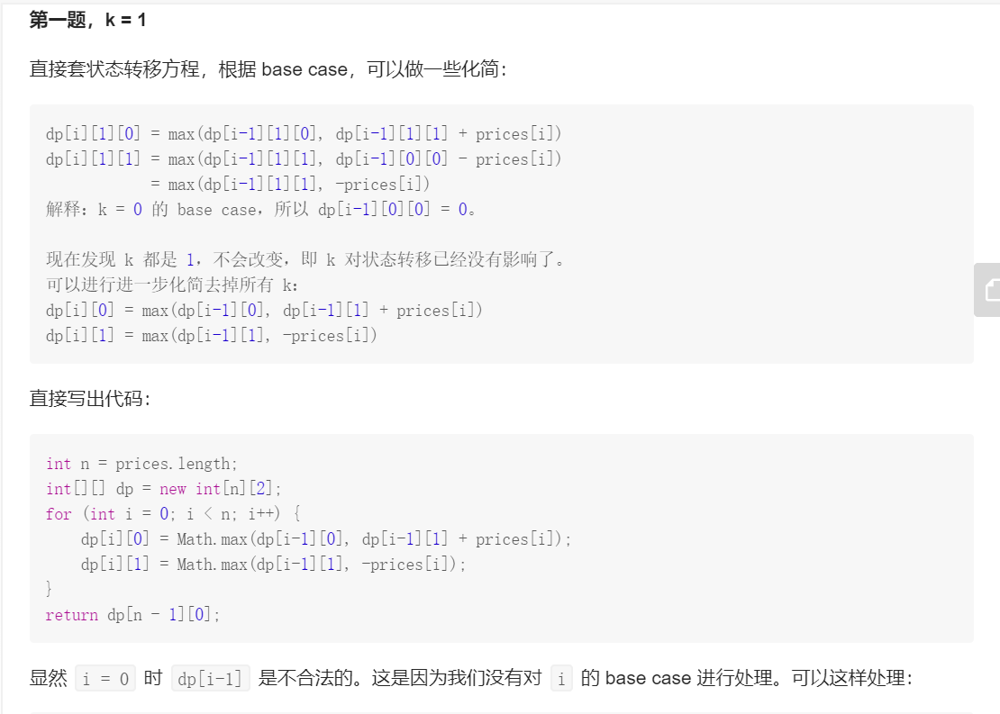
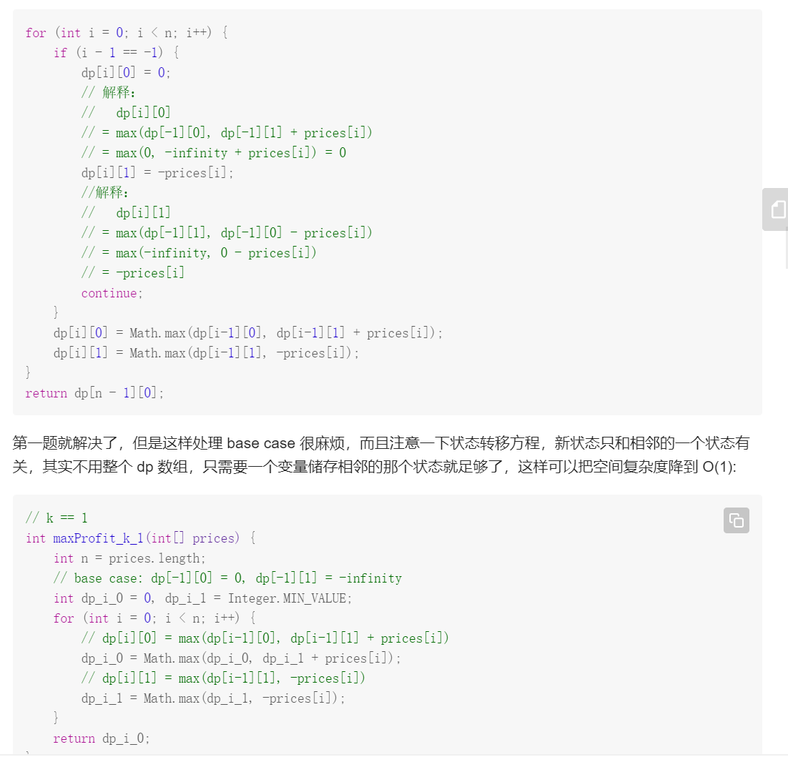
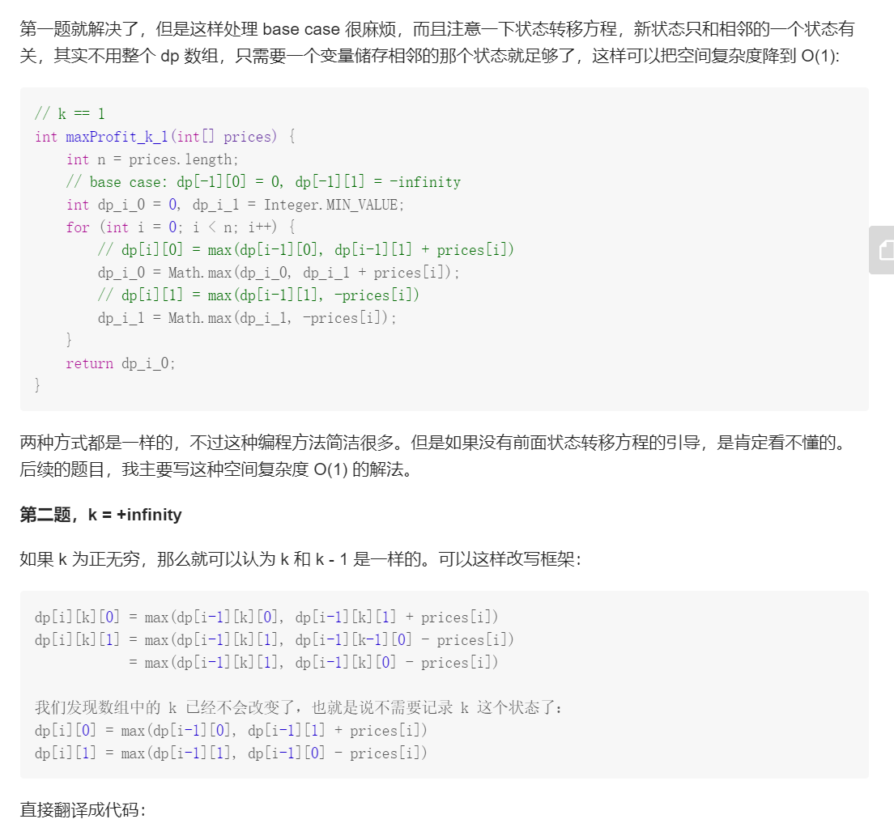
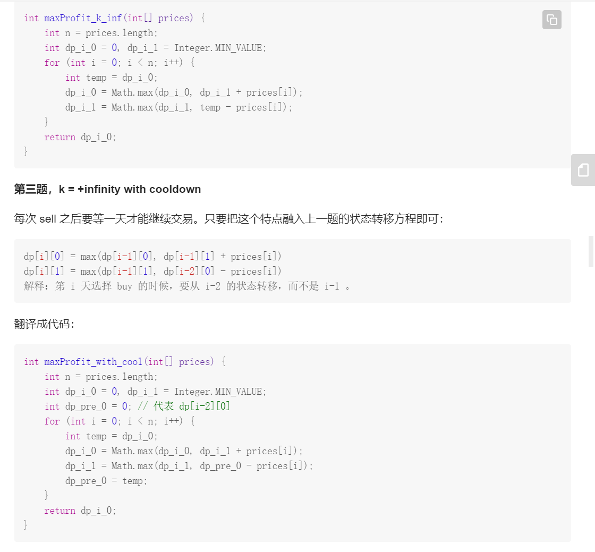
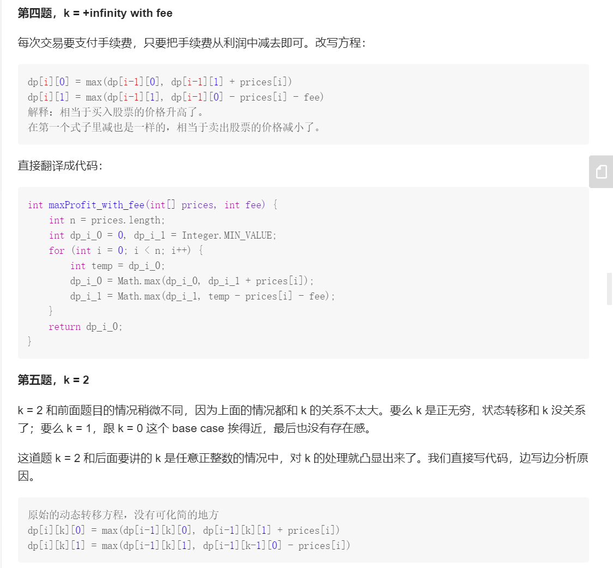
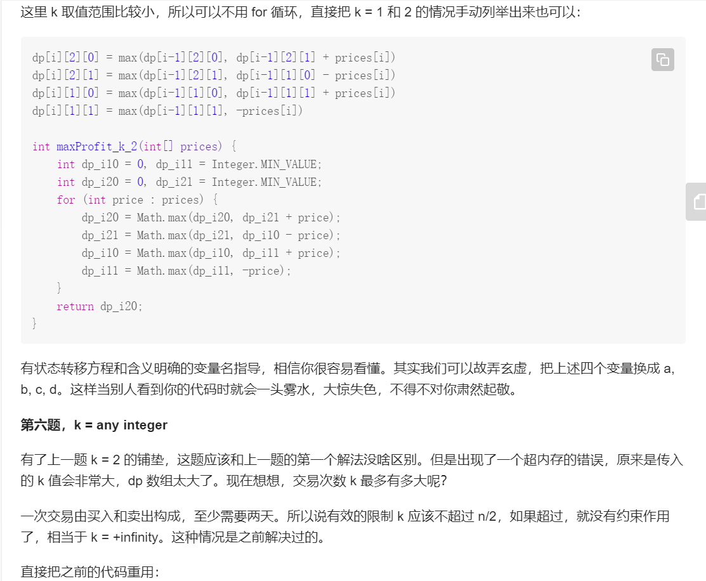
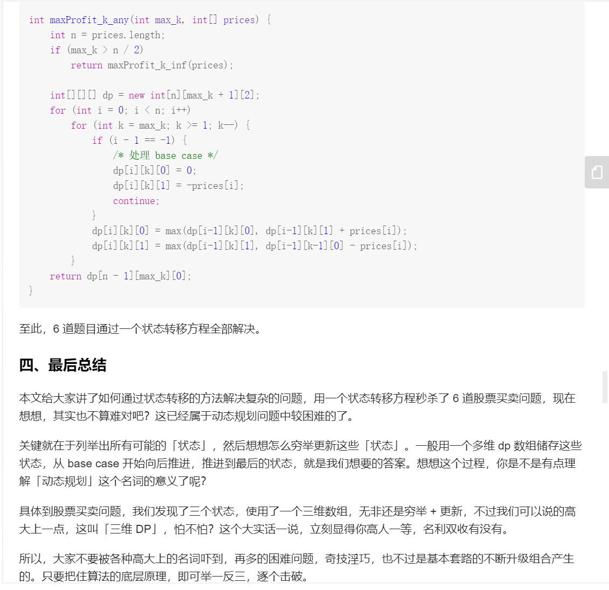

# 动态规划问题

必考题

**解题思路**：状态定义，转移方程，初始条件，返回值

## 动态规划问题解题思路

[递归和迭代参考这个解释](https://baijiahao.baidu.com/s?id=1635388976060265522&wfr=spider&for=pc)

[这个讲的太清楚了](https://www.zhihu.com/question/23995189)

一言以蔽之：大事化小，小事化了。　　

将一个大问题转化成几个小问题；　　
求解小问题；　　
推出大问题的解。

如何设计DP算法　　
下面介绍比较通用的设计DP算法的步骤。　　
首先，把我们面对的局面表示为x。这一步称为设计状态。　　
对于状态x，记我们要求出的答案(e.g.最小费用)为f(x).我们的目标是求出f(T).找出f(x)与哪些局面有关（记为p），写出一个式子（称为状态转移方程），通过f(p)来推出f(x).[阮行止](https://www.zhihu.com/question/23995189/answer/613096905)

目前见到的动态规划问题有两种，因此先确定是哪种问题~

- 选择一个解决方案，求**最大/最小的函数值**
- 弄清做某事的**方案，数量**或者事件发生的**概率**

每个阶段只有一个状态->递推；

每个阶段的最优状态都是由上一个阶段的最优状态得到的->贪心；

每个阶段的最优状态是由之前所有阶段的状态的组合得到的->搜索；

每个阶段的最优状态可以从之前某个阶段的某个或某些状态直接得到而不管之前这个状态是如何得到的->动态规划。

**[判断性继承思想](https://www.luogu.com.cn/blog/pks-LOVING/junior-dynamic-programming-dong-tai-gui-hua-chu-bu-ge-zhong-zi-xu-lie)**


还有一个很重要的，对比递归，大量重复子问题中间结果的保存，dp可以有效的节省存储空间。

动态规划问题解题思路

感觉这个图没啥用，但是总结了好多题


### 最大子序和问题

给定一个整数数组 nums ，找到一个具有最大和的连续子数组（子数组最少包含一个元素），返回其最大和。

示例:

输入: [-2,1,-3,4,-1,2,1,-5,4],
输出: 6
解释: 连续子数组 [4,-1,2,1] 的和最大，为 6。

dp[i]和dp[i-1]差一个nums[i]

找出状态转移方程：$d p[i]=\max \{n u m s[i], d p[i-1]+n u m s[i]\}$


```r
class Solution:
    def maxSubArray(self,nums:List[int])->int:
        if len(nums)==0:
            return 0
        if len(nums)==1:
            range nums[0]

        res=nums[0]
        for i in range(1,len(nums)):
            nums[i]=max(nums[i],nums[i]+nums[-1])

            res=max(res,num[i])
        return res
```

这一种写法比较直观
```r

from typing import List


class Solution:
    def maxSubArray(self, nums: List[int]) -> int:
        size = len(nums)
        if size == 0:
            return 0
        dp = [0 for _ in range(size)]

        dp[0] = nums[0]
        for i in range(1, size):
            dp[i] = max(dp[i - 1] + nums[i], nums[i])
        return max(dp)


```


## 最短路径和问题

给定一个包含非负整数的 m x n 网格，请找出一条从左上角到右下角的路径，使得路径上的数字总和为最小。

说明：每次只能向下或者向右移动一步。

示例:

输入:
[
  [1,3,1],
  [1,5,1],
  [4,2,1]
]
输出: 7
解释: 因为路径 1→3→1→1→1 的总和最小。


二维的动态规划

i横向,j纵向
```r
class Solution:
    def minPathSum(self, grid: [[int]]) -> int:
        for i in range(len(grid)):
            for j in range(len(grid[0])):
                if i == j == 0: continue
                elif i == 0:  grid[i][j] = grid[i][j - 1] + grid[i][j]
                elif j == 0:  grid[i][j] = grid[i - 1][j] + grid[i][j]
                else: grid[i][j] = min(grid[i - 1][j], grid[i][j - 1]) + grid[i][j]
        return grid[-1][-1]
```

## 爬楼梯问题

斐波那契数列：只需要考虑最后到达最后一阶实现的几种情况

题目一般有2种，可以爬2阶或者3阶，思路一样，递归+DP，但是要注意时间复杂度。。

或者爬1阶，2阶

假设你正在爬楼梯。需要 n 阶你才能到达楼顶。

每次你可以爬 1 或 2 个台阶。你有多少种不同的方法可以爬到楼顶呢？

注意：给定 n 是一个正整数。

示例 1：

输入： 2
输出： 2
解释： 有两种方法可以爬到楼顶。
1.  1 阶 + 1 阶
2.  2 阶
示例 2：

输入： 3
输出： 3
解释： 有三种方法可以爬到楼顶。
1.  1 阶 + 1 阶 + 1 阶
2.  1 阶 + 2 阶
3.  2 阶 + 1 阶


```r
class Solution:
    def climbStairs(self, n: int) -> int:
        res = [0] * 46
        res[0] = 1
        res[1] = 2
        
        for i in range(2,n):
            res[i] = res[i-1] + res[i-2]
        return res[n-1]
```

画个图发现就是二叉树的遍历

## 不同路径


解题思路:与爬楼梯的思路一致

令 dp[i][j] 是到达 i, j 最多路径

状态转移方程：dp[i][j] = dp[i-1][j] + dp[i][j-1]

**注意，对于第一行 dp[0][j]，或者第一列 dp[i][0]，由于都是在边界，所以只能为 1**

时间复杂度：O(m*n)

空间复杂度：O(m∗n)
```r
class Solution:
    def uniquePaths(self, m: int, n: int) -> int:
        d = [[0]*n for _ in range(m)]
        for i in range(m):
            d[i][0] = 1 # 从（0,0）出发，边界上的点只能一直向右走或者向下走，所以到边界上的点只有一种走法
        for j in range(n):
            d[0][j] = 1
        for i in range(1,m):
            for j in range(1,n):
                d[i][j] = d[i-1][j]+d[i][j-1]
        return d[-1][-1]
        
```


**优化**：因为我们每次只需要 dp[i-1][j],dp[i][j-1]

因此可以考虑降空间复杂度，减少一个数组

>当前点为上面点加左边点，那么计算第二行时可以直接在第一行计算，及当前点加左边点就ok了，当前点原来值表示上一行的上面点的值。所以实际一行数组重复计算就完事了。


这个思路太强了，不好想~

```r
class Solution:
    def uniquePaths(self, m: int, n: int) -> int:
        cur = [1] * n 
        for i in range(1, m):
            for j in range(1, n):
                cur[j] += cur[j-1] #等号右边分别是该位置上边的值和左边的值
        return cur[-1]


```

## 最长回文子字符串

这个之前参加蚂蚁笔试遇到了

给定一个字符串 s，找到 s 中最长的回文子串。你可以假设 s 的最大长度为 1000。

示例 1：

输入: "babad"
输出: "bab"
注意: "aba" 也是一个有效答案。
示例 2：

输入: "cbbd"
输出: "bb"

解题思路

对于一个子串而言，如果它是回文串，并且长度大于 22，那么将它首尾的两个字母去除之后，它仍然是个回文串。例如对于字符串 “ababa”，如果我们已经知道 “bab” 是回文串，那么“ababa” 一定是回文串，这是因为它的首尾两个字母都是 “a”。

因此得到一个递推的关系是

用 P(i,j) 表示字符串 s 的第 i到 j个字母组成的串（下文表示成 s[i:j]）是否为回文串：

$$P(i, j)=\left\{\begin{array}{ll}\text { true, } & \text { 如果子串 } S_{i} \ldots S_{j} \text { 是回文串 } \\ \text { false }, & \text { 其它情况 }\end{array}\right.$$
因此得到的状态转移方程是

$P(i, j)=P(i+1, j-1) \wedge\left(S_{i}==S_{j}\right)$

只有s[i+1:j-1]是回文串，并且s的第i和j个字母相同时s[i:j]才会是回文串。

理解思路，然后手敲，目前的时间复杂度是$O(n^2)$

```r
class Solution:
    def longestPalindrome(self, s: str) -> str:
        n = len(s)
        dp = [[False] * n for _ in range(n)]
        ans = ""
        # 枚举子串的长度 l+1
        for l in range(n):
            # 枚举子串的起始位置 i，这样可以通过 j=i+l 得到子串的结束位置
            for i in range(n):
                j = i + l
                if j >= len(s):
                    break
                if l == 0:
                    dp[i][j] = True
                elif l == 1:
                    dp[i][j] = (s[i] == s[j])
                else:
                    dp[i][j] = (dp[i + 1][j - 1] and s[i] == s[j])
                if dp[i][j] and l + 1 > len(ans):
                    ans = s[i:j+1]
        return ans


```

还有一个自底向上,还没看懂

```r
class Solution:
    def longestPalindrome(self, s: str) -> str:
        length = len(s)
#dp用来做动态规划存储的
        dp = [[0] * length for _ in range(length)]
        left, right = 0, 0 #长度为1时
        for i in range(1, length):
#因为最大长度为length，所以j+i<=length，第二遍不需要遍历到length
             for j in range(length-i):
#如j+1 >= j+i-1是用来初始化0或者1的回文的，s[j] == s[j+i]  是楼主说的条件1 s[i] = s[j]，dp[j+1][j+i-1] 是楼主说的条件2 s[i+1:j-1] 是一个回文串
                if s[j] == s[j+i] and (j+1 >= j+i-1 or dp[j+1][j+i-1]):
# 因为同时满足条件1和条件2，所以更长的字符也是回文
                    dp[j][j+i] = 1 
#记录左区间和右区间，用来返回的时候截取回文
                    left, right = j, j+i
        return s[left: right+1]
```

## 最大乘积和

这个题一开始我想的很简单，就类似与最大上升子序和来做了，结果。。。==

给你一个整数数组 nums ，请你找出数组中乘积最大的连续子数组（该子数组中至少包含一个数字），并返回该子数组所对应的乘积。

 

示例 1:

输入: [2,3,-2,4]
输出: 6
解释: 子数组 [2,3] 有最大乘积 6。
示例 2:

输入: [-2,0,-1]
输出: 0
解释: 结果不能为 2, 因为 [-2,-1] 不是子数组。

解题思路

首先假设存在某个最大乘积，然后对数组遍历，在经过每个元素的时候，有以下四种情况：

**如果该元素为正数：**

- 如果到上一个元素为止的最大乘积也是正数，那么直接乘上就好了，同样的最大乘积也会变得更大
- 如果到上一个元素为止的最大乘积是负数，那么最大乘积就会变成该元素本身，且连续性被断掉


**如果该元素为负数：**

- 如果到上一个元素为止的最大乘积也是负数，那么直接乘上就好了，同样的最大乘积也会变得更大
- 如果到上一个元素为止的最大乘积是正数，那么最大乘积就会不变，且连续性被断掉

以上四种情况中说到的最大乘积都是临时最大乘积，每遍历新的元素都需要进行比较来确定真正的最大乘积。

**如果细心的话就可以发现，如果要得到乘以当前元素以后的最大乘积，需要记录最大乘积，也要记录最小乘积，因为最小值可能翻身变最大值。**


对对对对。。。需要用两个记录两个值。。

负负为正
负正为负

但是看成是动态规划问题挺不好想的，只能多看几遍了

时间复杂度是O(n)

```r
class Solution:
    def maxProduct(self, nums: List[int]) -> int:
        if not nums: return 
        res = nums[0]
        pre_max = nums[0]
        pre_min = nums[0]
        for num in nums[1:]:
            cur_max = max(pre_max * num, pre_min * num, num)#pre_max:之前的最大值
            cur_min = min(pre_max * num, pre_min * num, num)#pre_min:之前的最小值，num:当前值
            res = max(res, cur_max)
            pre_max = cur_max
            pre_min = cur_min
        return res

```

## 比特位计数

给定一个非负整数 num。对于 0 ≤ i ≤ num 范围中的每个数字 i ，计算其二进制数中的 1 的数目并将它们作为数组返回。

示例 1:

输入: 2
输出: [0,1,1]  ** 返回0，1，2三个数的二进制种的1的数目**
示例 2:

输入: 5
输出: [0,1,1,2,1,2]


对于所有的数字，只有两类：

奇数：二进制表示中，奇数一定比前面那个偶数多一个 1，因为多的就是最低位的 1。
          举例： 
         0 = 0       1 = 1
         2 = 10      3 = 11
偶数：二进制表示中，偶数中 1 的个数一定和除以 2 之后的那个数一样多。因为最低位是 0，除以 2 就是右移一位，也就是把那个 0 抹掉而已，所以 1 的个数是不变的。
           举例：
          2 = 10       4 = 100       8 = 1000
          3 = 11       6 = 110       12 = 1100
另外，0 的 1 个数为 0，于是就可以根据奇偶性开始遍历计算了。


```r
class Solution:
    def countBits(self, num: int) -> List[int]:
        ret = [0, 1, 1]
        for n in range(3, num+1):
            ret.append(ret[-1]+1) if n & 1 == 1 else ret.append(ret[n//2])
        return ret[0:num+1]
```


## 买卖股票专题


一个方法团灭6个买卖股票题，我觉得认真看看的话，真的能够团灭~

这里我直接复制过来

而且我们可以用自然语言描述出每一个状态的含义，比如说 dp[3][2][1] 的含义就是：今天是第三天，我现在手上持有着股票，至今最多进行 2 次交易。再比如 dp[2][3][0] 的含义：今天是第二天，我现在手上没有持有股票，至今最多进行 3 次交易。很容易理解，对吧？

我们想求的最终答案是 dp[n - 1][K][0]，即最后一天，最多允许 K 次交易，最多获得多少利润。读者可能问为什么不是 dp[n - 1][K][1]？因为 [1] 代表手上还持有股票，[0] 表示手上的股票已经卖出去了，很显然后者得到的利润一定大于前者。

**记住如何解释「状态」，一旦你觉得哪里不好理解，把它翻译成自然语言就容易理解了。**[labuladong](https://leetcode-cn.com/problems/best-time-to-buy-and-sell-stock/solution/yi-ge-fang-fa-tuan-mie-6-dao-gu-piao-wen-ti-by-l-3/)




>现在，我们已经完成了动态规划中最困难的一步：状态转移方程。如果之前的内容你都可以理解，那么你已经可以秒杀所有问题了，只要套这个框架就行了。不过还差最后一点点，就是定义 base case，即最简单的情况。




python实现
```r
class Solution:
    def maxProfit(self, prices: List[int]) -> int:
        n = len(prices)
        if not n or n < 2:
            return 0
        dp = [[0,0] for i in range(n)]
        dp[0][0] = 0
        dp[0][1] = -prices[0]

        for i in range(1,n):
            dp[i][0] = max(dp[i-1][0],dp[i-1][1]+prices[i])
            dp[i][1] = max(dp[i-1][1],-prices[i])
        return dp[n-1][0]

```













买股票的的价格不能低于买股票的，这是一个约束条件

给定一个数组，它的第 i 个元素是一支给定股票第 i 天的价格。

如果你最多只允许完成一笔交易（即买入和卖出一支股票一次），设计一个算法来计算你所能获取的最大利润。

注意：你不能在买入股票前卖出股票。

 
示例 1:

输入: [7,1,5,3,6,4]
输出: 5
解释: 在第 2 天（股票价格 = 1）的时候买入，在第 5 天（股票价格 = 6）的时候卖出，最大利润 = 6-1 = 5 。
     注意利润不能是 7-1 = 6, 因为卖出价格需要大于买入价格；同时，你不能在买入前卖出股票。

```r
class Solution:
    def maxProfit(self, prices: List[int]) -> int:
        inf = int(1e9)
        minprice = inf  #用一个值来维护历史最低价格
        maxprofit = 0 #利润不能小于0
        for price in prices:
            maxprofit = max(price - minprice, maxprofit)
            minprice = min(price, minprice)
        return maxprofit
```


### 完全平方数

这题没想起来怎么转，知道想起找零钱的那个题。

给定正整数 n，找到若干个完全平方数（比如 1, 4, 9, 16, ...）使得它们的和等于n。你需要让组成和的完全平方数的个数最少。

示例 1:

输入: n = 12
输出: 3 
解释: 12 = 4 + 4 + 4.
示例 2:

输入: n = 13
输出: 2
解释: 13 = 4 + 9.

感觉有点像coin那个题

dp[i]表示i最少可以由几个平方数构成。

初试化$dp=[0,1,2,⋯,n]$，长度为n+1，最多次数就是全由1构成。

遍历dp，对于i，遍历区间[2,n+1)：

遍历所有平方数小于i的数j，遍历区间$[1,int(\sqrt{i})+1)$：
$dp[i]=min(dp[i],dp[i-j*j]+1)$。始终保存所有可能情况中的最小值。
返回dp[n]

因此时间复杂度是：O(n\sqrt{n})
空间复杂度：O(n)

```r
class Solution:
    def numSquares(self, n: int) -> int:
        dp=[i for i in range(n+1)]
        for i in range(2,n+1):
            for j in range(1,int(i**(0.5))+1):
                dp[i]=min(dp[i],dp[i-j*j]+1)
        return dp[-1]
```


## 最长上升子序列

给定一个无序的整数数组，找到其中最长上升子序列的长度。

示例:

输入: [10,9,2,5,3,7,101,18]
输出: 4
解释: 最长的上升子序列是 [2,3,7,101]，它的长度是 4。
说明:

可能会有多种最长上升子序列的组合，你只需要输出对应的长度即可。
你算法的时间复杂度应该为 O(n2) 。
**进阶: 你能将算法的时间复杂度降低到 O(n log n) 吗?**


解题思路：枚举

给个时间复杂度为$O(n^2)$

```r
class Solution:
    def lengthOfLIS(self, nums: List[int]) -> int:
        n = len(nums)
        if n == 0: return 0
        dp = [1] * n
        ans = 1
        for i in range(n):
            for j in range(i):
                if nums[i] > nums[j]:
                    dp[i] = max(dp[i], dp[j] + 1)
                    ans = max(ans, dp[i])
        return  ans


```

## 找零钱问题

给定不同面额的硬币 coins 和一个总金额 amount。编写一个函数来计算可以凑成总金额所需的最少的硬币个数。如果没有任何一种硬币组合能组成总金额，返回 -1。

 

示例 1:

输入: coins = [1, 2, 5], amount = 11
输出: 3 
解释: 11 = 5 + 5 + 1
示例 2:

输入: coins = [2], amount = 3
输出: -1


```r
class Solution:
    def coinChange(self, coins: List[int], amount: int) -> int:
        dp=[float('inf')]*(amount+1)
        dp[0]=0
        for i in range(1,amount+1):
            for coin in coins:
                if i>=coin:
                    dp[i]=min(dp[i],dp[i-coin]+1)
        return dp[-1] if(dp[-1]!=float('inf')) else -1
```

目前的时间复杂度O(amount*len(coins))


有么有更快的方法？
有的，回溯算法+dbf

可以查查，理解下~


找零钱问题是背包问题的一个例子


## 单词切分

给定一个非空字符串 s 和一个包含非空单词列表的字典 wordDict，判定 s 是否可以被空格拆分为一个或多个在字典中出现的单词。

说明：

拆分时可以重复使用字典中的单词。
你可以假设字典中没有重复的单词。
示例 1：

输入: s = "leetcode", wordDict = ["leet", "code"]
输出: true
解释: 返回 true 因为 "leetcode" 可以被拆分成 "leet code"。
示例 2：

输入: s = "applepenapple", wordDict = ["apple", "pen"]
输出: true
解释: 返回 true 因为 "applepenapple" 可以被拆分成 "apple pen apple"。
     注意你可以重复使用字典中的单词。
示例 3：

输入: s = "catsandog", wordDict = ["cats", "dog", "sand", "and", "cat"]
输出: false


**解题思路**


1. 初始化 $d p=[\text { False, } \cdots, \text { False], 长度为 } n+1 . n \text { 为字符串长度。 } d p[i] \text { 表示 } s \text { 的前 } i$ 位是否可以用 wordDict 中的单词表示。
2. 初始化 $d p[0]=T r u e,$ 空字符可以被表示
3. 遍历字符串的所有子串，遍历开始索引 $i,$ 遍历区间 $[0, n)$
。遍历结束索引 $j,$ 遍历区间 $[i+1, n+1)$
- 若 $d p[i]=$ True 且 $s[i, \cdots, j)$ 在 wordlist 中: $d p[j]=T r u e_{\circ}$ 解释: $d p[i]=$ True i兄明 $s$ 的前 $i$ 位可以用 $w o r d D i c t$ 表示, 则 $s[i, \cdots, j)$ 出现在 $w o r d D i c t$ 中，说明 $s$ 的前 $j$ 位可以 表示。
4. 返回 $d p[n]$


问题不难，就是没想到用动态规划

```r
class Solution:
    def wordBreak(self, s: str, wordDict: List[str]) -> bool:       
        n=len(s)
        dp=[False]*(n+1)
        dp[0]=True
        for i in range(n):
            for j in range(i+1,n+1):
                if(dp[i] and (s[i:j] in wordDict)):
                    dp[j]=True
        return dp[-1]
```

## 打家劫舍专题

你是一个专业的小偷，计划偷窃沿街的房屋。每间房内都藏有一定的现金，影响你偷窃的唯一制约因素就是相邻的房屋装有相互连通的防盗系统，如果两间相邻的房屋在同一晚上被小偷闯入，系统会自动报警。

给定一个代表每个房屋存放金额的非负整数数组，计算你在不触动警报装置的情况下，能够偷窃到的最高金额。

示例 1:

输入: [1,2,3,1]
输出: 4
解释: 偷窃 1 号房屋 (金额 = 1) ，然后偷窃 3 号房屋 (金额 = 3)。
     偷窃到的最高金额 = 1 + 3 = 4 。


```r
class Solution:
    def rob(self, nums: List[int]) -> int:
       prev = 0
       curr = 0
    
     # 每次循环，计算“偷到当前房子为止的最大金额”
       for i in nums:
        # 循环开始时，curr 表示 dp[k-1]，prev 表示 dp[k-2]
        # dp[k] = max{ dp[k-1], dp[k-2] + i }
           prev, curr = curr, max(curr, prev + i)
        # 循环结束时，curr 表示 dp[k]，prev 表示 dp[k-1]

       return curr

```

或者另一种写法,即动态规划，

```r

class Solution:
    def rob(self, nums):
        if not nums:
            return 0
        if len(nums)==1:
            return nums[0]
        sumList = [nums[0]]      #存放盗窃的每一个房间的最大收益
        sumList.append(max(nums[0], nums[1]))
        for i in range(2,len(nums)):
            sumList.append(max(sumList[i-2]+nums[i], sumList[i-1]))
        return sumList[-1]
```


问题2：环形房屋

你是一个专业的小偷，计划偷窃沿街的房屋，每间房内都藏有一定的现金。这个地方所有的房屋都围成一圈，这意味着第一个房屋和最后一个房屋是紧挨着的。同时，相邻的房屋装有相互连通的防盗系统，如果两间相邻的房屋在同一晚上被小偷闯入，系统会自动报警。

给定一个代表每个房屋存放金额的非负整数数组，计算你在不触动警报装置的情况下，能够偷窃到的最高金额。

示例 1:

输入: [2,3,2]
输出: 3
解释: 你不能先偷窃 1 号房屋（金额 = 2），然后偷窃 3 号房屋（金额 = 2）, 因为他们是相邻的。
示例 2:

输入: [1,2,3,1]
输出: 4
解释: 你可以先偷窃 1 号房屋（金额 = 1），然后偷窃 3 号房屋（金额 = 3）。
     偷窃到的最高金额 = 1 + 3 = 4 。

解题思路：可以开辟2个队列保存结果嘛,第一个队列保存从[0,n-1]的结果，第二个队列保存从[1,n]的结果

```r
class Solution(object):
    def rob(self, nums):
        if not nums:
            return 0
        n = len(nums)
        if n<=2:
            return max(nums)
        dp1 = [0 for _ in range(n)]
        dp2 = [0 for _ in range(n)]
        # 初始化两个dp数组，dp1是计算的是[1,end],dp2计算的是[0,end-1],这个比较好想
        dp1[0] = 0
        dp1[1] = nums[1]
        dp2[0] = nums[0]
        dp2[1] = max(nums[0],nums[1])
        # 按照【打家劫舍 I】的转移方式执行两遍
        for i in range(2,n):
            dp1[i] = max(dp1[i-1],dp1[i-2]+nums[i])
        for i in range(2,n-1):
            dp2[i] = max(dp2[i-1],dp2[i-2]+nums[i])
        return max(dp1[-1],dp2[-2])
```

进阶题

在上次打劫完一条街道之后和一圈房屋后，小偷又发现了一个新的可行窃的地区。这个地区只有一个入口，我们称之为“根”。 除了“根”之外，每栋房子有且只有一个“父“房子与之相连。一番侦察之后，聪明的小偷意识到“这个地方的所有房屋的排列类似于一棵二叉树”。 如果两个直接相连的房子在同一天晚上被打劫，房屋将自动报警。

计算在不触动警报的情况下，小偷一晚能够盗取的最高金额。

示例 1:

输入: [3,2,3,null,3,null,1]

     3
    / \
   2   3
    \   \ 
     3   1

输出: 7 
解释: 小偷一晚能够盗取的最高金额 = 3 + 3 + 1 = 7.
示例 2:

输入: [3,4,5,1,3,null,1]

     3
    / \
   4   5
  / \   \ 
 1   3   1

输出: 9
解释: 小偷一晚能够盗取的最高金额 = 4 + 5 = 9.


哎，这个小偷太能想了==


```r

# Definition for a binary tree node.
# class TreeNode:
#     def __init__(self, x):
#         self.val = x
#         self.left = None
#         self.right = None

class Solution:
    def rob(self, root: TreeNode) -> int:
        return self.helper(root)[1]
    
    # helper函数返回一个节点为根的最大值 = [当前节点不参与计算的最大收益，当前节点的最大收益(参与/不参与)]
    def helper(self, root):
        if root is None:
            return [0, 0]
        left_amount = self.helper(root.left)
        right_amount = self.helper(root.right)
        withoutRoot = left_amount[1] + right_amount[1]
        withRoot = root.val + left_amount[0] + right_amount[0]
        return [withoutRoot, max(withRoot, withoutRoot)]


```