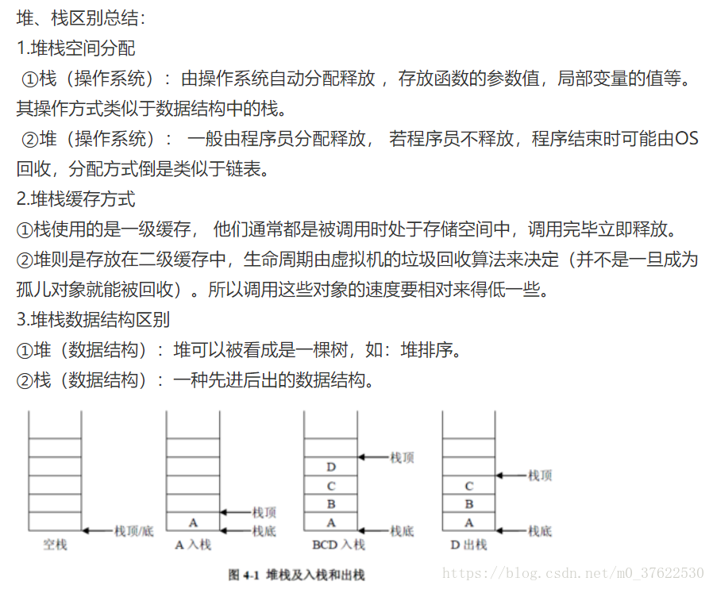
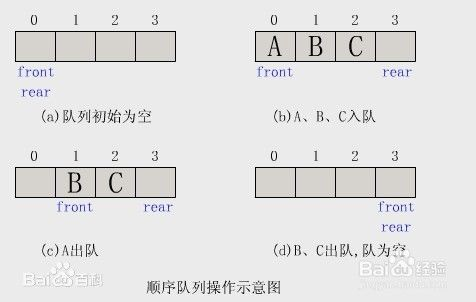
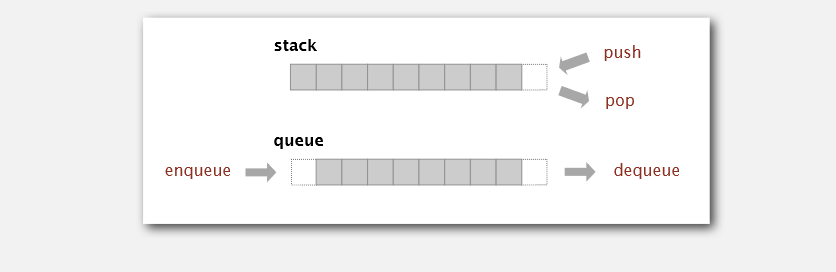
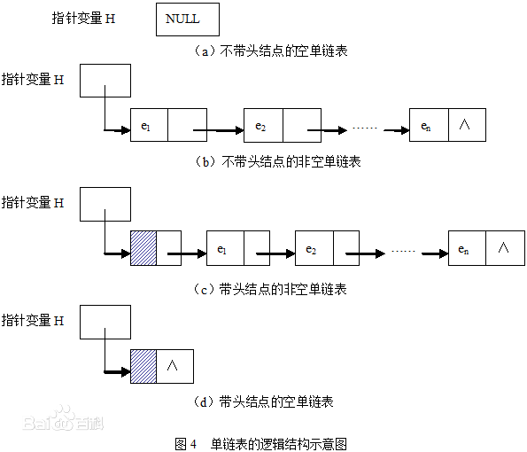
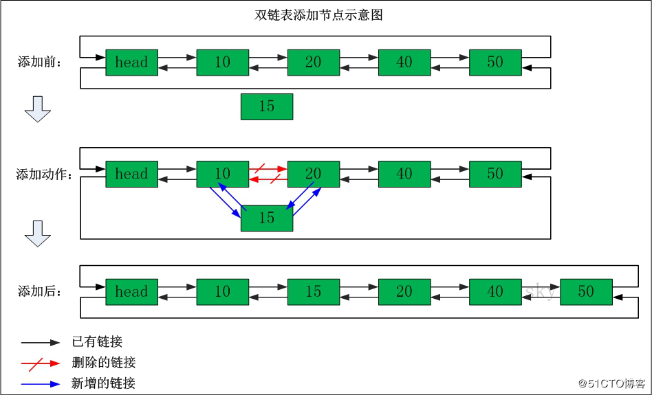
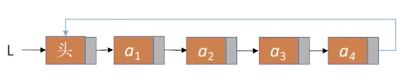

# 基础结构

## stack

后进先出，删除与加入均在**栈顶操作**

栈也称为堆栈，是一种**线性表**。

堆栈的特性： 最先放入堆栈中的内容最后被拿出来，最后放入堆栈中的内容最先被拿出来， 被称为先进后出、后进先出。

堆栈中两个最重要的操作是PUSH和POP，两个是相反的操作。

PUSH：在堆栈的顶部加入一个元素。

POP：在堆栈顶部移去一个元素， 并将堆栈的大小减一。
具体参考[「大羚羊」](https://blog.csdn.net/m0_37622530/article/details/81429837)



## queue


队列——先进先出

队列也是一种特殊的线性表。不同于栈所服从的先进后出的原则，队列的原则是先进先出。

队列在队头做删除操作,在队尾做插入操作：



**我一直在想怎么可以把两种数据结构不记混，后来发现，画个图！**其次是“每日一遍，神清气爽~”



主要考题：深度优先搜索和广度优先搜索（二叉树的层序遍历，先、中、后序遍历等）

### 数组实现栈

```r

class Stack:
    def __init__(self, array = None):
        super().__init__()
        self.array = array

    # 入栈
    def push(self, x):
        self.array.append(x)

    # 出栈
    def pop(self,):
        if len(self.array) == 0:
            return

        return self.array.pop()

    # 取栈顶元素
    def top(self,):
        if len(self.array) == 0:
            return

        return self.array[-1]

    # 判空
    def isEmpty(self,):
        return True if self.array == [] else False

```

### 数组实现队列

```r
class Queue:
    def __init__(self, array = None):
        super().__init__()
        self.array = array

    # 入队
    def enqueue(self, x):
        self.array.append(x)

    # 出队
    def dequeue(self):
        if len(self.array) == 0:
            return

        return self.array.pop(0)

    # 判空
    def isEmpty(self,):
        return True if self.array == [] else False


```

## 链表

### 单向链表

>线性的顺序存储数据，而是在每一个节点里存到下一个节点的指针(Pointer)。由于不必须按顺序存储，链表的插入和删除操作可以达到O(1)的复杂度。

链表带指针~链表带指真~链表带指针~重要的事情说三遍！


循环链表是痛点！感觉链表题大部分也是画图，记得使用中间变量

>链表是一种物理存储单元上非连续、非顺序的存储结构，数据元素的逻辑顺序是通过链表中的指针链接次序实现的。链表由一系列结点（链表中每一个元素称为结点）组成，结点可以在运行时动态生成。每个结点包括两个部分：一个是存储数据元素的数据域，另一个是存储下一个结点地址的指针域。 相比于线性表顺序结构，操作复杂。由于不必须按顺序存储，链表在插入的时候可以达到O(1)的复杂度，比另一种线性表顺序表快得多，但是查找一个节点或者访问特定编号的节点则需要O(n)的时间，而线性表和顺序表相应的时间复杂度分别是O(logn)和O(1)。
使用链表结构可以克服数组链表需要预先知道数据大小的缺点，链表结构可以充分利用计算机内存空间，实现灵活的内存动态管理。但是链表失去了数组随机读取的优点，同时链表由于增加了结点的指针域，空间开销比较大。链表最明显的好处就是，常规数组排列关联项目的方式可能不同于这些数据项目在记忆体或磁盘上顺序，数据的存取往往要在不同的排列顺序中转换。链表允许插入和移除表上任意位置上的节点，但是不允许随机存取。链表有很多种不同的类型：单向链表，双向链表以及循环链表。链表可以在多种编程语言中实现。像Lisp和Scheme这样的语言的内建数据类型中就包含了链表的存取和操作[百度百科](https://baike.baidu.com/item/%E9%93%BE%E8%A1%A8/9794473?fr=aladdin)

做插入和删除操作的时候是链表更快，但是做查找的话，链表不如数组等顺序存储结构。

每个链表开头节点所带的指针叫head：头指针



除了单项链表还有双向和循环链表

### 双向链表

>双向链表也叫双链表，是链表的一种，它的每个数据结点中都有两个指针，分别指向直接后继和直接前驱。所以，从双向链表中的任意一个结点开始，都可以很方便地访问它的前驱结点和后继结点。一般我们都构造双向循环链表。[baike]https://baike.baidu.com/item/%E5%8F%8C%E5%90%91%E9%93%BE%E8%A1%A8/2968731?fr=aladdin)


### 循环链表

>表尾结点的next指针指向头结点




## array

数组是用于储存多个相同类型数据的集合。

### 一维数组


### 二维数组

## tree

## 递归的思想

感觉大部分问题，应该是可以通过递归来解决的，但是理解起来总归是需要一段时间的.

遇到问题不用着急,先写出递推的逻辑,然后写出递归的终止条件
