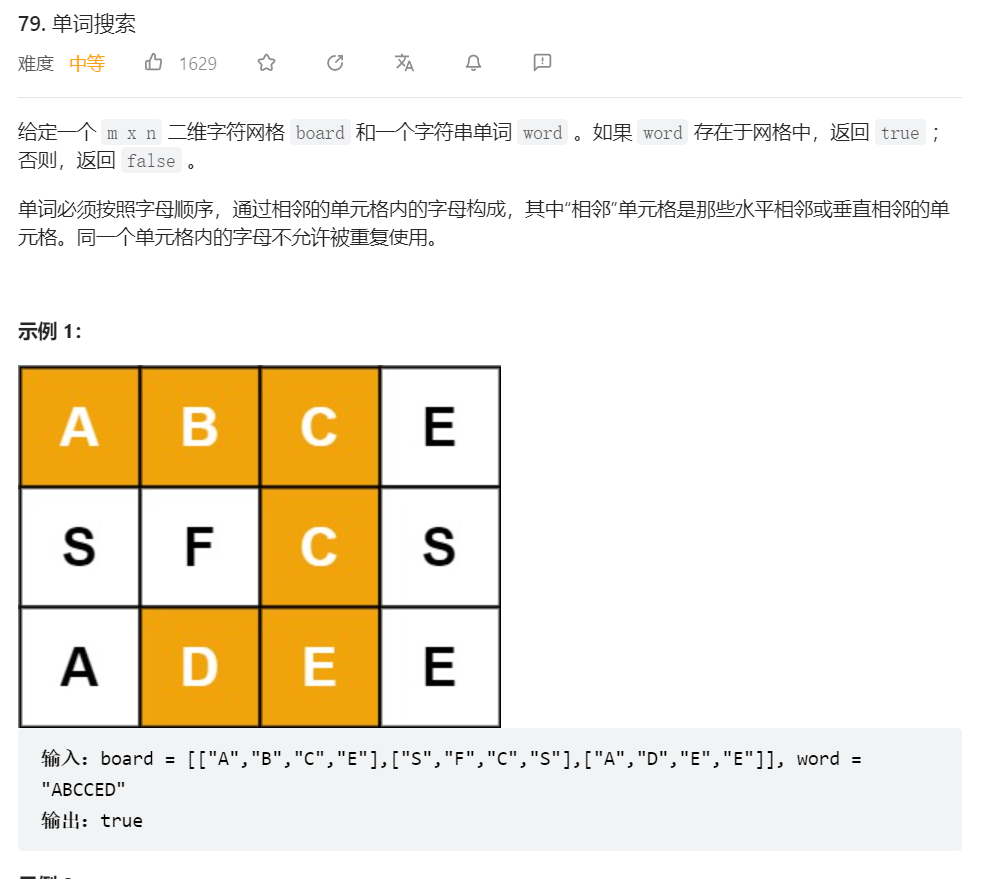
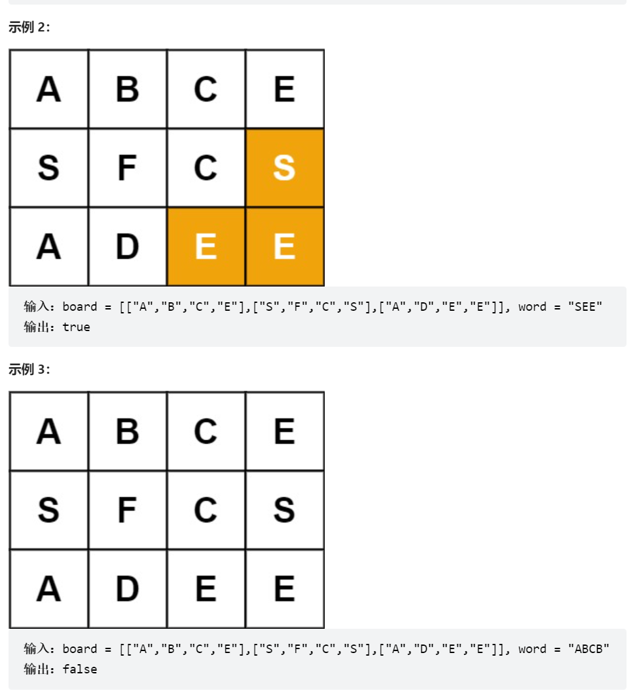
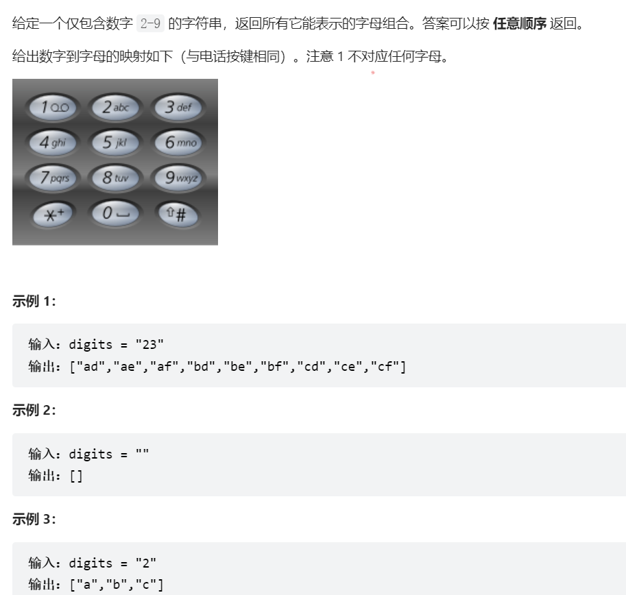

# 回溯专题

## 定义

参考[【代码随想录】](https://github.com/youngyangyang04/leetcode-master/blob/master/problems/%E5%9B%9E%E6%BA%AF%E7%AE%97%E6%B3%95%E7%90%86%E8%AE%BA%E5%9F%BA%E7%A1%80.md)

回溯是递归的副产品
- 回溯法解决的问题

- 组合问题：N个数里面按一定规则找出k个数的集合

- 切割问题：一个字符串按一定规则有几种切割方式

- 子集问题：一个N个数的集合里有多少符合条件的子集

- 排列问题：N个数按一定规则全排列，有几种排列方式

- 棋盘问题：N皇后，解数独等等


另外，会有一些同学可能分不清什么是组合，什么是排列？

组合是不强调元素顺序的，排列是强调元素顺序。

例如：{1, 2} 和 {2, 1} 在组合上，就是一个集合，因为不强调顺序，而要是排列的话，{1, 2} 和 {2, 1} 就是两个集合了。

记住组合无序，排列有序，就可以了。

- 如何理解回溯法

>回溯法解决的问题都可以抽象为树形结构，因为回溯法解决的都是在集合中递归查找子集，集合的大小就构成了树的宽度，递归的深度，都构成的树的深度。递归就要有终止条件，所以必然是一颗高度有限的树（N叉树）。

总之,一句话本质上还是递归，既包含二叉树的前序遍历又包含二叉树的后序遍历。


## 解决方法

主要包含三个点

- 定义路径

- 出口条件

- 做出选择

一般基于模板的变形就是在出口条件和做出选择的地方进行变形

- 下面是一个标准化的模板
```r
res = []
def backtrack(路径, 选择列表):
    if 满足结束条件:
        res.append(路径)
        return  
        
    if 满足剪枝条件：
    	return
    	
    for 选择 in 选择列表:
        做选择
        backtrack(路径, 选择列表)
        撤销选择

``` 

## 全排列问题一

给定一个不含重复数字的数组 nums ，返回其 所有可能的全排列 。你可以 按任意顺序 返回答案。

 

示例 1：

输入：nums = [1,2,3]
输出：[[1,2,3],[1,3,2],[2,1,3],[2,3,1],[3,1,2],[3,2,1]]
示例 2：

输入：nums = [0,1]
输出：[[0,1],[1,0]]
示例 3：

输入：nums = [1]
输出：[[1]]


```r
class Solution:
    def permute(self, nums: List[int]) -> List[List[int]]:
        res = []
        def backtrack(nums, tmp):
            if not nums:
                res.append(tmp)
                return 
            for i in range(len(nums)):
                backtrack(nums[:i] + nums[i+1:], tmp + [nums[i]])
        backtrack(nums, [])
        return res

```


## 全排列问题二

- 题目描述

给定一个可包含重复数字的序列 nums ，按任意顺序 返回所有不重复的全排列。

 

示例 1：

输入：nums = [1,1,2]
输出：
[[1,1,2],
 [1,2,1],
 [2,1,1]]
示例 2：

输入：nums = [1,2,3]
输出：[[1,2,3],[1,3,2],[2,1,3],[2,3,1],[3,1,2],[3,2,1]]

- 解题思路

套模板


```r
class Solution(object):
    def permute(self, nums):
        """
        :type nums: List[int]
        :rtype: List[List[int]]
        """
        res=[]
        track=[] #路径
        def backtrack(track):
            if len(track)==len(nums):# 出口条件
                res.append(track.copy()) # 把track的副本加入res中，避免后面修改track时产生影响
                return 
            for i in nums: # 做选择
                if i not in track:
                    track.append(i)
                    backtrack(track) # 递归
                    track.pop() # 退栈。回溯
        backtrack(track)
        return res
        
```

- copy

这个是浅拷贝，是有关py的底层原理

a=b此时a是拷贝了b的引用


## 组合总和一

- 题目描述

给定一个无重复元素的正整数数组 candidates 和一个正整数 target ，找出 candidates 中所有可以使数字和为目标数 target 的唯一组合。

candidates 中的数字可以无限制重复被选取。如果至少一个所选数字数量不同，则两种组合是唯一的。 

对于给定的输入，保证和为 target 的唯一组合数少于 150 个。

示例 1：

输入: candidates = [2,3,6,7], target = 7
输出: [[7],[2,2,3]]
示例 2：

输入: candidates = [2,3,5], target = 8
输出: [[2,2,2,2],[2,3,3],[3,5]]
示例 3：

输入: candidates = [2], target = 1
输出: []
示例 4：

输入: candidates = [1], target = 1
输出: [[1]]
示例 5：

输入: candidates = [1], target = 2
输出: [[1,1]]

- 解题思路

定义路径
定义出口
选择条件

这道题主要就是在出口和选择条件处做的变形


```r
class Solution:
    def combinationSum(self, candidates: List[int], target: int) -> List[List[int]]:
        res=[]
        track=[]
        def backtrack(track):
            if sum(track)==target:
                res.append(track.copy())
                return 
            if sum(track)>target:
                return 
            for i in candidates:
                if track and i < max(track):
                    continue
                track.append(i)
                backtrack(track)
                track.pop()
        backtrack(track)
        return res
```

## 组合总和二

- 题目描述

给定一个数组 candidates 和一个目标数 target ，找出 candidates 中所有可以使数字和为 target 的组合。
candidates 中的每个数字在每个组合中只能使用一次。

注意：解集不能包含重复的组合。 
示例 1:

输入: candidates = [10,1,2,7,6,1,5], target = 8,
输出:
[
[1,1,6],
[1,2,5],
[1,7],
[2,6]
]
示例 2:

输入: candidates = [2,5,2,1,2], target = 5,
输出:
[
[1,2,2],
[5]
]

- 解题思路

模板还是那个模板，只是题目稍作修改，增加了一个每个元素不重复

思路不能变，但是需要增加辅助条件

```r
class Solution:
    def combinationSum2(self, candidates, target):
        res=[]
        track=[]
        candidates.sort() # 定义完路径增加一个排序
        def backtrack(j,track):
            if sum(track)==target: # 出口条件依然不变
                res.append(track.copy())
                return
            if sum(track)>target:
                return
            for i in range(j,len(candidates)): # 但是选择条件这里需要增加一个计数，保证选择的元素不重复，赶紧是一个指针的思想
                if i>j and candidates[i] == candidates[i - 1] :
                    continue
                
                track.append(candidates[i])
                backtrack(i+1,track)
                track.pop()
        backtrack(0,track)
        return res
```

- 仔细观察这个题，还是选择这里做出了一丢丢的改变

## 组合总和三

- 题目描述

找出所有相加之和为 n 的 k 个数的组合。组合中只允许含有 1 - 9 的正整数，并且每种组合中不存在重复的数字。

说明：
所有数字都是正整数。
解集不能包含重复的组合。 
示例 1:

输入: k = 3, n = 7
输出: [[1,2,4]]
示例 2:

输入: k = 3, n = 9
输出: [[1,2,6], [1,3,5], [2,3,4]]

- 解题思路

修改出口-选择

```r
class Solution:
    def combinationSum3(self, k: int, n: int) -> List[List[int]]:
        res=[]
        track=[]
        def backtrack(j,track):
            if sum(track)==n and len(track)==k:
                res.append(track.copy())
                return
            if len(track)==k:
                return
            for i in range(j,10):
                track.append(i)
                backtrack(i+1,track)
                track.pop()
        backtrack(1,track)
        return res
```

找到感觉了，肝~

## 组合总和四

- 题目描述

给你一个由 不同 整数组成的数组 nums ，和一个目标整数 target 。请你从 nums 中找出并返回总和为 target 的元素组合的个数。

题目数据保证答案符合 32 位整数范围。

 

示例 1：

输入：nums = [1,2,3], target = 4
输出：7
解释：
所有可能的组合为：
(1, 1, 1, 1)
(1, 1, 2)
(1, 2, 1)
(1, 3)
(2, 1, 1)
(2, 2)
(3, 1)
请注意，顺序不同的序列被视作不同的组合。
示例 2：

输入：nums = [9], target = 3
输出：0

- 解题思路

依然是套模板，不过这道题用回溯会超出时间限制

```r
class Solution:
    def combinationSum4(self, nums: List[int], target: int) -> int:
        res=[]
        track=[]
        def backtrack(track):
            if sum(track)==target:
                res.append(track.copy())
                return 
            if sum(track)>target:
                return
            for i in nums:
                track.append(i)
                backtrack(track)
                track.pop()
        backtrack(track)
        return len(res)
```

后面还是会把这个题写到dp里面

## 分割回文字符串

- 题目描述

给你一个字符串 s，请你将 s 分割成一些子串，使每个子串都是 回文串 。返回 s 所有可能的分割方案。

回文串 是正着读和反着读都一样的字符串。

示例 1：

输入：s = "aab"
输出：[["a","a","b"],["aa","b"]]
示例 2：

输入：s = "a"
输出：[["a"]]

- 解题思路

套模板

```r
class Solution:
    def partition(self, s: str) -> List[List[str]]:
        res = []  
        track = []  #放已经回文的子串
        def backtrack(s,startIndex):
            if startIndex >= len(s):  #如果起始位置已经大于s的大小，说明已经找到了一组分割方案了
                return res.append(track.copy())
            for i in range(startIndex,len(s)):
                p = s[startIndex:i+1]  #获取[startIndex,i+1]在s中的子串
                if p == p[::-1]: 
                    track.append(p)  #是回文子串
                else: 
                    continue  #不是回文，跳过
                backtrack(s,i+1)  #寻找i+1为起始位置的子串
                track.pop()  #回溯过程，弹出本次已经填在path的子串
        backtrack(s,0)
        return res
```

## 括号生成

解题思路：回溯+深度优先搜索

数字 n 代表生成括号的对数，请你设计一个函数，用于能够生成所有可能的并且 有效的 括号组合。

 

示例 1：
输入：n = 3
输出：["((()))","(()())","(())()","()(())","()()()"]

示例 2：
输入：n = 1
输出：["()"]


```r
from typing import List


class Solution:
    def generateParenthesis(self, n: int) -> List[str]:

        res = []
        cur_str = ''

        def dfs(cur_str, left, right, n):
            """
            :param cur_str: 从根结点到叶子结点的路径字符串
            :param left: 左括号已经使用的个数
            :param right: 右括号已经使用的个数
            :return:
            """
            if left == n and right == n:
                res.append(cur_str)
                return
            if left < right:
                return

            if left < n:
                dfs(cur_str + '(', left + 1, right, n)

            if right < n:
                dfs(cur_str + ')', left, right + 1, n)

        dfs(cur_str, 0, 0, n)
        return res


```
 
[liweiwei1419](https://leetcode.cn/problems/generate-parentheses/solution/hui-su-suan-fa-by-liweiwei1419/)


## 单词搜索




比较典型的无重复回溯，但是不好写

```r
class Solution:
    def exist(self, board: List[List[str]], word: str) -> bool:
        # dfs，找到与word相匹配的单词
        m, n = len(board), len(board[0])
        w = len(word)

        # i, j为当前坐标，k为当前word匹配到的坐标
        def dfs(i, j, k):
            # 当索引越界，或当前不匹配，或搜索已访问过的坐标时，进行剪枝
            if not 0 <= i < m or not 0 <= j < n or board[i][j] != word[k]: return False
            # 当最后一个字母匹配时，搜索成功
            if k == w - 1: return True
            # 将访问过的字符暂时置为空
            board[i][j] = ''
            # 有上下左右四个搜索方向，搜索下一个字母
            res = dfs(i+1, j, k+1) or dfs(i-1, j, k+1) or dfs(i, j-1, k+1) or dfs(i, j+1, k+1)
            # 将访问过的字符还原
            board[i][j] = word[k]
            return res
        
        # 共有MN个起点，每个起点除去回头路有三个搜索方向，故时间复杂度为3**k*MN
        for i in range(m):
            for j in range(n):
                if dfs(i, j, 0): return True
        return False


```

[bullimito](https://leetcode.cn/problems/word-search/solution/dfs-by-bullimito-1ate/)


## 电话号码的字母组合

题目描述




```r
class Solution:
    def letterCombinations(self, digits: str) -> List[str]:
        dic = {'2':'abc', '3':'def', '4':'ghi', '5':'jkl', '6':'mno', '7':'pqrs','8':'tuv','9':'wxyz'} #首先定义一个哈希表，把相应的数字和字母对应起来
        n = len(digits) #计算给定字符串中数字的长度
        if n == 0:
            return []

        def dfs(index): #定义递归回溯函数
            if index == n: #如果此时递归到了字符串中最后一个数字，则表示第一层深度搜索结束，将结果存储起来
                res.append(''.join(tmp)) #注意一下这边存储的时候要把多个字符串组合成一个字符串，利用
                #join函数，这边还要注意的是后面会把tmp中的最上面字符弹出，这边利用join函数也同时避免
                #了tmp弹出时影响res的目的，不然全部返回空字符串
            else: #如果这个时候没搜索到最后一层，则
                for i in dic[digits[index]]: #逐个遍历当前数字对应的字母
                    tmp.append(i) #将这个字母加到tmp中
                    dfs(index + 1) #因为要把下一个数字对应的字母继续加进去，所以这边index + 1，函数传递下一个位置
                    tmp.pop() #因为还需要把最后一个数字的字母逐个加进去，所以这边要把最后一个弹出，
                    #因为上一行的dfs函数遇到结束条件，才回向下执行，所以这边已经完成一次深度的搜索，此时要把最后一个字母弹出，实现下一轮遍历
        

        res = [] #初始化返回结果数组
        tmp = [] #初始化过渡数组
        dfs(0) #首先执行index = 0，因为都是从第一个字母开始组合
        return res #返回结果函数


```

[a-jun-bao-1234](https://leetcode.cn/problems/letter-combinations-of-a-phone-number/solution/17-dian-hua-hao-ma-de-zi-mu-zu-he-di-gui-tcxk/)

## N皇后


