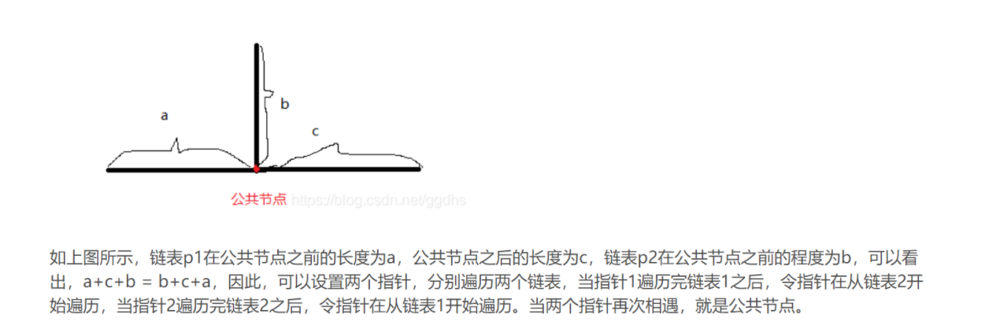

# 链表问题

必考题


## 删除链表的倒数第N个节点

给定一个链表，删除链表的倒数第 n 个节点，并且返回链表的头结点。

示例：

给定一个链表: 1->2->3->4->5, 和 n = 2.

当删除了倒数第二个节点后，链表变为 1->2->3->5.
说明：

给定的n保证是有效的。

进阶：

你能尝试使用一趟扫描实现吗？


- 可以考虑快慢指针来实现各种位置删除的链表


能不能用1次遍历解决这个问题呢？这里我们运用到解决这类线性列表的数据结构题目一个高频技巧，双指针。
为了方便，**在原有链表前面设置一个哑结点，哑结点的好处在于，因为这里我们是要删除一个结点，所以我们可以定位到被删除结点的前置结点，然后将前置结点的后续指针指向被删除结点的后续结点，则可完成删除。**

**建立两个链表，l1先从第一个节点访问到第n个节点，然后l1和l2同时进行扫描，当l1扫描到链表尾时，l2到倒数第n个节点。**

我们设置两个指针，两个指针初始状态都指向哑结点，指针fast 先走n步，然后指针fast和指针slow同步往前继续遍历链表，直至fast的后续结点为空，此时指针slow到达被删除结点的前置结点。[belinda](https://leetcode-cn.com/problems/remove-nth-node-from-end-of-list/solution/chao-ke-ai-dong-hua-jiao-ni-ru-he-shan-chu-lian-bi/)

1.定义一个头结点，指向链表的第一个结点
2.快慢指针指向头结点
3.快指针先走n步
4.快慢指针一起走，直到快指针走到链表尾
5.慢指针后一位链接为其后一位的后一位（实现截断连接）
6.返回头结点的后一位结点。[Huster2018](https://leetcode-cn.com/problems/remove-nth-node-from-end-of-list/solution/python3-shuang-zhi-zhen-20you-hua-ban-by-huster201/)


```r
# Definition for singly-linked list.
# class ListNode(object):
#     def __init__(self, x):
#         self.val = x
#         self.next = None
 
class Solution(object):
    
        """
        :type head: ListNode
        :type n: int
        :rtype: ListNode
        """
    def removeNthFromEnd(self, head: ListNode, n: int) -> ListNode:
        Node = ListNode(None) #哑铃节点
        Node.next = head
        first,slow = Node,Node
        for i in range(n):
            first = first.next
        while first.next != None:
            first = first.next
            slow = slow.next
        slow.next = slow.next.next #指向删除节点的后续位置
        return Node.next

```

- 方法二

list法

```r
class Solution:
    def FindKthToTail(self, head, k):
        # write code here
        res=[]
        while head:
            res.append(head)
            head=head.next
        if k>len(res) or k<1:
            return 
        return res[-k]
```

## 环形链表


示例 3：

输入：head = [1], pos = -1
输出：false
解释：链表中没有环。

题解:也是快慢指针的问题

- 通过使用具有不同速度的快、慢两个指针遍历链表，空间复杂度可以被降低至O(1)。慢指针每次移动一步，而快指针每次移动两步。

- 如果列表中不存在环，最终快指针将会最先到达尾部，此时我们可以返回 false。

- 现在考虑一个环形链表，把慢指针和快指针想象成两个在环形赛道上跑步的运动员（分别称之为慢跑者与快跑者）。而快跑者最终一定会追上慢跑者。这是为什么呢？考虑下面这种情况（记作情况 A）- 假如快跑者只落后慢跑者一步，在下一次迭代中，它们就会分别跑了一步或两步并相遇。

- 其他情况又会怎样呢？例如，我们没有考虑快跑者在慢跑者之后两步或三步的情况。但其实不难想到，因为在下一次或者下下次迭代后，又会变成上面提到的情况 A。

```r
class Solution(object):
    def hasCycle(self, head):
        if(head == None or head.next == None):
            return False
        node1 = head #慢指针
        node2 = head.next #快指针
        while(node1 != node2):
            if(node2 == None or node2.next == None):
                return False
            node1 = node1.next
            node2 = node2.next.next
            
        return True #相遇的话返回true

```

## 反转链表

反转一个单链表。

示例:

输入: 1->2->3->4->5->NULL
输出: 5->4->3->2->1->NULL
[这个图解挺好的](https://blog.csdn.net/gongliming_/article/details/88712221)

```r
# Definition for singly-linked list.
# class ListNode:
#     def __init__(self, x):
#         self.val = x
#         self.next = None

class Solution:
    def reverseList(self, head: ListNode) -> ListNode:
        if head == None or head.next==None:  # 若链表为空或者仅一个数就直接返回
        return head 
        rev,p=None,head
        while p:
          rev,rev.next,p=p,rev,p.next
        return rev
```

写一个过程

```r
迭代指针：p = head、结果指针：res = none

以1->2->3->4->5为例：

过程：

res:None

第一层循环

res:1->2->3->4->5 res = p

res:1->None res.next = res

p:2->3->4->5 p = p.next

第二层循环

res:2->3->4->5 res = p

res:2->1->None res.next = res

p:3->4->5 p = p.next

第三层循环

res:3->4->5 res = p

res:3->2->1->None res.next = res

p:4->5 p = p.next

第四层循环

res:4->5 res = p

res:4->3->2->1->None res.next = res

p:5 p = p.next

第五层循环

res:5 res = p

res:5->4->3->2->1->None res.next = res

p:None p = p.next


```

## 排序链表

在**O(n log n)** 时间复杂度和**常数级空间复杂度**下，对链表进行排序。

示例 1:

输入: 4->2->1->3
输出: 1->2->3->4
示例 2:

输入: -1->5->3->4->0
输出: -1->0->3->4->5


因此这个题就是考归并排序的

递归排序三部曲：

- 1，快慢指针找中点；
- 2，递归调用mergeSort，
- 3，合并两个链表

这个答案也能通过
```r


class Solution:
    def sortList(self, head: ListNode) -> ListNode:
        if not (head and head.next): return head
        pre, slow, fast = None, head, head
        while fast and fast.next: 
            pre, slow, fast = slow, slow.next, fast.next.next
        pre.next = None
        return self.mergeTwoLists(*map(self.sortList, (head, slow)))
    
    def mergeTwoLists(self, l1: ListNode, l2: ListNode) -> ListNode:
        if l1 and l2:
            if l1.val > l2.val: l1, l2 = l2, l1
            l1.next = self.mergeTwoLists(l1.next, l2)
        return l1 or l2

```


**bug**

我这个事件复杂度为o(n)的为啥报错

```r
class Solution:
    def sortList(self, head: ListNode) -> ListNode:
        t = []
        cur = head
        while cur:
            t.append(cur.val)
            cur = cur.next

        return t.sort()
```

至此，双指针的链表题都齐了

下面开始单指针的

## 回文链表

请判断一个链表是否为回文链表。

示例 1:

输入: 1->2
输出: false
示例 2:

输入: 1->2->2->1
输出: true

```r
# Definition for singly-linked list.
# class ListNode:
#     def __init__(self, x):
#         self.val = x
#         self.next = None

class Solution:
    def isPalindrome(self, head: ListNode) -> bool:
        t = []
        cur = head
        while cur:
            t.append(cur.val)
            cur = cur.next

        return t == t[::-1]
```

## 合并两个有序链表

将两个升序链表合并为一个新的 升序 链表并返回。新链表是通过拼接给定的两个链表的所有节点组成的。
示例：

输入：1->2->4, 1->3->4
输出：1->1->2->3->4->4

思路

- 判断两个链表是否存在，否则返回另一个
- 比较两个链表结点的值


```r
# Definition for singly-linked list.
# class ListNode:
#     def __init__(self, val=0, next=None):
#         self.val = val
#         self.next = next
class Solution:
    def mergeTwoLists(self, l1: ListNode, l2: ListNode) -> ListNode:
      if not l1:
          return l2
      if not l2:
          return l1:
      while l1 and l2:
          if l1.val<=l2.val:
              l1.next=self.mergeTwoLists(l1.next,l2)
              return l1
          else: 
              l2.next=self.mergeTwoLists(l1,l2.next)
              return l2
              
```

## 删除链表中的结点

请编写一个函数，使其可以删除某个链表中给定的（非末尾）节点，你将只被给定要求被删除的节点。

示例 1:

输入: head = [4,5,1,9], node = 5
输出: [4,1,9]
解释: 给定你链表中值为5的第二个节点，那么在调用了你的函数之后，该链表应变为 4 -> 1 -> 9.
示例 2:

输入: head = [4,5,1,9], node = 1
输出: [4,5,9]
解释: 给定你链表中值为1的第三个节点，那么在调用了你的函数之后，该链表应变为 4 -> 5 -> 9.

**node是待删除的结点，因此就让指向node的指针指向node的下一个结点就好了**

```r

class Solution:
    def deleteNode(self, node):
        """
        :type node: ListNode
        :rtype: void Do not return anything, modify node in-place instead.
        """
        node.val=node.next.val
        node.next=node.next.next
```

## 判断链表中是否有环


```r
class Solution:
    """
    定义 两个指针, 一个快指针fast, 一个慢指针slow,  快指针一次都两步,慢指针一次走一步. 
    如果 两个指针相遇了, 则说明链表是有环的. 
    如果 fast 都走到null了, 还没有相遇则说明没有环. 
    """

    def hasCycle(self, head):

        flag = False
        if head is None or head.next is None or head.next.next is None:
            return flag

        fast = head.next.next
        slow = head.next

        while fast is not slow:

            if fast.next is None or fast.next.next is None:
                # no circle
                return flag
            fast = fast.next.next
            slow = slow.next

        # 相遇肯定有环
        if fast is slow:
            # hasCircle
            flag = True

        return flag


```

## 链表中环的入口

给一个链表，若其中包含环，请找出该链表的环的入口结点，否则，输出null。

本质上也是快慢指针的思想，但是可以有简单一点的方法

```r
# -*- coding:utf-8 -*-
# class ListNode:
#     def __init__(self, x):
#         self.val = x
#         self.next = None
class Solution:
    def EntryNodeOfLoop(self, pHead):
        # write code here
        if not pHead:
            return None
        lst = []
        while pHead:
            if pHead in lst:
                return pHead
            else:
                lst.append(pHead)
                pHead = pHead.next
        return None
```

- 方法二

快慢指针的方式才是主流

第一步：如何确定一个链表中包含环。
定义两个指针，同时从链表的头节点出发，一个指针一次走一步，另一个一次走两步。如果走得快的指针走上了走的慢的指针，那么链表就包含环；如果走的快的指针走到了链表的末尾都没有追上第一个指针，那么链表就不包含环。

第二步：如何找到环的入口。
慢指针回到表头，快指针留在相遇点，二者同步往前直到相遇在入口结点。

```r
# -*- coding:utf-8 -*-
# class ListNode:
#     def __init__(self, x):
#         self.val = x
#         self.next = None
class Solution:
    def detectCycle(self, head: ListNode) -> ListNode:
        slow, fast = head, head
        while fast and fast.next:
            slow = slow.next
            fast = fast.next.next
            # 如果相遇
            if slow == fast:
                p = head
                q = slow
                while p!=q:
                    p = p.next
                    q = q.next
                #你也可以return q
                return p

        return None
        
```


## 两两交换链表的节点

两两交换链表中的节点
        给定一个链表，两两交换其中相邻的节点，并返回交换后的链表。你不能只是单纯的改变节点内部的值，而是需要实际的进行节点交换。
        示例:
        给定 1->2->3->4, 你应该返回 2->1->4->3.

```r
# Definition for singly-linked list.
class ListNode(object):
    def __init__(self, x):
        self.val = x
        self.next = None
        
class Solution(object):
    def swapPairs(self, head):
        """
        :type head: ListNode
        :rtype: ListNode
        """

        # If the list has no node or has only one node left.
        if not head or not head.next:
            return head

        # Nodes to be swapped
        first_node = head
        second_node = head.next

        # Swapping
        first_node.next  = self.swapPairs(second_node.next)
        second_node.next = first_node

        # Now the head is the second node
        return second_node
```

## 链表相交并找出交点

给定两个（单向）链表，判定它们是否相交并返回交点。请注意相交的定义基于节点的引用，而不是基于节点的值。换句话说，如果一个链表的第k个节点与另一个链表的第j个节点是同一节点（引用完全相同），则这两个链表相交。

示例 1：

输入：listA = [4,1,8,4,5], listB = [5,0,1,8,4,5]

输出：Reference of the node with value = 8

输入解释：相交节点的值为 8 （注意，如果两个列表相交则不能为 0）。从各自的表头开始算起，链表 A 为 [4,1,8,4,5]，链表 B 为 [5,0,1,8,4,5]。在 A 中，相交节点前有 2 个节点；在 B 中，相交节点前有 3 个节点。

这个题也是剑指offer上面的，和公共节点的题类似

解题思路：


```r

# -*- coding:utf-8 -*-
# class ListNode:
#     def __init__(self, x):
#         self.val = x
#         self.next = None
class Solution:
    def FindFirstCommonNode(self, pHead1, pHead2):
        # write code here
        if pHead1== None or pHead2 == None:
            return None
        p1 = pHead1
        p2 = pHead2
        while(p1!=p2):  
            p1 = pHead2 if p1 is None else p1.next
            # 由于若pHead2是pHead1的最后一个节点，，因此不能以p1.next==None作为判断条件。
            # 否则就会死循环。
            p2 = pHead1 if p2 is None else p2.next
        return p1
```


## 限制时间复杂度输出链表的中间值

主要思想是快慢指针

快指针先走2步，那慢指针走一步，当快指针走到末尾的时候，慢指针刚好走到中间。


