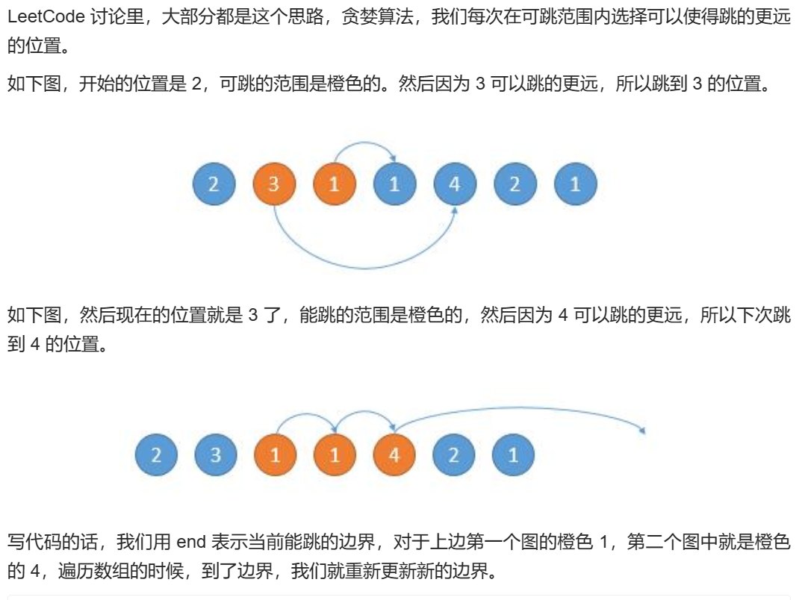

# 贪心专题

参考github：代码随想录

## 定义

通过局部最优解，找到全局最优解。并不会像dp问题有较强的规律。所以，先找到局部最优解。
贪心算法常见的题差不多20道，实在不行背一下吧，背熟了就是自己的了。（狗头保命）

## 分饼干

- 题目描述

假设你是一位很棒的家长，想要给你的孩子们一些小饼干。但是，每个孩子最多只能给一块饼干。

对每个孩子 i，都有一个胃口值 g[i]，这是能让孩子们满足胃口的饼干的最小尺寸；并且每块饼干 j，都有一个尺寸 s[j] 。如果 s[j] >= g[i]，我们可以将这个饼干 j 分配给孩子 i ，这个孩子会得到满足。你的目标是尽可能满足越多数量的孩子，并输出这个最大数值。

示例 1: 输入: g = [1,2,3], s = [1,1] 输出: 1 解释: 你有三个孩子和两块小饼干，3个孩子的胃口值分别是：1,2,3。 虽然你有两块小饼干，由于他们的尺寸都是1，你只能让胃口值是1的孩子满足。 所以你应该输出1。

示例 2: 输入: g = [1,2], s = [1,2,3] 输出: 2 解释: 你有两个孩子和三块小饼干，2个孩子的胃口值分别是1,2。 你拥有的饼干数量和尺寸都足以让所有孩子满足。 所以你应该输出2.

提示：

1 <= g.length <= 3 * 10^4
0 <= s.length <= 3 * 10^4
1 <= g[i], s[j] <= 2^31 - 1

- 思路分析：

因为要尽可能满足多的孩子，所以小饼干给小孩，大饼干给大孩子。
随意，第i块饼干当g[i]<=s[i]时候就可以分发。

```r
class Solution:
    def findContentChildren(self, g: List[int], s: List[int]) -> int:
        g.sort()
        s.sort()
        res = 0
        for i in range(len(s)):
            if res <len(g) and s[i] >= g[res]:  #小饼干先喂饱小胃口
                res += 1
        return res
```

提到分吃的，笔者果然更有感觉，吃货本质暴漏了

## 摆动序列

- 题目描述

如果连续数字之间的差严格地在正数和负数之间交替，则数字序列称为摆动序列。第一个差（如果存在的话）可能是正数或负数。少于两个元素的序列也是摆动序列。

例如， [1,7,4,9,2,5] 是一个摆动序列，因为差值 (6,-3,5,-7,3) 是正负交替出现的。相反, [1,4,7,2,5] 和 [1,7,4,5,5] 不是摆动序列，第一个序列是因为它的前两个差值都是正数，第二个序列是因为它的最后一个差值为零。

给定一个整数序列，返回作为摆动序列的最长子序列的长度。 通过从原始序列中删除一些（也可以不删除）元素来获得子序列，剩下的元素保持其原始顺序。

示例

输入: [1,17,5,10,13,15,10,5,16,8]
输出: 7
解释: 这个序列包含几个长度为 7 摆动序列，其中一个可为[1,17,10,13,10,16,8]。

- 解题思路

s表示前后两数之差

正负交替出现：说明前后s[i]\*s[i+1]<0,s[i-1]*s[i]<0

差值为0时不算摆动，记得跳过

```r
class Solution:
    def wiggleMaxLength(self, nums: List[int]) -> int:
        preC,curC,res = 0,0,1  #题目里nums长度大于等于1，当长度为1时，其实到不了for循环里去，所以不用考虑nums长度
        for i in range(len(nums) - 1):
            curC = nums[i + 1] - nums[i]
            if curC * preC <= 0 and curC !=0:  #差值为0时，不算摆动
                res += 1
                preC = curC  #如果当前差值和上一个差值为一正一负时，才需要用当前差值替代上一个差值
        return res
```

看完综上两道题，贪心算法告诉我们的道理就是别想太多。
另外一个常见的贪心就是计数问题，满足条件继续，不满足跳过继续

## 跳跃游戏一

- 题目描述

给定一个非负整数数组，你最初位于数组的第一个位置。

数组中的每个元素代表你在该位置可以跳跃的最大长度。

判断你是否能够到达最后一个位置。

示例 1: 输入: [2,3,1,1,4] 输出: true 解释: 我们可以先跳 1 步，从位置 0 到达 位置 1, 然后再从位置 1 跳 3 步到达最后一个位置。

示例 2: 输入: [3,2,1,0,4] 输出: false 解释: 无论怎样，你总会到达索引为 3 的位置。但该位置的最大跳跃长度是 0 ， 所以你永远不可能到达最后一个位置。

- 解题思路 

①假设当前能到达的最远位置为变量 max_position，并初始化为 0；
②遍历数组 nums 中的元素，如果当前能到达的最远位置大于等于当前位置 i，并且当前位置 i 加上其对应元素 jump 能够达到的位置超过 max_position，那么更新 max_position；
③如果当前能到达的最远位置变量 max_position 到不了当前位置 i ，直接返回 False 提前结束循环；如果当前能到达的最远位置变量 max_position 大于等于数组最远位置，直接返回 True 提前结束循环。

```r
def test(lis):
    max_position = 0
    length_lis = len(lis)
    for i in range(length_lis-1):
        max_cur = i + lis[i]
        if max_cur > max_position:
            max_position = max_cur
    if max_position >= (length_lis-1):
        return True
    return False
```

## 跳跃游戏二

进阶版

- 题目描述

给定一个非负整数数组，你最初位于数组的第一个位置。
数组中的每个元素代表你在该位置可以跳跃的最大长度。
你的目标是使用最少的跳跃次数到达数组的最后一个位置。

示例:
输入: [2,3,1,1,4]
输出: 2
解释: 
跳到最后一个位置的最小跳跃数是 2。
从下标为 0 跳到下标为 1 的位置，跳
1 步，然后跳 3 步到达数组的最
后一个位置。

- 解题思路
顺藤摸瓜



总结：每次找局部最优，最后达到全局最优

```r
class Solution:
    def jump(self, nums: List[int]) -> int:
        n, step, end, maxPosition = len(nums), 0, 0, 0
        for i in range(n-1):
            maxPosition = max(maxPosition, nums[i] + i)
            if i == end:
                end = maxPosition
                step += 1
        return step

```

理解的不是很好，多看几遍

## K次取反后最大化的数组和

- 题目描述

给定一个整数数组 A，我们只能用以下方法修改该数组：我们选择某个索引 i 并将 A[i] 替换为 -A[i]，然后总共重复这个过程 K 次。（我们可以多次选择同一个索引 i。）

以这种方式修改数组后，返回数组可能的最大和。

示例 1： 输入：A = [4,2,3], K = 1 输出：5 解释：选择索引 (1,) ，然后 A 变为 [4,-2,3]。

示例 2： 输入：A = [3,-1,0,2], K = 3 输出：6 解释：选择索引 (1, 2, 2) ，然后 A 变为 [3,1,0,2]。

示例 3： 输入：A = [2,-3,-1,5,-4], K = 2 输出：13 解释：选择索引 (1, 4) ，然后 A 变为 [2,3,-1,5,4]。

提示：

1 <= A.length <= 10000
1 <= K <= 10000
-100 <= A[i] <= 100

- 解题思路

挑正数绝对值小的，负数绝对值大的先反转
>
本题思路其实比较好想了，如何可以让数组和最大呢？
贪心的思路，局部最优：让绝对值大的负数变为正数，当前数值达到最大，整体最优：整个数组和达到最大。

局部最优可以推出全局最优。

那么如果将负数都转变为正数了，K依然大于0，此时的问题是一个有序正整数序列，如何转变K次正负，让 数组和达到最大。

那么又是一个贪心：局部最优：只找数值最小的正整数进行反转，当前数值可以达到最大（例如正整数数组{5, 3, 1}，反转1 得到-1 比 反转5得到的-5 大多了），全局最优：整个数组和达到最大。

那么本题的解题步骤为：

第一步：将数组按照绝对值大小从大到小排序，注意要按照绝对值的大小
第二步：从前向后遍历，遇到负数将其变为正数，同时K--
第三步：如果K还大于0，那么反复转变数值最小的元素，将K用完
第四步：求和

```r
class Solution:
    def largestSumAfterKNegations(self, A: List[int], K: int) -> int:
        A = sorted(A, key=abs, reverse=True) # 将A按绝对值从大到小排列
        for i in range(len(A)):
            if K > 0 and A[i] < 0:
                A[i] *= -1
                K -= 1
        if K > 0:
            A[-1] *= (-1)**K #取A最后一个数只需要写-1
        return sum(A)

```

- 原来sorted还可以按照绝对值进行排序，函数封装的不错

## 加油站

- 题目描述：

在一条环路上有 N 个加油站，其中第 i 个加油站有汽油 gas[i] 升。

你有一辆油箱容量无限的的汽车，从第 i 个加油站开往第 i+1 个加油站需要消耗汽油 cost[i] 升。你从其中的一个加油站出发，开始时油箱为空。

如果你可以绕环路行驶一周，则返回出发时加油站的编号，否则返回 -1。

说明: 

如果题目有解，该答案即为唯一答案。
输入数组均为非空数组，且长度相同。
输入数组中的元素均为非负数。
示例1：

输入：

gas = [1,2,3,4,5]

cost = [3,4,5,1,2]

输出：3

- 解题思路


如果总油量减去总消耗大于等于零那么一定可以跑完一圈，说明各个站点的加油站 剩油量rest[i]相加一定是大于等于零的。

每个加油站的剩余量rest[i]为gas[i] - cost[i]。

i从0开始累加rest[i]，和记为curSum，一旦curSum小于零，说明[0,i]区间都不能作为起始位置，起始位置从i+1算起，再从0计算curSum。

```r
class Solution:
    def canCompleteCircuit(self, gas: List[int], cost: List[int]) -> int:
        start = 0
        curSum = 0
        totalSum = 0
        for i in range(len(gas)):
            curSum += gas[i] - cost[i] # 剩余油量
            totalSum += gas[i] - cost[i]
            if curSum < 0:
                curSum = 0
                start = i + 1 # 重新开始计数 
        if totalSum < 0: return -1
        return start
```

## 分发糖果

- 题目描述

老师想给孩子们分发糖果，有 N 个孩子站成了一条直线，老师会根据每个孩子的表现，预先给他们评分。

你需要按照以下要求，帮助老师给这些孩子分发糖果：

每个孩子至少分配到 1 个糖果。
相邻的孩子中，评分高的孩子必须获得更多的糖果。
那么这样下来，老师至少需要准备多少颗糖果呢？

示例 1: 输入: [1,0,2] 输出: 5 解释: 你可以分别给这三个孩子分发 2、1、2 颗糖果。

示例 2: 输入: [1,2,2] 输出: 4 解释: 你可以分别给这三个孩子分发 1、2、1 颗糖果。 第三个孩子只得到 1 颗糖果，这已满足上述两个条件。

- 解题思路
 
 这道题目一定是要确定一边之后，再确定另一边，例如比较每一个孩子的左边，然后再比较右边，如果两边一起考虑一定会顾此失彼。

先确定右边评分大于左边的情况（也就是从前向后遍历）

此时局部最优：只要右得比左边孩子更多的糖果

局部最优可以推出全局最优。

如果ratings[i] > ratings[i - 1] 那么[i]的糖 一定要比[i - 1]的糖多一个，所以贪心：candyVec[i] = candyVec[i - 1] + 1

再确定左孩子大于右孩子的情况（从后向前遍历）

遍历顺序这里有同学可能会有疑问，为什么不能从前向后遍历呢？

因为如果从前向后遍历，根据 ratings[i + 1] 来确定 ratings[i] 对应的糖果，那么每次都不能利用上前一次的比较结果了。

所以确定左孩子大于右孩子的情况一定要从后向前遍历！

如果 ratings[i] > ratings[i + 1]，此时candyVec[i]（第i个小孩的糖果数量）就有两个选择了，一个是candyVec[i + 1] + 1（从右边这个加1得到的糖果数量），一个是candyVec[i]（之前比较右孩子大于左孩子得到的糖果数量）。

那么又要贪心了，局部最优：取candyVec[i + 1] + 1 和 candyVec[i] 最大的糖果数量，保证第i个小孩的糖果数量即大于左边的也大于右边的。全局最优：相邻的孩子中，评分高的孩子获得更多的糖果。

局部最优可以推出全局最优。

所以就取candyVec[i + 1] + 1 和 candyVec[i] 最大的糖果数量，candyVec[i]只有取最大的才能既保持对左边candyVec[i - 1]的糖果多，也比右边candyVec[i + 1]的糖果多。

```r
class Solution:
    def candy(self, ratings: List[int]) -> int:
        candyVec = [1] * len(ratings)
        for i in range(1, len(ratings)):
            if ratings[i] > ratings[i - 1]:
                candyVec[i] = candyVec[i - 1] + 1
        for j in range(len(ratings) - 2, -1, -1):
            if ratings[j] > ratings[j + 1]:
                candyVec[j] = max(candyVec[j], candyVec[j + 1] + 1)
        return sum(candyVec)
```

题本身不是难题，就是看看能否考虑清楚所有的可能性，没感觉有贪心的思想

## 柠檬水找零

- 题目描述
在柠檬水摊上，每一杯柠檬水的售价为 5 美元。

顾客排队购买你的产品，（按账单 bills 支付的顺序）一次购买一杯。

每位顾客只买一杯柠檬水，然后向你付 5 美元、10 美元或 20 美元。你必须给每个顾客正确找零，也就是说净交易是每位顾客向你支付 5 美元。

注意，一开始你手头没有任何零钱。

如果你能给每位顾客正确找零，返回 true ，否则返回 false 。

示例 1： 输入：[5,5,5,10,20] 输出：true 解释： 前 3 位顾客那里，我们按顺序收取 3 张 5 美元的钞票。 第 4 位顾客那里，我们收取一张 10 美元的钞票，并返还 5 美元。 第 5 位顾客那里，我们找还一张 10 美元的钞票和一张 5 美元的钞票。 由于所有客户都得到了正确的找零，所以我们输出 true。

示例 2： 输入：[5,5,10] 输出：true

示例 3： 输入：[10,10] 输出：false

示例 4： 输入：[5,5,10,10,20] 输出：false 解释： 前 2 位顾客那里，我们按顺序收取 2 张 5 美元的钞票。 对于接下来的 2 位顾客，我们收取一张 10 美元的钞票，然后返还 5 美元。 对于最后一位顾客，我们无法退回 15 美元，因为我们现在只有两张 10 美元的钞票。 由于不是每位顾客都得到了正确的找零，所以答案是 false。

提示：

0 <= bills.length <= 10000
bills[i] 不是 5 就是 10 或是 20 

- 解题思路

这是前几天的leetcode每日一题，感觉不错，给大家讲一下。

这道题目刚一看，可能会有点懵，这要怎么找零才能保证完整全部账单的找零呢？

但仔细一琢磨就会发现，可供我们做判断的空间非常少！

只需要维护三种金额的数量，5，10和20。

有如下三种情况：
如果顾客支付了 5 美元钞票，那么我们就得到 5 美元的钞票。
如果顾客支付了 10 美元钞票，我们必须找回一张 5 美元钞票。如果我们没有 5 美元的钞票，答案就是
false，因为我们无法正确找零。
如果顾客支付了 20 美元钞票，我们必须找回 15 美元。
如果我们有一张 10 美元和一张 5 美元，那么我们总会更愿意这样找零，这比用三张 5 美元进行找零更有利。
否则，如果我们有三张 5 美元的钞票，那么我们将这样找零。
否则，我们将无法给出总面值为 15 美元的零钱，答案是 false。


```r

class Solution:
    def lemonadeChange(self, bills: List[int]) -> bool:
        five, ten, twenty = 0, 0, 0
        for bill in bills:
            if bill == 5:
                five += 1
            elif bill == 10:
                if five < 1: return False
                five -= 1
                ten += 1
            else:
                if ten > 0 and five > 0:
                    ten -= 1
                    five -= 1
                    twenty += 1
                elif five > 2:
                    five -= 3
                    twenty += 1
                else:
                    return False
        return True

```

比较啰嗦的一个题,没意思

## 根据身高重排队列

- 题目描述

假设有打乱顺序的一群人站成一个队列。 每个人由一个整数对(h, k)表示，其中h是这个人的身高，k是排在这个人前面且身高大于或等于h的人数。 编写一个算法来重建这个队列。
注意：总人数少于1100人。
示例：

输入:
[[7,0], [4,4], [7,1], [5,0], [6,1], [5,2]]
输出:
[[5,0], [7,0], [5,2], [6,1], [4,4], [7,1]]

- 解题思路

先进行排序，对第一位降序，第二维升序。
再对其进行模拟，因为长得高的看不见长得矮的，所以先确定高的，同样的身高里面先确定前面需要的人数少的。

```r
class Solution:
    def reconstructQueue(self, people: List[List[int]]) -> List[List[int]]:
        people.sort(key=lambda x:(-x[0],x[1]))
        ans=[]
        for p in people:
            ans.insert(p[1],p)
        return ans
```

有点点难,sort是个好用的函数

## 无重叠区间

- 题目描述

给定一个区间的集合，找到需要移除区间的最小数量，使剩余区间互不重叠。

注意: 可以认为区间的终点总是大于它的起点。 区间 [1,2] 和 [2,3] 的边界相互“接触”，但没有相互重叠。

示例 1: 输入: [ [1,2], [2,3], [3,4], [1,3] ] 输出: 1 解释: 移除 [1,3] 后，剩下的区间没有重叠。

示例 2: 输入: [ [1,2], [1,2], [1,2] ] 输出: 2 解释: 你需要移除两个 [1,2] 来使剩下的区间没有重叠。

示例 3: 输入: [ [1,2], [2,3] ] 输出: 0 解释: 你不需要移除任何区间，因为它们已经是无重叠的了。

- 解题思路

参考 https://github.com/youngyangyang04/leetcode-master/blob/master/problems/0435.%E6%97%A0%E9%87%8D%E5%8F%A0%E5%8C%BA%E9%97%B4.md

```r
class Solution:
    def eraseOverlapIntervals(self, intervals: List[List[int]]) -> int:
        if len(intervals) == 0: return 0
        intervals.sort(key=lambda x: x[1])
        count = 1 # 记录非交叉区间的个数
        end = intervals[0][1] # 记录区间分割点
        for i in range(1, len(intervals)):
            if end <= intervals[i][0]:
                count += 1
                end = intervals[i][1]
        return len(intervals) - count
```


## 合并区间

- 题目：问题描述：

给出一个区间的集合，请合并所有重叠的区间。

示例 1:

输入: [[1,3],[2,6],[8,10],[15,18]] 输出: [[1,6],[8,10],[15,18]] 解释:
区间 [1,3] 和 [2,6] 重叠, 将它们合并为 [1,6]. 示例 2:

输入: [[1,4],[4,5]] 输出: [[1,5]] 解释: 区间 [1,4] 和 [4,5]
可被视为重叠区间。

**画个图就就懂了，而且今天发现一个问题，leetcode就是用代码解决小学数学应用题，而小学数学应用题是我的死穴**

核心：其实是贪心法的体现，关注于相邻的两个数组，那么就有两种情况，以[[1,3],[2,6],[8,10],[15,18]]为例。

先对二维数组按一维数组的第0位进行排序，假设结果是res=[]。

当res为空时先将[1,3]加入到res中，再遍历到[2,6]，此时有两种情况，如果当前数组的第0位大于res中最后一个数组的第1位，说明当前数组和res末尾的数组不会重叠，此时之间将当前数组加到res末尾。如果当前数组第0位小于或等于res末尾数组第1位，再判断当前数组第1位和res末尾数组第一位誰大，将其更新res末尾数组的第一位。依次类推。

``` {.r}
class Solution:
    def merge(self, intervals: List[List[int]]) -> List[List[int]]:
        res = []
        intervals.sort() # 没太理解这个操作的含义，我甚至觉得不加这个也可以
        for i in intervals:
            if not res or res[-1][1]<i[0]:
                res.append(i)
            else:
                res[-1][1] = max(res[-1][1],i[1])
        return res
        
```

[参考](https://www.cnblogs.com/xiximayou/p/12346966.html)

## 合并插入区间

问题描述：

给出一个无重叠的 ，按照区间起始端点排序的区间列表。

在列表中插入一个新的区间，你需要确保列表中的区间仍然有序且不重叠（如果有必要的话，可以合并区间）。

示例 1:

输入: intervals = [[1,3],[6,9]], newInterval = [2,5] 输出: [[1,5],[6,9]]
示例 2:

输入: intervals = [[1,2],[3,5],[6,7],[8,10],[12,16]], newInterval =
[4,8] 输出: [[1,2],[3,10],[12,16]] 解释: 这是因为新的区间 [4,8] 与
[3,5],[6,7],[8,10] 重叠。

``` {.r}
class Solution:
    def insert(self, intervals: List[List[int]], newInterval: List[int]) -> List[List[int]]:
        res = []
        intervals.append(newInterval)
        intervals.sort()
        for i in intervals:
            if not res or res[-1][1]<i[0]:
                res.append(i)
            else:
                res[-1][1]=max(res[-1][1],i[1])
        return res
```

[参考](https://www.cnblogs.com/xiximayou/p/12347243.html)


## 单调递增的数字

- 题目描述

给定一个非负整数 N，找出小于或等于 N 的最大的整数，同时这个整数需要满足其各个位数上的数字是单调递增。

（当且仅当每个相邻位数上的数字 x 和 y 满足 x <= y 时，我们称这个整数是单调递增的。）

示例 1: 输入: N = 10 输出: 9

示例 2: 输入: N = 1234 输出: 1234

示例 3: 输入: N = 332 输出: 299

说明: N 是在 [0, 10^9] 范围内的一个整数

- 解题思路

题目要求小于等于N的最大单调递增的整数，那么拿一个两位的数字来举例。

例如：98，一旦出现strNum[i - 1] > strNum[i]的情况（非单调递增），首先想让strNum[i - 1]--，然后strNum[i]给为9，这样这个整数就是89，即小于98的最大的单调递增整数。

这一点如果想清楚了，这道题就好办了。

局部最优：遇到strNum[i - 1] > strNum[i]的情况，让strNum[i - 1]--，然后strNum[i]给为9，可以保证这两位变成最大单调递增整数。

全局最优：得到小于等于N的最大单调递增的整数。

但这里局部最优推出全局最优，还需要其他条件，即遍历顺序，和标记从哪一位开始统一改成9。

此时是从前向后遍历还是从后向前遍历呢？

从前向后遍历的话，遇到strNum[i - 1] > strNum[i]的情况，让strNum[i - 1]减一，但此时如果strNum[i - 1]减一了，可能又小于strNum[i - 2]。

这么说有点抽象，举个例子，数字：332，从前向后遍历的话，那么就把变成了329，此时2又小于了第一位的3了，真正的结果应该是299。

所以从前后向遍历会改变已经遍历过的结果！

那么从后向前遍历，就可以重复利用上次比较得出的结果了，从后向前遍历332的数值变化为：332 -> 329 -> 299

确定了遍历顺序之后，那么此时局部最优就可以推出全局，找不出反例，试试贪心。

```r
class Solution:
    def monotoneIncreasingDigits(self, n: int) -> int:
        a = list(str(n))
        for i in range(len(a)-1,0,-1):
            if int(a[i]) < int(a[i-1]):
                a[i-1] = str(int(a[i-1]) - 1)
                a[i:] = '9' * (len(a) - i)  #python不需要设置flag值，直接按长度给9就好了
        return int("".join(a)) 
```

有点点难度


以上就是贪心常考的问题，但是笔者赶紧还是不太能摸到门路，代码就是很直白


