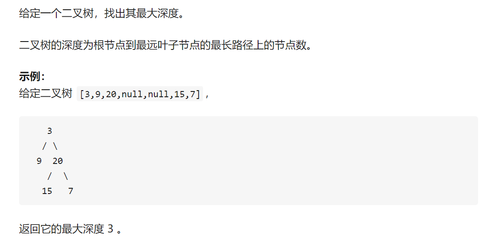
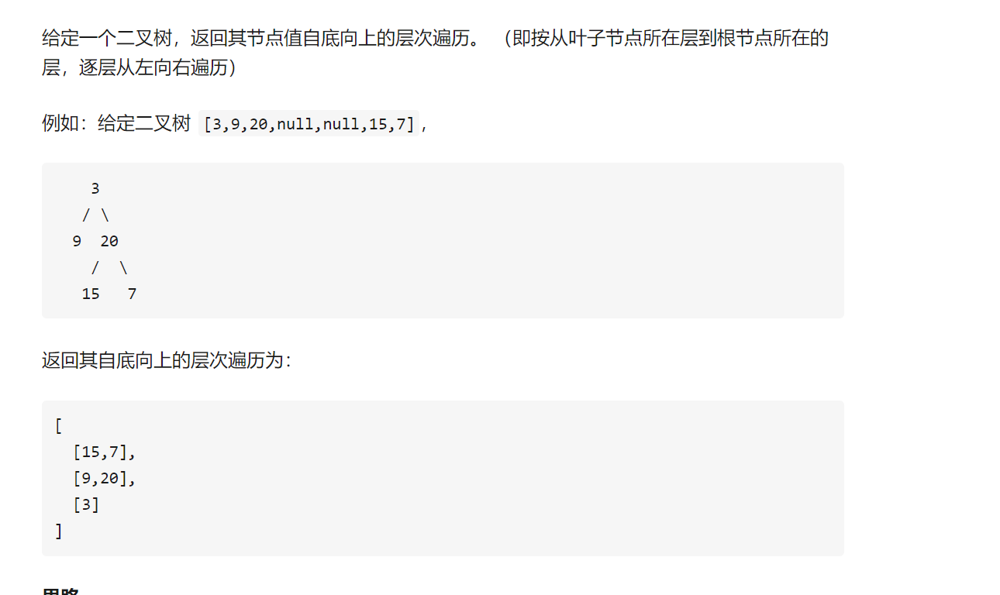
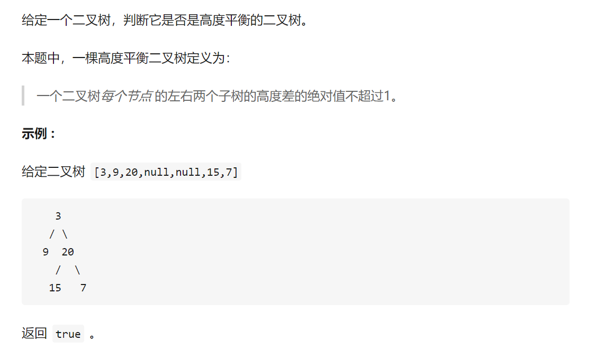

# 二叉树专题

- root.val是该节点的值。
- root则相当于指向该节点的指针。
- root.left, root.right指向其左右节点的位置

val=values
left,right就是位置

## 定义二叉树

二叉树节点的定义

```r

# Definition for a binary tree node.
class TreeNode(object):
    def __init__(self, x):
        self.val = x
        self.left = None
        self.right = None

```

二叉树是非常优秀的一种数据结构,其中word2vec底层等加速算法都是二叉树及其拓展

具体可以参考[知乎](https://zhuanlan.zhihu.com/p/63419145)


二叉树的考点主要分为一颗树上的遍历,树的深度,是否平衡等;多颗树的对比,算下来一共是20+的题.然而大部分的问题都可以用递归来解决.递归递归有递有归.

## 树的最大深度



```r
def maxDeath(node):
	if not node:
		return 0
	left = maxDeath(node.left)
	right = maxDeath(node.right)
	return max(left, right) + 1
```

## 树的最小深度

最小深度是从根节点到最近叶子节点的最短路径上的节点数量。

```r
class Solution(object):
    def minDepth(self, root):
       
        if root is None:
            return 0
        if root.left and root.right: # 左右节点都存在的时候
            return min(self.minDepth(root.left),self.minDepth(root.right))+1
        else:
            return max(self.minDepth(root.left),self.minDepth(root.right))+1 #根节点只有一个节点的时候
```

## 二叉树中节点的个数

这里是全部的节点的个数,根节点和叶子节点的总和

```r
def numOfTreeNode(root):
	if not root:
		return 0
	left = numOfTreeNode(root.left)
	right = numOfTreeNode(root.right)
	return left + right + 1

```

## 二叉树的叶子节点的个数

叶子节点的个数,那就直接剪掉根节点那一个就好了,但是如果只有一个根节点,那该根节点也是叶子节点(这种情况容易忘)

```r

ef numsOfNoChildNode(root):
	if not root:
		return 0
	if not root.left and not root.right:
		return 1
	return numsOfNoChildNode(root.left)+numsOfNoChildNode(root.right)
```

## 二叉树第k层节点的个数

```r
def numsOfkLevelTreeNode(root, k):
	if (not root) or k < 1:
		return 0
	if k == 1:
		return 1
	numsLeft = numsOfkLevelTreeNode(root.left, k-1)
	numsRight = numsOfkLevelTreeNode(root.right, k-1)
	return numsLeft + numsRight

```

## 二叉树的层次遍历



**也叫二叉树的广度优先搜索~**

要知道层次遍历的本质是在考**队列**:其思路就是将二叉树的节点加入队列，出队的同时将其非空左右孩子依次入队，出队到队列为空即完成遍历。

```r
# -*- coding:utf-8 -*-
# class TreeNode:
#     def __init__(self, x):
#         self.val = x
#         self.left = None
#         self.right = None
class Solution:
    # 返回从上到下每个节点值列表，例：[1,2,3]
    def PrintFromTopToBottom(self, root):
        # write code here
        outList=[]
        queue=[root]
        while queue!=[] and root:
            outList.append(queue[0].val)
            if queue[0].left!=None:
                queue.append(queue[0].left)
            if queue[0].right!=None:
                queue.append(queue[0].right)
            queue.pop(0)
        return outList
```

## 二叉树的前序遍历

*前序:*跟-左-右
*中序:*左-根-右
*后序:*左-右-根

以上三种是深度优先搜索,一般用到的是栈

**层次遍历:**广度有限搜索,一般用到的是队列

```r
class TreeNode:
    def __init__(self, x):
        self.val = x
        self.left = None
        self.right = None
class Solution:
    #前序
    def preorder(self,root,ans=[]):
        if root!=None:
            ans.append(root.val)
        if root.left:
            self.preorder(root.left,ans)
        if root.right:
            self.preorder(root.right,ans)
        return ans
```

## 二叉树的中序遍历

给定一个二叉树，返回它的中序 遍历。

示例:

输入: [1,null,2,3]
   1
    \
     2
    /
   3

输出: [1,3,2]


```r
# Definition for a binary tree node.
# class TreeNode:
#     def __init__(self, x):
#         self.val = x
#         self.left = None
#         self.right = None

class Solution:
    def inorderTraversal(self, root: TreeNode) -> List[int]:
        if root == None: 如果节点不存在
            return []
        left = self.inorderTraversal(root.left)
        right = self.inorderTraversal(root.right)
        return left + [root.val] + right #输出的时候把顺序变一下子

```

## 二叉树的后序遍历


```r
class TreeNode:
    def __init__(self, x):
        self.val = x
        self.left = None
        self.right = None
    def postorder(self,root,ans=[]):
        if root.left:
            self.postorder(root.left,ans)
        if root.right:
            self.postorder(root.right,ans)
        ans.append(root.val)
        return ans
        
```

**二叉树遍历小节**


参考[【作者：821218213】](https://leetcode-cn.com/problems/binary-tree-inorder-traversal/solution/python3-er-cha-shu-suo-you-bian-li-mo-ban-ji-zhi-s/)

```r
# Definition for a binary tree node.
# class TreeNode:
#     def __init__(self, x):
#         self.val = x
#         self.left = None
#         self.right = None


# 递归
# 时间复杂度：O(n)，n为节点数，访问每个节点恰好一次。
# 空间复杂度：空间复杂度：O(h)，h为树的高度。最坏情况下需要空间O(n)，平均情况为O(logn)


# 递归1：二叉树遍历最易理解和实现版本
class Solution:
    def preorderTraversal(self, root: TreeNode) -> List[int]:
        if not root:
            return []
        # 前序递归
        return [root.val] + self.preorderTraversal(root.left) + self.preorderTraversal(root.right)
        # # 中序递归 
        # return self.inorderTraversal(root.left) + [root.val] + self.inorderTraversal(root.right)
        # # 后序递归
        # return self.postorderTraversal(root.left) + self.postorderTraversal(root.right) + [root.val]

# 递归2：通用模板，可以适应不同的题目，添加参数、增加返回条件、修改进入递归条件、自定义返回值
class Solution:
    def preorderTraversal(self, root: TreeNode) -> List[int]:
        def dfs(cur):
            if not cur:
                return      
            # 前序递归
            res.append(cur.val)
            dfs(cur.left)
            dfs(cur.right) 
            
            # # 中序递归
            # dfs(cur.left)
            # res.append(cur.val)
            # dfs(cur.right)
            
            # # 后序递归
            # dfs(cur.left)
            # dfs(cur.right)
            # res.append(cur.val)      
        res = []
        dfs(root)
        return res

```

## 二叉树遍历迭代法

```r
# 时间复杂度：O(n)，n为节点数，访问每个节点恰好一次。
# 空间复杂度：O(h)，h为树的高度。取决于树的结构，最坏情况存储整棵树，即O(n)


# 层序遍历最常用模板
class Solution:
    def levelOrder(self, root: TreeNode) -> List[List[int]]:
        if not root:
            return []
        cur, res = [root], []
        while cur:
            lay, layval = [], []
            for node in cur:
                layval.append(node.val)
                if node.left: lay.append(node.left)
                if node.right: lay.append(node.right)
            cur = lay
            res.append(layval)
        return res
        
# 前、中、后序遍历通用模板,考察栈的
class Solution:
    def preorderTraversal(self, root: TreeNode) -> List[int]:
        if not root:
            return []        
        res = []
        stack = [root]
        # # 前序迭代模板：最常用的二叉树DFS迭代遍历模板(栈是后进先出,注意压入栈的顺序,先压入右孩子，再压入左孩子)
        while stack:
            cur = stack.pop()
            res.append(cur.val)
            if cur.right:
                stack.append(cur.right)
            if cur.left:
                stack.append(cur.left)
        return res
        # # 后序迭代，相同模板：将前序迭代进栈顺序稍作修改，最后得到的结果反转
        # 先压栈顺序按照来左孩子-右孩子-根节点压栈,这样最后结果 取相反就是后序遍历
        # while stack:
        #     cur = stack.pop()
        #     if cur.left:
        #         stack.append(cur.left)
        #     if cur.right:
        #         stack.append(cur.right)
        #     res.append(cur.val)
        # return res[::-1]
```

## 前序遍历和中序遍历构造二叉树

注意：已知前序和后序无法确定二叉树

已知一棵树:假设没有重复元素
前序遍历 preorder = [3,9,20,15,7]
中序遍历 inorder = [9,3,15,20,7]


根据前序和中序,可以还原出来二叉树

```r
    3
   / \
  9  20
    /  \
   15   7

```

>
在这个例子当中，前序遍历 preorder 的第一个元素 3 即是根节点，再看中序遍历， inorder 中 3 的左边 [9] 即是左子树，而右边 [15, 20, 7] 即是右子树。根据这个思路，就能构造出完整的二叉树。
这里说下具体的思路：
- 首先找到根节点（依据：前序遍历顺序，先遍历根节点）
- 构建根节点的左子树（依据：中序遍历，根节点的左侧为左子树）
- 构建根节点的右子树（依据：中序遍历，根节点的右侧为右子树）
题目中，有个提示：【假设树中没有重复的元素】。依据这个提示，我们在前序遍历中找到的根节点元素，可根据元素值在中序遍历中定位它的位置。[「&quot;大梦三千秋」](https://blog.csdn.net/weixin_45642918/article/details/106282599)

根据观察到的规律直接用递归，画个图就有规律了

```r
class Solution(object):
	def buildTree(self, preorder, inorder):
		if not (preorder and inorder):
			return None
		# 根据前序数组的第一个元素，就可以确定根节点	
		root = TreeNode(preorder[0])
		# 用preorder[0]去中序数组中查找对应的元素
		mid_idx = inorder.index(preorder[0])
		# 递归的处理前序数组的左边部分和中序数组的左边部分
		# 递归处理前序数组右边部分和中序数组右边部分
		root.left = self.buildTree(preorder[1:mid_idx+1],inorder[:mid_idx])
		root.right = self.buildTree(preorder[mid_idx+1:],inorder[mid_idx+1:])
		return root

```

## 对称二叉树

>首先判断头结点是否为空。然后**将根节点的左右两个节点假设成两个独立的树**，如果左右两个树都为空，返回True。然后看左子树的左结点和右子树的右结点、左子树的右结点和右子树的左结点是否相同，都相同返回True.

```r
class Solution(object):
    def isSymmetric(self, root):

        if root is None:
            return True
        return self.isSymmetricTree(root.left,root.right)
    def isSymmetricTree(self,left,right):
        if left is None and right is None:
            return True
        if left is None or right is None or left.val != right.val:
            return False
        return self.isSymmetricTree(left.left,right.right) and self.isSymmetricTree(left.right,right.left)
```

## 判断是否是完全二叉树

什么是完全二叉树:若设二叉树的深度为k，除第 k 层外，其它各层 (1～k-1) 的结点数都达到最大个数，第k 层所有的结点都连续集中在最左边，这就是完全二叉树。


```r
```

## 最低公共祖先

```r
class Solution(object):
    def lowestCommonAncestor(self, root, p, q):
        """
        :type root: TreeNode
        :type p: TreeNode
        :type q: TreeNode
        :rtype: TreeNode
        """
        if not root:
            return None
        if q == root or p == root: # 如果找到了某一个点 则当前节点为答案
            return root
        left = self.lowestCommonAncestor(root.left, p, q)
        right = self.lowestCommonAncestor(root.right, p, q)
        if left and right: # 如果左子树中可以找到其公共祖先 右子树也可以 则说明当前节点就是答案
            return root
        if not left: # 左边找不到了 那就是右子树的答案
            return right
        elif not right: # 右边亦然
            return left
```

## 判断是否是二叉搜索树

什么是二叉搜索树
>给定一个二叉树，判断其是否是一个有效的二叉搜索树。

假设一个二叉搜索树具有如下特征：

节点的左子树只包含小于当前节点的数。
节点的右子树只包含大于当前节点的数。
所有左子树和右子树自身必须也是二叉搜索树。

```r
示例1:

输入:
    2
   / \
  1   3
输出: true
示例2:

输入:
   5
  / \
  1  4
    / \
   3   6
输出: false
解释: 输入为: [5,1,4,null,null,3,6]。
    根节点的值为 5 ，但是其右子节点值为 4 。


```

>思路简单：将中序遍历的值一个个存入一个list中。理解二叉搜索树后，明白二叉搜索树中序遍历后是个递增序列。最后判断list是否为一个递增序列即可。

二叉树的中序遍历是一个递增的序列

```r
class Solution:
    def isValidBST(self, root):
        
        def BFS(root, left, right):
            if root is None:# 判断根节点是否存在
                return True
            
            if left < root.val < right: # 左节点的值小于根节点小于右子树
                return BFS(root.left, left, root.val) and BFS(root.right, root.val, right)
            else:
                return False

        return BFS(root, -float('inf'), float('inf'))

```

## 路径总和问题

- 路径总和1

题目描述:


不会解题的时候相递归


```r
class Solution(object):
    def hasPathSum(self, root, sum):
        if root is None:
            return False
        if root.left is None and root.right is None and root.val==sum:
            return True
        else:
            return self.hasPathSum(root.left,sum-root.val) or self.hasPathSum(root.right,sum-root.val)
```

- 路径总和2


利用递归，当root为None时，返回False，当root的值等于sum且root为叶节点时，返回true，如果不相等，往下递归，只要左子树和右子树有一条路径即可返回True

这个代码的思路非常巧妙，nice
```r
class Solution(object):
    def pathSum(self, root, sum):
        """
        :type root: TreeNode
        :type sum: int
        :rtype: int
        """
        if not root:
            return 0
        return self.pathSumFrom(root, sum) + self.pathSum(root.left, sum) + self.pathSum(root.right, sum)

    def pathSumFrom(self, node, sum):
        if not node:
            return 0
        return (1 if node.val == sum else 0) + self.pathSumFrom(node.left, sum - node.val) + self.pathSumFrom(node.right, sum - node.val) 
        
```

## 平衡二叉树



**一个高度平衡二叉树是指一个二叉树每个节点 的左右两个子树的高度差的绝对值小于1。**

```r
class Solution(object):
    def isBalanced(self, root):

        if root == None:
            return True
        elif abs(self.height(root.left)-self.height(root.right))>1: #高度的绝对值之差大于1，不平衡
            return False
        else:
            return self.isBalanced(root.left) and self.isBalanced(root.right)
    
    def height(self,root): #判断是否为平衡
        if root == None:
            return 0
        else:
            return max(self.height(root.left),self.height(root.right))+ 1
```

## 翻转二叉树


```r
class Solution(object):
    def invertTree(self, root):

        if root is not None:
            root.left,root.right = self.invertTree(root.right),self.invertTree(root.left)
        return root
```
