# leetcode_hot_100

## 两数之和


给定一个整数数组 nums 和一个目标值 target，请你在该数组中找出和为目标值的那 两个 整数，并返回他们的数组下标。
你可以假设每种输入只会对应一个答案。但是，你不能重复利用这个数组中同样的元素。

示例:

给定 nums = [2, 7, 11, 15], target = 9
因为 nums[0] + nums[1] = 2 + 7 = 9
所以返回 [0, 1]

```r

class Solution(object):

# 定义twoSum方法，接收两个参数，一个整数类型的列表nums和一个整数类型的target，返回一个整数类型的列表
def twoSum(self, nums: List[int], target: int) -> List[int]:
    
    # 初始化一个字典records
    records = dict()

    # 使用enumerate函数遍历列表nums中所有元素（value），得到对应下标（index）
    for index, value in enumerate(nums):
        
        # 对于当前元素（value），在records字典中查找是否存在匹配的key（即差值），如果存在，就返回对应键和当前下标构成的列表
        if target - value in records:
            return [records[target- value], index]
        
        # 如果未找到匹配的key，将该元素作为一个新key添加到字典records中，并将其下标作为对应的value进行存储
        records[value] = index

    # 如果整个循环结束后仍未找到满足条件的元素，则返回一个空列表
    return []

```

## 字母异位词分组

给你一个字符串数组，请你将 字母异位词 组合在一起。可以按任意顺序返回结果列表。

字母异位词 是由重新排列源单词的字母得到的一个新单词，所有源单词中的字母通常恰好只用一次。


示例 1:

输入: strs = ["eat", "tea", "tan", "ate", "nat", "bat"]
输出: [["bat"],["nat","tan"],["ate","eat","tea"]]
示例 2:

输入: strs = [""]
输出: [[""]]
示例 3:

输入: strs = ["a"]
输出: [["a"]]

**解题思路**：此处撰写解题思路 对列表元素做排序处理，这样相同元素字符串就一样了。 遍历把排序字符当键，原元素当值加入列表。 在结合判断就轻松搞定了，细节看代码[一不小心](https://leetcode.cn/problems/group-anagrams/solutions/868383/zi-dian-gao-ding-hao-li-jie-dai-ma-duan-qitb3/)

```r
class Solution:

# 定义groupAnagrams方法，接收一个字符串类型的列表strs作为参数，并返回另一个字符串类型的列表
def groupAnagrams(self, strs: List[str]) -> List[List[str]]:

    # 初始化一个字典r
    r = {}

    # 遍历字符串列表strs中的每一个元素
    for i in strs:
        
        # 将该元素进行排序并组合生成一个新字符串s
        s = ''.join(sorted(i))
        
        # 如果新生成的字符串s不存在于字典r的键中，就将该元素转化为字典r的一个新键，对应值是仅该元素的单一列表
        if s not in r:
            r[s] = [i]
        
        # 如果新生成的字符串s已经在字典r的键中存在，那么就将这个元素添加到与该键相关联的列表中
        else:
            r[s].append(i)
    
    # 将字典r中的值以列表形式提取出来，返回结果
    return [v for v in r.values()]

```

## 最长连续序列

**题目描述：**
给定一个未排序的整数数组 nums ，找出数字连续的最长序列（不要求序列元素在原数组中连续）的长度。

请你设计并实现时间复杂度为 O(n) 的算法解决此问题。

 

示例 1：

输入：nums = [100,4,200,1,3,2]
输出：4
解释：最长数字连续序列是 [1, 2, 3, 4]。它的长度为 4。
示例 2：

输入：nums = [0,3,7,2,5,8,4,6,0,1]
输出：9
 
 
**解题思路**:先对nums进行排序，这样连续的子序列肯定会挨在一起，互相摩擦~ 特殊情况：空数组直接返回0，因为它太寂寞，和我一样。 可以看出，该问题明显满足所谓的最优子结构与子问题重叠，相互交!叉![Faye Wong]
(https://leetcode.cn/problems/longest-consecutive-sequence/solutions/1402682/dong-tai-gui-hua-dp-by-fayewong6-ta79/)

```r
class Solution:
    def longestConsecutive(self, nums: List[int]) -> int:
        if not nums:return 0
        nums.sort()
        dp=[1]*len(nums)#初始化，最短的连续子序列长度也就为1，就是单个数
        for i in range(1,len(nums)):
            if nums[i]-nums[i-1]==1:#如果前后正好相差一，就是连续的，就在前面的基础上长度加1
                dp[i]=dp[i-1]+1
            elif nums[i]==nums[i-1]:#如果发现和前面的值相同，那我们把这个长度保持住，以便后续
                dp[i]=dp[i-1]#遇到连续子序列继续加1
        return max(dp)#返回最大的长度

```

## 移动零

给定一个数组 nums，编写一个函数将所有 0 移动到数组的末尾，同时保持非零元素的相对顺序。

请注意 ，必须在不复制数组的情况下原地对数组进行操作。

 

示例 1:

输入: nums = [0,1,0,3,12]
输出: [1,3,12,0,0]
示例 2:

输入: nums = [0]
输出: [0]

解题思路：双指针[在下小芳 🌸]
(https://leetcode.cn/problems/move-zeroes/solutions/1692862/hao-li-jie-de-shuagn-zhi-shen-by-wo-shi-zvkwm/)

和某个链表题很相似

```r
class Solution:
    def moveZeroes(self, nums: List[int]) -> None:
        """
        Do not return anything, modify nums in-place instead.
        """
        slow, fast = 0, 0
        while fast < len(nums):
            if nums[fast] != 0:
                nums[slow], nums[fast] = nums[fast], nums[slow]
                slow += 1
            fast += 1
        return nums
```

## 三数之和

题目描述
给你一个整数数组 nums ，判断是否存在三元组 [nums[i], nums[j], nums[k]] 满足 i != j、i != k 且 j != k ，同时还满足 nums[i] + nums[j] + nums[k] == 0 。请

你返回所有和为 0 且不重复的三元组。

注意：答案中不可以包含重复的三元组。

 

 

示例 1：

输入：nums = [-1,0,1,2,-1,-4]
输出：[[-1,-1,2],[-1,0,1]]
解释：
nums[0] + nums[1] + nums[2] = (-1) + 0 + 1 = 0 。
nums[1] + nums[2] + nums[4] = 0 + 1 + (-1) = 0 。
nums[0] + nums[3] + nums[4] = (-1) + 2 + (-1) = 0 。
不同的三元组是 [-1,0,1] 和 [-1,-1,2] 。
注意，输出的顺序和三元组的顺序并不重要。
示例 2：

输入：nums = [0,1,1]
输出：[]
解释：唯一可能的三元组和不为 0 。
示例 3：

输入：nums = [0,0,0]
输出：[[0,0,0]]
解释：唯一可能的三元组和为 0 。


**解题思路**：双指针+牌学
但是要特别注意边界值

```r
class Solution:
    def threeSum(self, nums: List[int]) -> List[List[int]]:
        
        n=len(nums)
        res=[]
        if(not nums or n<3):
            return []
        nums.sort()
        res=[]
        for i in range(n):
            if(nums[i]>0):
                return res
            if(i>0 and nums[i]==nums[i-1]): # 注意这个边界值判断，为什么是nums[i]==nums[i-1]而不是nums[i]==nums[i+1]，会丢解
                continue
            L=i+1
            R=n-1
            while(L<R):
                if(nums[i]+nums[L]+nums[R]==0):
                    res.append([nums[i],nums[L],nums[R]])
                    while(L<R and nums[L]==nums[L+1]):
                        L=L+1
                    while(L<R and nums[R]==nums[R-1]):
                        R=R-1
                    L=L+1
                    R=R-1
                elif(nums[i]+nums[L]+nums[R]>0):
                    R=R-1
                else:
                    L=L+1
        return res

```

## 盛水最多的容器

给定一个长度为 n 的整数数组 height 。有 n 条垂线，第 i 条线的两个端点是 (i, 0) 和 (i, height[i]) 。

找出其中的两条线，使得它们与 x 轴共同构成的容器可以容纳最多的水。

返回容器可以储存的最大水量。

说明：你不能倾斜容器。

示例 1：
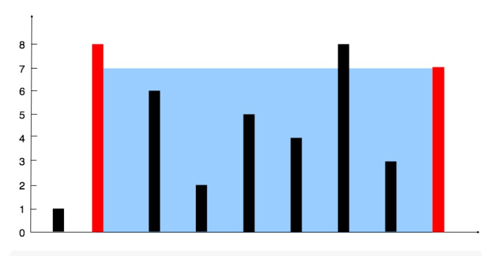

输入：[1,8,6,2,5,4,8,3,7]
输出：49 
解释：图中垂直线代表输入数组 [1,8,6,2,5,4,8,3,7]。在此情况下，容器能够容纳水（表示为蓝色部分）的最大值为 49。
示例 2：

输入：height = [1,1]
输出：1

**解题思路**：
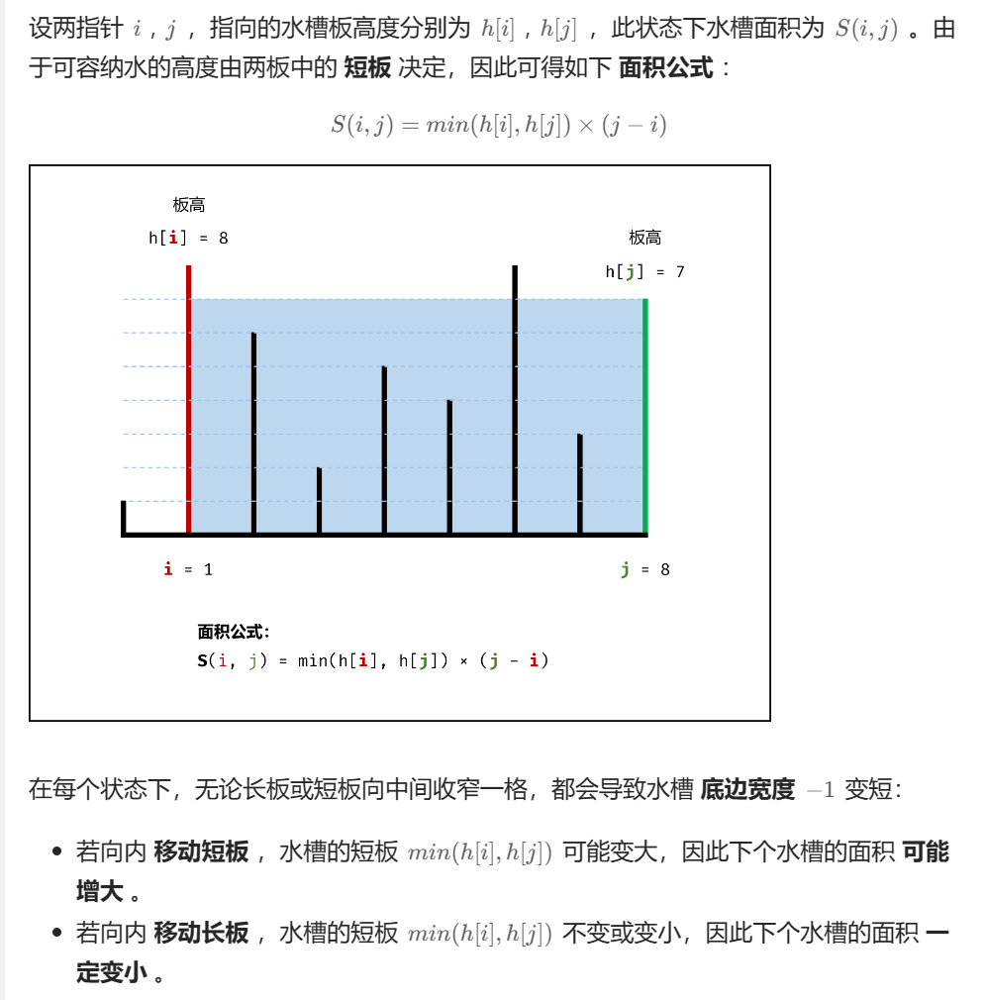
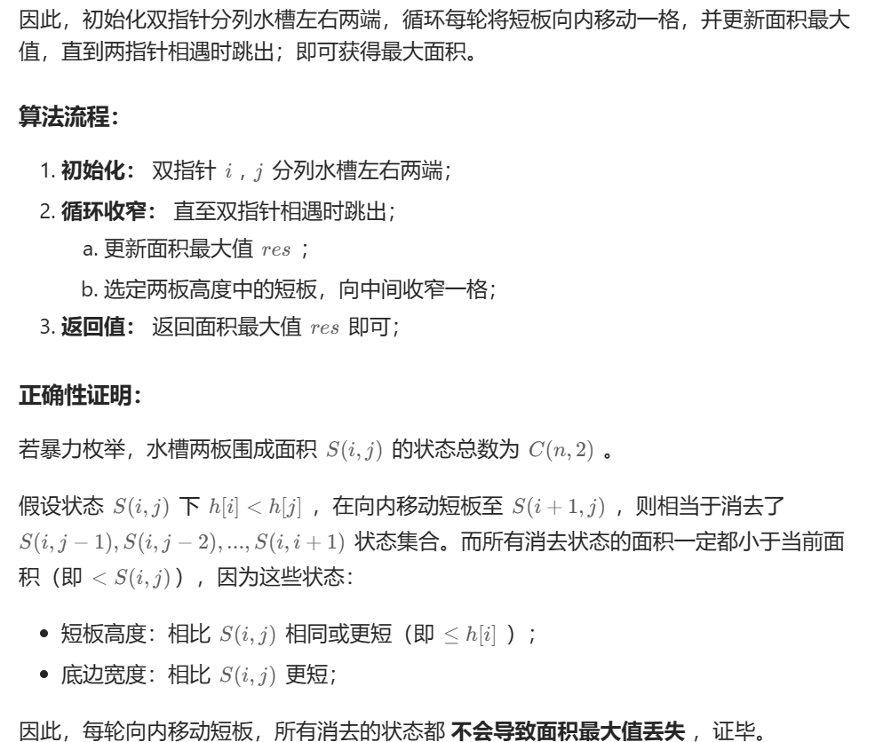


```r
class Solution:
    def maxArea(self, height: List[int]) -> int:
        i, j, res = 0, len(height) - 1, 0
        while i < j:
            if height[i] < height[j]:
                res = max(res, height[i] * (j - i))
                i += 1
            else:
                res = max(res, height[j] * (j - i))
                j -= 1
        return res
```

## 接雨水

hard题

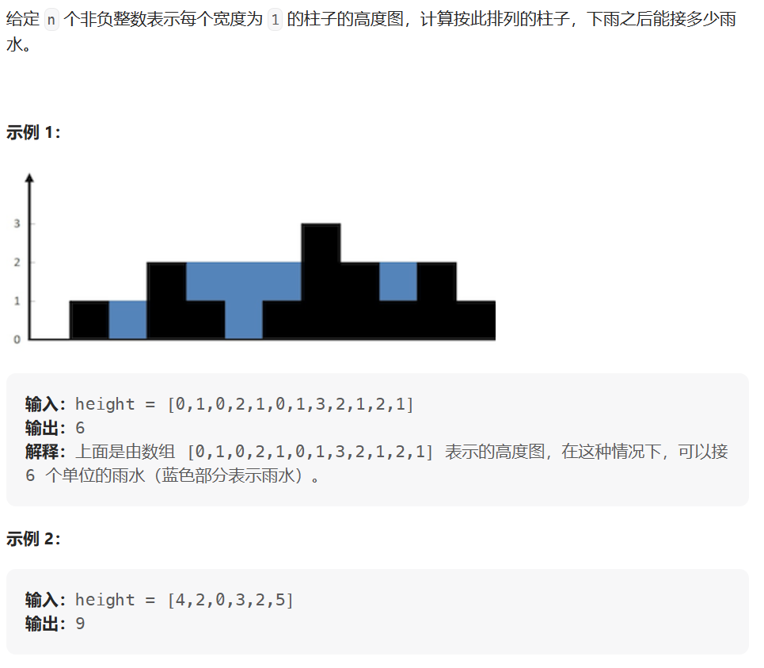

解题思路：单调栈（单调递减栈），双指针，动态规划

遍历的是下标

```r
class Solution(object):
    # 定义trap方法，接收一个整数列表类型的参数height，并返回一个整数类型的结果
    def trap(self, height: List[int]) -> int:
        # 初始化变量res（记录蓄水池的面积）和stack（存储元素下标），并使用for循环遍历height中的每个元素
        res = 0
        stack = []
        for i in range(len(height)):
            # 如果当前stack不为空，并且当前元素大于stack末尾元素所对应的高度
            while stack and height[i]>height[stack[-1]]:
                # 弹出stack末尾元素
                cur=stack.pop()
                # 判断弹出该元素后是否还有至少一个元素在stack中
                if not stack:
                    break
                # 计算当前弹出元素与新栈顶元素之间的蓄水池面积，并将结果累加到res中
                h=min(height[i],height[stack[-1]]) - height[cur]
                res += (i-stack[-1]-1)*h

            # 将当前元素的下标添加到stack中
            stack.append(i)

        # 返回计算得到的蓄水池面积res
        return res
```


## 无重复的最长字串


题目描述：

给定一个字符串 s ，请你找出其中不含有重复字符的 最长子串 的长度。

 
示例 1:

输入: s = "abcabcbb"
输出: 3 
解释: 因为无重复字符的最长子串是 "abc"，所以其长度为 3。
示例 2:

输入: s = "bbbbb"
输出: 1
解释: 因为无重复字符的最长子串是 "b"，所以其长度为 1。
示例 3:

输入: s = "pwwkew"
输出: 3
解释: 因为无重复字符的最长子串是 "wke"，所以其长度为 3。
     请注意，你的答案必须是 子串 的长度，"pwke" 是一个子序列，不是子串。
     

解题思路：滑动窗口

其实就是一个队列,比如例题中的 abcabcbb，进入这个队列（窗口）为 abc 满足题目要求，当再进入 a，队列变成了 abca，这时候不满足要求。所以，我们要移动这个队列！

如何移动？

我们只要把队列的左边的元素移出就行了，直到满足题目要求！

一直维持这样的队列，找出队列出现最长的长度时候，求出解！

时间复杂度：O(n)[powcai](https://leetcode.cn/problems/longest-substring-without-repeating-characters/solutions/3982/hua-dong-chuang-kou-by-powcai/)


```r

class Solution:
    def lengthOfLongestSubstring(self, s: str) -> int:
        if not s:
          return 0
        max_len = 0        # 最大长度
        tp = []                 # 放字符串的一个队列    
        for a in s:
            while a in tp:
                del tp[0]           # 删除队列左边第一个，直到没有重复的字符串
            tp.append(a)       
            if len(tp) > max_len: max_len = len(tp)
        return max_len

```

## 找到字符串中所有字母异位词

题目描述

给定两个字符串 s 和 p，找到 s 中所有 p 的 异位词 的子串，返回这些子串的起始索引。不考虑答案输出的顺序。

异位词 指由相同字母重排列形成的字符串（包括相同的字符串）。


示例 1:

输入: s = "cbaebabacd", p = "abc"
输出: [0,6]
解释:
起始索引等于 0 的子串是 "cba", 它是 "abc" 的异位词。
起始索引等于 6 的子串是 "bac", 它是 "abc" 的异位词。
 示例 2:

输入: s = "abab", p = "ab"
输出: [0,1,2]
解释:
起始索引等于 0 的子串是 "ab", 它是 "ab" 的异位词。
起始索引等于 1 的子串是 "ba", 它是 "ab" 的异位词。
起始索引等于 2 的子串是 "ab", 它是 "ab" 的异位词。


个人感觉这个也是hard题

```r
class Solution:
    def findAnagrams(self, s: str, p: str) -> List[int]:
        n,m = len(s),len(p)
        res = [] 
        #设置两个数组，分别用来记录字符串s和字符串p中子母的出现个数
        #需要注意的是，这两个数组的索引分别对应着当前字符与字符a的ASCII码的差
        s_count = [0] * 26
        p_count = [0] * 26

        for i in range(m):
            #统计p字符串，例如p=‘abc'，此时p_count=[1,1,1,0,0...]
            p_count[ord(p[i]) - ord('a')] += 1
        
        #采用滑动窗口的方式，遍历s
        #需要注意的是：left，right表示的是在字符串s中的索引；cur_left,cur_right表示的是字符串s中索引为left和right的字符在数组中的索引。
        left = 0
        for right in range(n):
            #边遍历字符串s，边更新s_count
            cur_right = ord(s[right]) - ord('a')
            s_count[cur_right] += 1
            #当我们发现数量不对时(可以简单理解为滑动窗口大小>固定窗口大小了，此时需要移动左窗口，在这里是一个道理)
            while s_count[cur_right] > p_count[cur_right]:
                cur_left = ord(s[left]) - ord('a')
                s_count[cur_left] -= 1
                left += 1
            #如果我们发现数量正好，则满足异位词的条件，将左窗口位置加入结果列表即可
            if right - left + 1 == m:
                res.append(left)
        return res
```

## 和为k的子数组

题目描述

给你一个整数数组 nums 和一个整数 k ，请你统计并返回 该数组中和为 k 的连续子数组的个数 。

 

示例 1：

输入：nums = [1,1,1], k = 2
输出：2
示例 2：

输入：nums = [1,2,3], k = 3
输出：2

**解题思路**
前缀和
什么是前缀和：前缀和指一个数组的某下标之前的所有数组元素的和（包含其自身）
通常，会在前缀和首位放一个0。比如数组[1,2,3][1,2,3][1,2,3]。其前缀和是[0,1,3,6][0,1,3,6][0,1,3,6]

前缀和通常可以帮助我们快速计算某个区间内的和。比如我们要算 $i, j$ 之间的和， $n u m s[i]+n u m s[i+1]+\cdots+n u m s[j]$ 。他可以看作是 $n u m s[0]+n u m s[1]+\cdots$ nums $[i]+n u m s[i+1]+\cdots+n u m s[j]$ 减去 $n u m s[0]+n u m s[1]+\cdots+n u m s[i-1$ 式子也是 $\operatorname{preSum}[j]-\operatorname{preSum}[i-1]$ 。
不过这种解法的时间复杂度还是On2

```r
class Solution:
    def subarraySum(self, nums: List[int], k: int) -> int:
        # 要求的连续子数组
        count = 0
        n = len(nums)

        preSum = [0]

        # 求前缀和数组
        tmp = 0
        for i in range(n):
            tmp += nums[i]
            preSum.append(tmp)
        
        # 求和为k的连续子数组，求i到j之间的和
        for i in range(1, n+1):
            for j in range(i, n+1):
                if preSum[j] - preSum[i-1] == k:  # preSum[j] - preSum[i-1]代表着在nums数组中，前j个数之和减去前i-1个数之和
                    count += 1
        
        return count
```

因此需要进行优化
进一步优化的话，我们可以边算前缀和，边统计。遍历过程中，我们统计历史中每一个前缀和出现的个数，然后计算到 $i$ 位置 (含 $i$ ) 的前缀和 presum减去目标 $k$ 在历史上出现过几次，假如出现过 $m$ 次，代表第 $i$ 位以前 (不含 $i$ ) 有 $m$ 个连续子数组的和为 presum $-k$，这 $m$ 个和为 presum $-k$ 的连续子数组，每一个都可以和 presum 组合成为 presum $($ presum $-k)=k$。[无穷升高的卡农](https://leetcode.cn/problems/subarray-sum-equals-k/solutions/1447027/python3-by-wu-qiong-sheng-gao-de-qia-non-w6jw/)


```r

class Solution:
    def subarraySum(self, nums: List[int], k: int) -> int:
        # 要求的连续子数组
        count = 0
        n = len(nums)
        preSums = collections.defaultdict(int) #创建了一个默认字典(defaultdict)对象preSums，它的值全都初始化为0。
        preSums[0] = 1

        presum = 0
        for i in range(n):
            presum += nums[i]
            
            # if preSums[presum - k] != 0:
            count += preSums[presum - k]   # 利用defaultdict的特性，当presum-k不存在时，返回的是0。这样避免了判断

            preSums[presum] += 1  # 给前缀和为presum的个数加1
            
        return count
```


## 滑动窗口最大值

给你一个整数数组 nums，有一个大小为 k 的滑动窗口从数组的最左侧移动到数组的最右侧。你只可以看到在滑动窗口内的 k 个数字。滑动窗口每次只向右移动一位。

返回 滑动窗口中的最大值 。

 
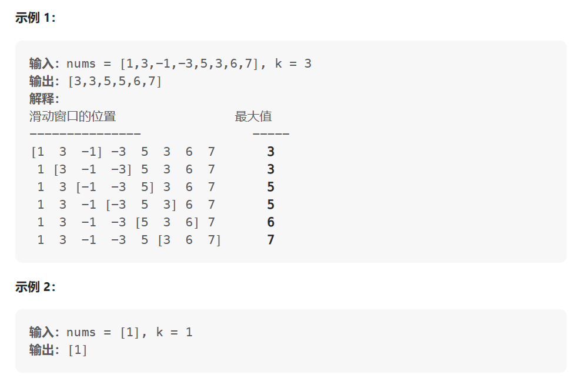

解题思路
实际上就是一个一维的最大池化，

代码参考：[编程文青李狗蛋](https://leetcode.cn/problems/sliding-window-maximum/solutions/1212012/acm-xuan-shou-tu-jie-leetcode-hua-dong-c-i3wj/)


```r
class Solution:
    def maxSlidingWindow(self, nums: List[int], k: int) -> List[int]:

        # 如果数组为空或 k = 0，直接返回空
        if not nums or not k:
            return []
        # 如果数组只有1个元素，直接返回该元素
        if len(nums) == 1:
            return [nums[0]]

        # 初始化队列和结果，队列存储数组的下标
        queue = []
        res = []

        for i in range(len(nums)):
            # 如果当前队列最左侧存储的下标等于 i-k 的值，代表目前队列已满。
            # 但是新元素需要进来，所以列表最左侧的下标出队列
            if queue and queue[0] == i - k:
                queue.pop(0)

            # 对于新进入的元素，如果队列前面的数比它小，那么前面的都出队列
            while queue and nums[queue[-1]] < nums[i]:
                queue.pop()
            # 新元素入队列
            queue.append(i)

            # 当前的大值加入到结果数组中
            if i >= k-1:
                res.append(nums[queue[0]])

        return res


```

## 最小覆盖字串

给你一个字符串 s 、一个字符串 t 。返回 s 中涵盖 t 所有字符的最小子串。如果 s 中不存在涵盖 t 所有字符的子串，则返回空字符串 "" 。
注意：
对于 t 中重复字符，我们寻找的子字符串中该字符数量必须不少于 t 中该字符数量。
如果 s 中存在这样的子串，我们保证它是唯一的答案。
示例 1：

输入：s = "ADOBECODEBANC", t = "ABC"
输出："BANC"
解释：最小覆盖子串 "BANC" 包含来自字符串 t 的 'A'、'B' 和 'C'。
示例 2：

输入：s = "a", t = "a"
输出："a"
解释：整个字符串 s 是最小覆盖子串。
示例 3:

输入: s = "a", t = "aa"
输出: ""
解释: t 中两个字符 'a' 均应包含在 s 的子串中，
因此没有符合条件的子字符串，返回空字符串。

hard题

解法一

```r
class Solution:
    def minWindow(self, s: str, t: str) -> str:
        need = collections.defaultdict(int)
        for c in t:
            need[c] += 1
        needCnt = len(t)
        i = 0 #记录起始位置
        res = (0, float('inf'))  #用两个元素，方便之后记录起终点
        #三步骤：
        #1. 增加右边界使滑窗包含t
        for j,c in enumerate(s):
            if need[c] >0:
                needCnt -= 1
            need[c] -= 1 #这行放在外面不可以，看19行 need[c] == 0
        #2. 收缩左边界直到无法再去掉元素   !注意，处理的是i
            if needCnt == 0:
                while True:
                    c = s[i]
                    if need[c] == 0: #表示再去掉就不行了(need>0)
                        break
                    else:
                        need[c] += 1
                        i += 1
                if j-i < res[1] - res[0]:  #这里是否减一都可以，只要每次都是这样算的就行，反正最后也是输出子串而非长度
                    res = (i,j)
        #3. i多增加一个位置，准备开始下一次循环(注意这步是在 needCnt == 0里面进行的 )
                need[s[i]] += 1
                needCnt += 1    #由于 移动前i这个位置 一定是所需的字母，因此NeedCnt才需要+1
                i += 1
        return "" if res[1]>len(s) else s[res[0]: res[1]+1]

```

解法二
```r
class Solution:
    def minWindow(self, s: 'str', t: 'str') -> 'str':
        from collections import Counter
        t = Counter(t)
        lookup = Counter()
        start = end = 0
        min_len = float("inf")
        res = ""
        while end < len(s):
            lookup[s[end]] += 1
            end += 1
            while all(map(lambda x: lookup[x] >= t[x], t.keys())):
                if end - start < min_len:
                    res = s[start:end]
                    min_len = end - start
                lookup[s[start]] -= 1
                start += 1
        return res

```

## 最大子数组和

给你一个整数数组 nums ，请你找出一个具有最大和的连续子数组（子数组最少包含一个元素），返回其最大和。

子数组 是数组中的一个连续部分。

 

示例 1：

输入：nums = [-2,1,-3,4,-1,2,1,-5,4]
输出：6
解释：连续子数组 [4,-1,2,1] 的和最大，为 6 。
示例 2：

输入：nums = [1]
输出：1
示例 3：

输入：nums = [5,4,-1,7,8]
输出：23

解题思路：比较经典的动态规划

```r
from typing import List
class Solution:
    def maxSubArray(self, nums: List[int]) -> int:
        size = len(nums)
        pre = 0
        res = nums[0]
        for i in range(size):
            pre = max(nums[i], pre + nums[i])
            res = max(res, pre)
        return res

```

## 合并区间


题目描述
以数组 intervals 表示若干个区间的集合，其中单个区间为 intervals[i] = [starti, endi] 。请你合并所有重叠的区间，并返回 一个不重叠的区间数组，该数组需恰好覆盖输入中的所有区间 。

示例 1：

输入：intervals = [[1,3],[2,6],[8,10],[15,18]]
输出：[[1,6],[8,10],[15,18]]
解释：区间 [1,3] 和 [2,6] 重叠, 将它们合并为 [1,6].
示例 2：

输入：intervals = [[1,4],[4,5]]
输出：[[1,5]]
解释：区间 [1,4] 和 [4,5] 可被视为重叠区间。

**画个图就就懂了，而且今天发现一个问题，leetcode就是用代码解决小学数学应用题，而小学数学应用题是我的死穴**

核心：其实是贪心法的体现，关注于相邻的两个数组，那么就有两种情况，以[[1,3],[2,6],[8,10],[15,18]]为例。

先对二维数组按一维数组的第0位进行排序，假设结果是res=[]。

当res为空时先将[1,3]加入到res中，再遍历到[2,6]，此时有两种情况，如果当前数组的第0位大于res中最后一个数组的第1位，说明当前数组和res末尾的数组不会重叠，此时之间将当前数组加到res末尾。如果当前数组第0位小于或等于res末尾数组第1位，再判断当前数组第1位和res末尾数组第一位誰大，将其更新res末尾数组的第一位。依次类推。

```r
class Solution:
    def merge(self, intervals: List[List[int]]) -> List[List[int]]:
        res = []
        intervals.sort() # 没太理解这个操作的含义，我甚至觉得不加这个也可以
        for i in intervals:
            if not res or res[-1][1]<i[0]:
                res.append(i)
            else:
                res[-1][1] = max(res[-1][1],i[1])
        return res
```

## 轮转数组

给定一个整数数组 nums，将数组中的元素向右轮转 k 个位置，其中 k 是非负数。

示例 1:

输入: nums = [1,2,3,4,5,6,7], k = 3
输出: [5,6,7,1,2,3,4]
解释:
向右轮转 1 步: [7,1,2,3,4,5,6]
向右轮转 2 步: [6,7,1,2,3,4,5]
向右轮转 3 步: [5,6,7,1,2,3,4]
示例 2:

输入：nums = [-1,-100,3,99], k = 2
输出：[3,99,-1,-100]
解释: 
向右轮转 1 步: [99,-1,-100,3]
向右轮转 2 步: [3,99,-1,-100]

```r
arr=[1,2,3,4,5,6,7]
def xz(nums,k):
    return nums[k:]+nums[:k]

print(xz(arr,3))
```

## 除自身以外数组的乘积

给你一个整数数组 nums，返回 数组 answer ，其中 answer[i] 等于 nums 中除 nums[i] 之外其余各元素的乘积 。

题目数据 保证 数组 nums之中任意元素的全部前缀元素和后缀的乘积都在  32 位 整数范围内。

请不要使用除法，且在 O(n) 时间复杂度内完成此题。

 

示例 1:

输入: nums = [1,2,3,4]
输出: [24,12,8,6]
示例 2:

输入: nums = [-1,1,0,-3,3]
输出: [0,0,9,0,0]

暴力解法

```r
class Solution:
    def productExceptSelf(self, nums: List[int]) -> List[int]:
        ans = []
        for i in range(len(nums)):
            sum = 1
            for j in nums[:i] + nums[i + 1:]:
                sum = sum * j
            ans.append(sum)
        return ans

```

前缀乘积+后缀乘积

```r
class Solution:
    def productExceptSelf(self, nums: List[int]) -> List[int]:
        n = len(nums)
        ans = [0] * n
        ans[0] = 1
        # 记录前缀乘积
        for i in range(1, n):
            ans[i] = ans[i - 1] * nums[i - 1]
        # r是后缀初始值
        r = 1
        for i in range(n - 1, -1, -1):
            ans[i] = ans[i] * r
            # r是后缀乘积
            r = r * nums[i]
        return ans
```


## 缺失的第一个正数

给你一个未排序的整数数组 nums ，请你找出其中没有出现的最小的正整数。

请你实现时间复杂度为 O(n) 并且只使用常数级别额外空间的解决方案。
 

示例 1：

输入：nums = [1,2,0]
输出：3
示例 2：

输入：nums = [3,4,-1,1]
输出：2
示例 3：

输入：nums = [7,8,9,11,12]
输出：1

解题思路

当忽略时间复杂度,比较简单

```r
class Solution:
    def firstMissingPositive(self, nums: List[int]) -> int:
        num=1
        nums.sort()
        for v in nums:
            if num==v:
                num+=1
        return num

```

实际想考察hash

```r
class Solution:
    def firstMissingPositive(self, nums: List[int]) -> int:
        for a in nums: #遍历每个座位，记当前坐着a号乘客
            while 0<a<=len(nums) and a!=nums[a-1]:  #乘客a是正票但坐错了! 其座位被 ta=nums[a-1]占了
                nums[a-1], a = a, nums[a - 1]  # a和ta两人互换则a对号入座。此后ta相当于新的a，去找自己的座位（循环执行）
        for i in range(len(nums)):
            if i+1!=nums[i]:return i+1  #找到首个没有对号入座的nums[i]!=i+1
        return len(nums)+1  #满座，返回N+1
        
```

## 矩阵置零

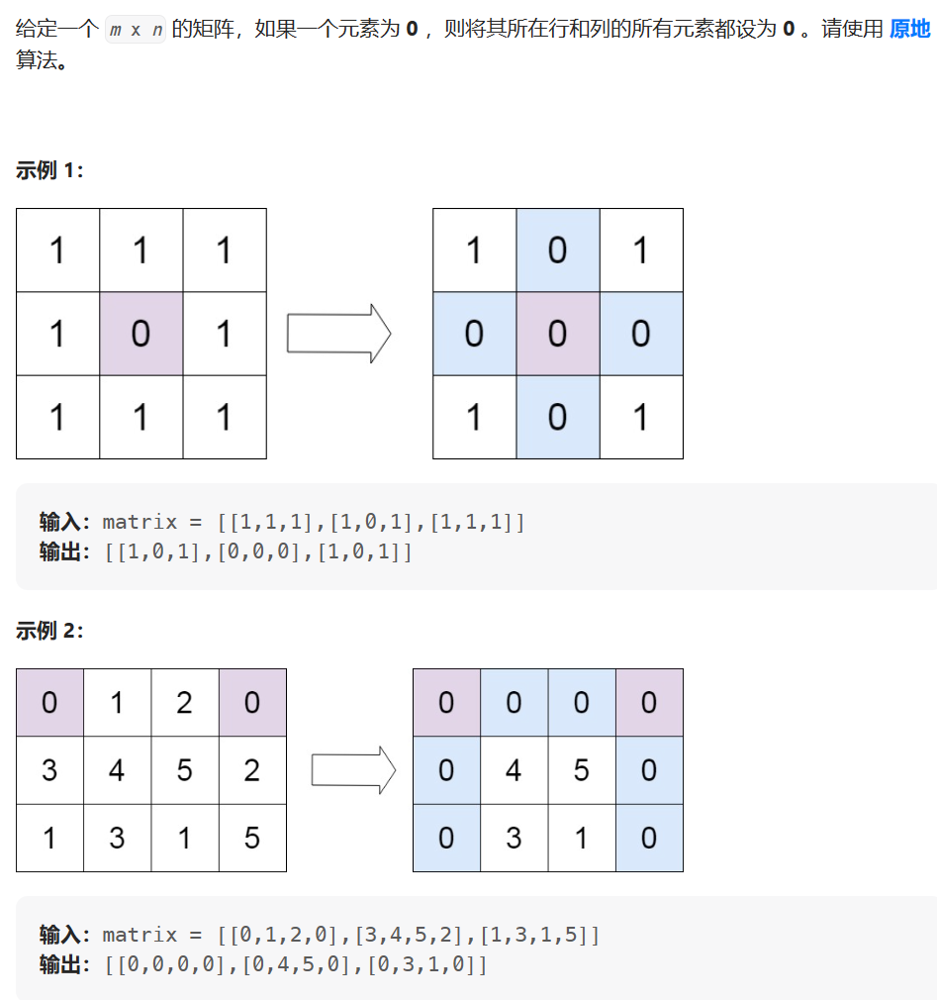


解题思路

思路一: 用 O(m+n)额外空间

两遍扫matrix,第一遍用集合记录哪些行,哪些列有0;第二遍置0


思路二: 用O(1)空间

关键思想: 用matrix第一行和第一列记录该行该列是否有0,作为标志位

但是对于第一行,和第一列要设置一个标志位,为了防止自己这一行(一列)也有0的情况.注释写在代码里,直接看代码很好理解

```r
class Solution:
    def setZeroes(self, matrix: List[List[int]]) -> None:
        """
        Do not return anything, modify matrix in-place instead.
        """
        row = len(matrix)
        col = len(matrix[0])
        row_zero = set()
        col_zero = set()
        for i in range(row):
            for j in range(col):
                if matrix[i][j] == 0:
                    row_zero.add(i)
                    col_zero.add(j)
        for i in range(row):
            for j in range(col):
                if i in row_zero or j in col_zero:
                    matrix[i][j] = 0

```

```r
class Solution:
    def setZeroes(self, matrix: List[List[int]]) -> None:
        """
        Do not return anything, modify matrix in-place instead.
        """
        flag_col = False
        row = len(matrix)
        col = len(matrix[0])
        for i in range(row):
            if matrix[i][0] == 0: flag_col = True
            for j in range(1,col):
                if matrix[i][j] == 0:
                    matrix[i][0] = matrix[0][j] = 0
        
        for i in range(row - 1, -1, -1):
            for j in range(col - 1, 0, -1):
                if matrix[i][0] == 0 or matrix[0][j] == 0:
                    matrix[i][j] = 0

            if flag_col == True: matrix[i][0] = 0

```

## 螺旋矩阵

给你一个 m 行 n 列的矩阵 matrix ，请按照 顺时针螺旋顺序 ，返回矩阵中的所有元素。

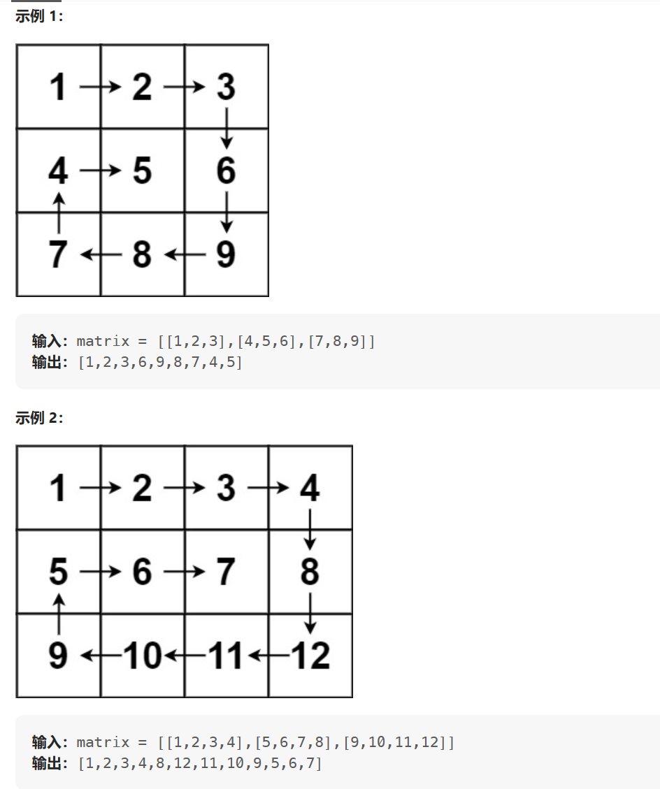


解题思路

思路一：大佬思路[这么水可不行](https://leetcode.cn/problems/spiral-matrix/solutions/2057738/python-zip-by-zhuzhzzz-tk7a/)

```r
def spiralOrder(self, matrix: List[List[int]]) -> List[int]:
        res = []
        while matrix:
            # 削头（第一层）
            res += matrix.pop(0)
            # 将剩下的逆时针转九十度，等待下次被削
            matrix = list(zip(*matrix))[::-1]
        return res
```

zip函数不常用，把中间结果展示出来


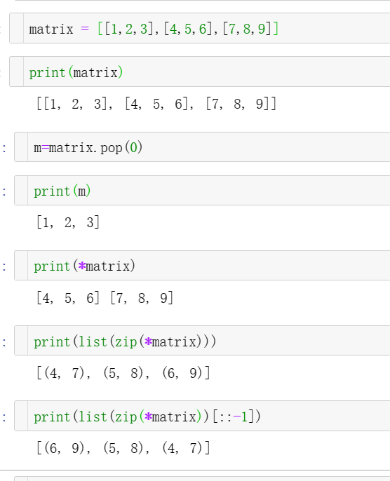

思路二：递归

```r
class Solution:
    def spiralOrder(self, matrix: List[List[int]]) -> List[int]:
        if not matrix or not matrix[0]:
            return list()
        
        rows, columns = len(matrix), len(matrix[0])
        order = list()
        left, right, top, bottom = 0, columns - 1, 0, rows - 1
        while left <= right and top <= bottom:
            for column in range(left, right + 1):
                order.append(matrix[top][column])
            for row in range(top + 1, bottom + 1):
                order.append(matrix[row][right])
            if left < right and top < bottom:
                for column in range(right - 1, left, -1):
                    order.append(matrix[bottom][column])
                for row in range(bottom, top, -1):
                    order.append(matrix[row][left])
            left, right, top, bottom = left + 1, right - 1, top + 1, bottom - 1
        return order

```

## 旋转图像

给定一个 n × n 的二维矩阵 matrix 表示一个图像。请你将图像顺时针旋转 90 度。

你必须在 原地 旋转图像，这意味着你需要直接修改输入的二维矩阵。请不要 使用另一个矩阵来旋转图像。

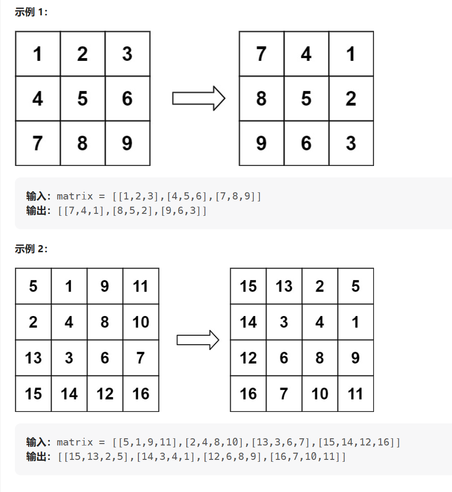

解题思路，和螺旋矩阵解题思路很相似，一旦涉及到顺时针旋转，考虑zip和矩阵倒叙 

```r
class Solution:
    def rotate(self, matrix: List[List[int]]) -> None:
        """
        Do not return anything, modify matrix in-place instead.
        """
        matrix[:] =[list(tup)[::-1] for tup in zip(*matrix)]
            
```

## 搜索二维矩阵

编写一个高效的算法来搜索 m x n 矩阵 matrix 中的一个目标值 target 。该矩阵具有以下特性：

每行的元素从左到右升序排列。
每列的元素从上到下升序排列。 

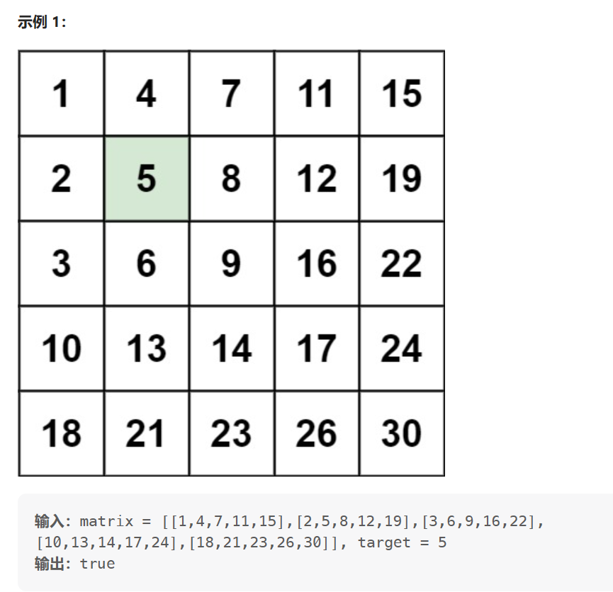
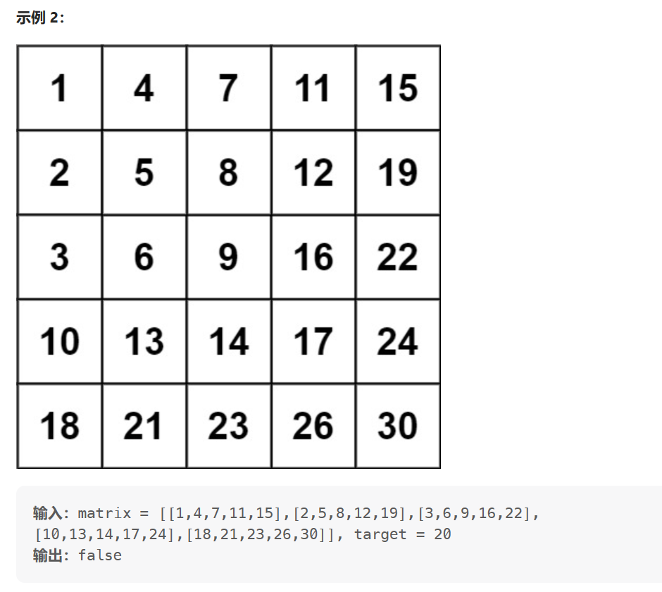

解题思路

对每一行分别用二分查找:[Awesome Kapitsa2xl](https://leetcode.cn/problems/search-a-2d-matrix-ii/solutions/2266833/di-yi-chong-bi-jiao-jian-dan-de-si-lu-du-wvtr/)

```r
class Solution(object):
    def searchMatrix(self, matrix, target):
        """
        :type matrix: List[List[int]]
        :type target: int
        :rtype: bool
        """
        m  = len(matrix) # 行数
        n = len(matrix[0]) # 列数
        if m==0 or n==0:
            return False
        
        for i in range(m):
            if matrix[i][0]>target:
                break
            if matrix[i][n-1]<target:
                continue
            flage = self.binarySearch(matrix[i],target)
            if flage!=-1:
                return True
        return False

    def binarySearch(self, num,target):
        l = 0
        r = len(num)-1
        while l<=r:
            mid = (l+r)//2
            if target<num[mid]:
                r = mid-1
            elif target>num[mid]:
                l = mid+1
            else:
                return mid
        return -1
```

## 链表专项

- [链表](https://gaowenxin95.github.io/leetcode-cookbook/analysis/链表问题.html)

### LRU

### 复制带随机指针的链表


## 二叉树专项

- [二叉树](https://gaowenxin95.github.io/leetcode-cookbook/二叉树专题.html)


