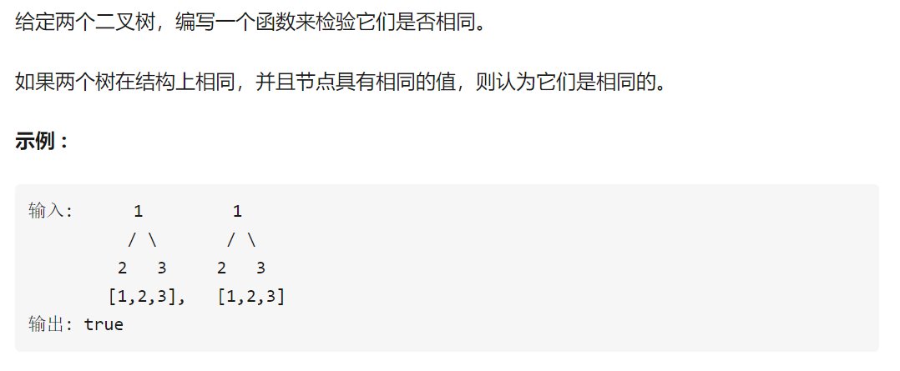
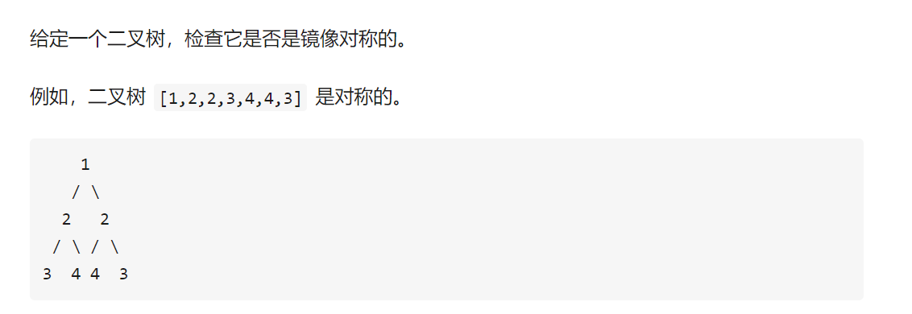
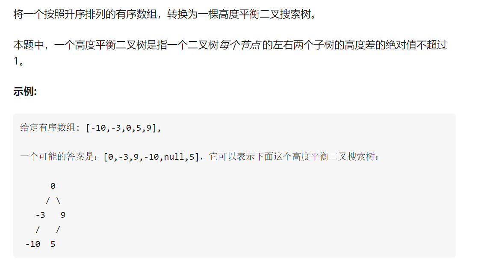

懵逼树上懵逼果，懵逼树下只有我。。。
一直寻找一个合适的leetcode的刷题顺序，不少大佬都推荐从二叉树开始刷。一开始心里是发怵的，从之前的发怵经验来看，所有事情都有一个从0到1的过程。第一遍感觉挺懵逼的，所以打算来第二遍，这一次我一定会放慢速度，好好理解的。


- root.val是该节点的值。
- root则相当于指向该节点的指针。
- root.left, root.right指向其左右节点的位置

val=values
left,right就是位置

二叉树节点的定义

```r

# Definition for a binary tree node.
class TreeNode(object):
    def __init__(self, x):
        self.val = x
        self.left = None
        self.right = None

```


还是得结合二叉树主要解决了什么实际的问题

树为啥这么好用？


[知乎](https://zhuanlan.zhihu.com/p/63419145)

### 相同的树问题



判断两个树是否为相同的树

解题思路：两个树的结构相同，节点相同则相同,或者都为空也相同
递归
假入有2棵树p,q

```r
class Solution(object):
    def isSameTree(self, p, q):

        if p is None and q is None:
            return True
        if p is not None and q is not None:
            return p.val==q.val and self.isSameTree(p.left,q.left) and self.isSameTree(p.right,q.right)
        return False
```

### 对称二叉树



>首先判断头结点是否为空。然后**将根节点的左右两个节点假设成两个独立的树**，如果左右两个树都为空，返回True。然后看左子树的左结点和右子树的右结点、左子树的右结点和右子树的左结点是否相同，都相同返回True.

```r
class Solution(object):
    def isSymmetric(self, root):

        if root is None:
            return True
        return self.isSymmetricTree(root.left,root.right)
    def isSymmetricTree(self,left,right):
        if left is None and right is None:
            return True
        if left is None or right is None or left.val != right.val:
            return False
        return self.isSymmetricTree(left.left,right.right) and self.isSymmetricTree(left.right,right.left)
```

### 二叉树的最大深度


二叉树的深度为根节点到最远叶子节点的最长路径上的节点数。

```r
class Solution(object):
    def maxDepth(self, root):

        if root is None:
            return 0
        else:
            return max(self.maxDepth(root.left),self.maxDepth(root.right))+1
```

### 二叉树的最小深度

最小深度是从根节点到最近叶子节点的最短路径上的节点数量。

```r
class Solution(object):
    def minDepth(self, root):
       
        if root is None:
            return 0
        if root.left and root.right:
            return min(self.minDepth(root.left),self.minDepth(root.right))+1
        else:
            return max(self.minDepth(root.left),self.minDepth(root.right))+1 #根节点只有一个节点的时候
```

### 二叉树的层次遍历


给定一个二叉树，返回其节点值自底向上的层次遍历。（即按从叶子节点所在层到根节点所在的层，逐层从左向右遍历）

定义两个数组，一个level的，一个level装节点的

```r
class Solution(object):
    def levelOrderBottom(self, root):

        if root is None: #根节点不为空
            return []
        
        result,current = [],[root] #当前节点在root
        
        while current:
            next_level,vals = [], []
            for node in current:
                vals.append(node.val)
                if node.left:
                    next_level.append(node.left)
                if node.right:
                    next_level.append(node.right)
            current = next_level
            result.append(vals)
        return result[::-1] #从低向上
```


### 序数组转化为二叉树



转换为二叉搜索树


**取有序数组的中间节点作为根节点，将数组分为左右两个部分，对左右两个子数组做相同的操作，递归的实现**。暴力取中间节点为root：递归实现

```r
class Solution:
    def sortedArrayToBST(self, nums: List[int]) -> TreeNode:
        if nums:
            m = len(nums) // 2 中间节点为根节点
            r = TreeNode(nums[m])
            r.left, r.right = map(self.sortedArrayToBST, [nums[:m], nums[m+1:]])
            return r
```

### 平衡二叉树


**一个高度平衡二叉树是指一个二叉树每个节点 的左右两个子树的高度差的绝对值小于1。**

```r
class Solution(object):
    def isBalanced(self, root):

        if root == None:
            return True
        elif abs(self.height(root.left)-self.height(root.right))>1: #高度的绝对值之差大于1，不平衡
            return False
        else:
            return self.isBalanced(root.left) and self.isBalanced(root.right)
    
    def height(self,root): #判断是否为平衡
        if root == None:
            return 0
        else:
            return max(self.height(root.left),self.height(root.right))+ 1
```

### 路径总和一


给定一个二叉树和一个目标和，判断该树中是否存在根节点到叶子节点的路径，这条路径上所有节点值相加等于目标和。

**从上到下加起来，最后一个节点的值就等于sum-前面的和，且这个节点是叶子节点。**

```r
class Solution(object):
    def hasPathSum(self, root, sum):
       
        if root is None:
            return False
        if root.left is None and root.right is None and root.val==sum:
            return True
        else:
            return self.hasPathSum(root.left,sum-root.val) or self.hasPathSum(root.right,sum-root.val)
```

### 翻转二叉树


镜面对换

那就是交换左右节点喽

```r
class Solution(object):
    def invertTree(self, root):

        if root is not None:
            root.left,root.right = self.invertTree(root.right),self.invertTree(root.left)
        return root
```

### 公共祖先

二叉搜索树的最近公共祖先

这个不太明白。。

哦哦哦，这是确定了树，按照此题分析就好了，哈哈，看树的结构，左子树均小于根节点的值，右子树均大于根节点的值


```r
# Definition for a binary tree node.
# class TreeNode(object):
#     def __init__(self, x):
#         self.val = x
#         self.left = None
#         self.right = None

class Solution(object):
    def lowestCommonAncestor(self, root, p, q):
        """
        :type root: TreeNode
        :type p: TreeNode
        :type q: TreeNode
        :rtype: TreeNode
        """
        pointer = root
        while pointer:
            if q.val < pointer.val and p.val < pointer.val:
                pointer = pointer.left
            elif q.val > pointer.val and p.val > pointer.val:
                pointer = pointer.right
            else:
                return pointer
```

### 二叉树的所有路径


```r
class Solution(object):
    def binaryTreePaths(self, root):
        """
        :type root: TreeNode
        :rtype: List[str]
        """
        result = list()
        if root == None:
            return result

        if root.left == None and root.right == None:
            result.append(str(root.val))
            return result # 保存根节点的值

        left = self.binaryTreePaths(root.left)
        for i in range(len(left)):
            result.append(str(root.val) + '->' + left[i]) #遍历一遍左节点

        right = self.binaryTreePaths(root.right) #遍历一遍右节点
        for i in range(len(right)):
            result.append(str(root.val) + '->' + right[i])

        return result
```

### 左叶子之和


也就是左子树的叶子节点的值与右子树左叶子叶子节点的值

```r
class Solution(object):
    def sumOfLeftLeaves(self, root):
        """
        :type root: TreeNode
        :rtype: int
        """
        result = 0
        if not root:
            return 0      
        if root.left and not root.left.left and not root.left.right:
            result += root.left.val
        return result+self.sumOfLeftLeaves(root.left)+self.sumOfLeftLeaves(root.right) 
```

### 路径总和二


利用递归，当root为None时，返回False，当root的值等于sum且root为叶节点时，返回true，如果不相等，往下递归，只要左子树和右子树有一条路径即可返回True

```r
class Solution(object):
    def pathSum(self, root, sum):
        """
        :type root: TreeNode
        :type sum: int
        :rtype: int
        """
        if not root:
            return 0
        return self.pathSumFrom(root, sum) + self.pathSum(root.left, sum) + self.pathSum(root.right, sum)

    def pathSumFrom(self, node, sum):
        if not node:
            return 0
        return (1 if node.val == sum else 0) + self.pathSumFrom(node.left, sum - node.val) + self.pathSumFrom(node.right, sum - node.val)
        
        
```

## 二叉树的遍历

二叉树这里还是可以多使用一点递归的方法

## 前序遍历

```r
class Solution(object):
    def __init__(self):
        self.res = []
    def preorderTraversal(self, root):
        """
        :type root: TreeNode
        :rtype: List[int]
        """
        if root == None:
            return []
        self.res.append(root.val)#每次遍历到根结点就把它加到队列中
        self.preorderTraversal(root.left)#当有左节点的时候就处理左节点
        self.preorderTraversal(root.right)#当同级没有左节点的时候再处理右节点
        return self.res
```

## 中序遍历

给定一个二叉树，返回它的中序 遍历。

示例:

输入: [1,null,2,3]
   1
    \
     2
    /
   3

输出: [1,3,2]


```r
# Definition for a binary tree node.
# class TreeNode:
#     def __init__(self, x):
#         self.val = x
#         self.left = None
#         self.right = None

class Solution:
    def inorderTraversal(self, root: TreeNode) -> List[int]:
        if root == None: 如果节点不存在
            return []
        left = self.inorderTraversal(root.left)
        right = self.inorderTraversal(root.right)
        return left + [root.val] + right #输出的时候把顺序变一下子

```


## 二叉树的层次遍历

  

给定一个二叉树，返回其按层次遍历的节点值。 （即逐层地，从左到右访问所有节点）。

例如: 给定二叉树: [3,9,20,null,null,15,7],

    3
   / \
  9  20
    /  \
   15   7
返回其层次遍历结果：
[
  [3],
  [9,20],
  [15,7]
]

```r

class Solution:
    def levelOrder(self, root: TreeNode) -> List[List[int]]:
        if root == None:
            return []
        layer = [root]  #定义当前层
        res = [] #保存结果的数组
        while len(layer): 
            this_res = [] #当前层的结果
            next_l = [] #下一层的结果
            for n in layer:
                this_res.append(n.val)
                if n.left: # 左右孩子都在下一层
                    next_l.append(n.left)
                if n.right:
                    next_l.append(n.right)
            res.append(this_res)
            layer = next_l
        return res

```


## 前序中序后序遍历


```r
class TreeNode:
    def __init__(self, x):
        self.val = x
        self.left = None
        self.right = None
class Solution:
    #前序
    def preorder(self,root,ans=[]):
        if root!=None:
            ans.append(root.val)
        if root.left:
            self.preorder(root.left,ans)
        if root.right:
            self.preorder(root.right,ans)
        return ans
    
    #中序
    def inorder(self,root,ans=[]):
        # if root.left==None and root.right==None:
        #     ans.append(root.val)
        #     return
        if root.left:
            self.inorder(root.left,ans)
        ans.append(root.val)
        if root.right:
            self.inorder(root.right,ans)
        return ans
    
    #后序
    def postorder(self,root,ans=[]):
        if root.left:
            self.postorder(root.left,ans)
        if root.right:
            self.postorder(root.right,ans)
        ans.append(root.val)
        return ans
        
```

## 堆排序

树遍历的思想

- [ ] 待补充


## 霍夫曼树

遍历树的思想真的挺重要的，后面的word2vec，fasttext等预训练模型都用到霍夫曼树的思想进行优化，提升训练速度。

## 二叉树遍历总结

参考[【作者：821218213】](https://leetcode-cn.com/problems/binary-tree-inorder-traversal/solution/python3-er-cha-shu-suo-you-bian-li-mo-ban-ji-zhi-s/)

```r
# Definition for a binary tree node.
# class TreeNode:
#     def __init__(self, x):
#         self.val = x
#         self.left = None
#         self.right = None


# 递归
# 时间复杂度：O(n)，n为节点数，访问每个节点恰好一次。
# 空间复杂度：空间复杂度：O(h)，h为树的高度。最坏情况下需要空间O(n)，平均情况为O(logn)


# 递归1：二叉树遍历最易理解和实现版本
class Solution:
    def preorderTraversal(self, root: TreeNode) -> List[int]:
        if not root:
            return []
        # 前序递归
        return [root.val] + self.preorderTraversal(root.left) + self.preorderTraversal(root.right)
        # # 中序递归 
        # return self.inorderTraversal(root.left) + [root.val] + self.inorderTraversal(root.right)
        # # 后序递归
        # return self.postorderTraversal(root.left) + self.postorderTraversal(root.right) + [root.val]

# 递归2：通用模板，可以适应不同的题目，添加参数、增加返回条件、修改进入递归条件、自定义返回值
class Solution:
    def preorderTraversal(self, root: TreeNode) -> List[int]:
        def dfs(cur):
            if not cur:
                return      
            # 前序递归
            res.append(cur.val)
            dfs(cur.left)
            dfs(cur.right) 
            # # 中序递归
            # dfs(cur.left)
            # res.append(cur.val)
            # dfs(cur.right)
            # # 后序递归
            # dfs(cur.left)
            # dfs(cur.right)
            # res.append(cur.val)      
        res = []
        dfs(root)
        return res


# 迭代
# 时间复杂度：O(n)，n为节点数，访问每个节点恰好一次。
# 空间复杂度：O(h)，h为树的高度。取决于树的结构，最坏情况存储整棵树，即O(n)

# 迭代1：前序遍历最常用模板（后序同样可以用）
class Solution:
    def preorderTraversal(self, root: TreeNode) -> List[int]:
        if not root:
            return []        
        res = []
        stack = [root]
        # # 前序迭代模板：最常用的二叉树DFS迭代遍历模板
        while stack:
            cur = stack.pop()
            res.append(cur.val)
            if cur.right:
                stack.append(cur.right)
            if cur.left:
                stack.append(cur.left)
        return res
        
        # # 后序迭代，相同模板：将前序迭代进栈顺序稍作修改，最后得到的结果反转
        # while stack:
        #     cur = stack.pop()
        #     if cur.left:
        #         stack.append(cur.left)
        #     if cur.right:
        #         stack.append(cur.right)
        #     res.append(cur.val)
        # return res[::-1]

# 迭代1：层序遍历最常用模板
class Solution:
    def levelOrder(self, root: TreeNode) -> List[List[int]]:
        if not root:
            return []
        cur, res = [root], []
        while cur:
            lay, layval = [], []
            for node in cur:
                layval.append(node.val)
                if node.left: lay.append(node.left)
                if node.right: lay.append(node.right)
            cur = lay
            res.append(layval)
        return res

        
        
# 迭代2：前、中、后序遍历通用模板（只需一个栈的空间）
class Solution:
    def inorderTraversal(self, root: TreeNode) -> List[int]: 
        res = []
        stack = []
        cur = root
        # 中序，模板：先用指针找到每颗子树的最左下角，然后进行进出栈操作
        while stack or cur:
            while cur:
                stack.append(cur)
                cur = cur.left
            cur = stack.pop()
            res.append(cur.val)
            cur = cur.right
        return res
        
        # # 前序，相同模板
        # while stack or cur:
        #     while cur:
        #         res.append(cur.val)
        #         stack.append(cur)
        #         cur = cur.left
        #     cur = stack.pop()
        #     cur = cur.right
        # return res
        
        # # 后序，相同模板
        # while stack or cur:
        #     while cur:
        #         res.append(cur.val)
        #         stack.append(cur)
        #         cur = cur.right
        #     cur = stack.pop()
        #     cur = cur.left
        # return res[::-1]
        


# 迭代3：标记法迭代（需要双倍的空间来存储访问状态）：
# 前、中、后、层序通用模板，只需改变进栈顺序或即可实现前后中序遍历，
# 而层序遍历则使用队列先进先出。0表示当前未访问，1表示已访问。
class Solution:
    def preorderTraversal(self, root: TreeNode) -> List[int]:
        res = []
        stack = [(0, root)]
        while stack:
            flag, cur = stack.pop()
            if not cur: continue
            if flag == 0:
                # 前序，标记法
                stack.append((0, cur.right))
                stack.append((0, cur.left))
                stack.append((1, cur))
                
                # # 后序，标记法
                # stack.append((1, cur))
                # stack.append((0, cur.right))
                # stack.append((0, cur.left))
                
                # # 中序，标记法
                # stack.append((0, cur.right))
                # stack.append((1, cur))
                # stack.append((0, cur.left))  
            else:
                res.append(cur.val)  
        return res
        
        # # 层序，标记法
        # res = []
        # queue = [(0, root)]
        # while queue:
        #     flag, cur = queue.pop(0)  # 注意是队列，先进先出
        #     if not cur: continue
        #     if flag == 0:
                  # 层序遍历这三个的顺序无所谓，因为是队列，只弹出队首元素
        #         queue.append((1, cur))
        #         queue.append((0, cur.left))
        #         queue.append((0, cur.right))
        #     else:
        #         res.append(cur.val)
        # return res


# 莫里斯遍历
# 时间复杂度：O(n)，n为节点数，看似超过O(n)，有的节点可能要访问两次，实际分析还是O(n)，具体参考大佬博客的分析。
# 空间复杂度：O(1)，如果在遍历过程中就输出节点值，则只需常数空间就能得到中序遍历结果，空间只需两个指针。
# 如果将结果储存最后输出，则空间复杂度还是O(n)。

# PS：莫里斯遍历实际上是在原有二叉树的结构基础上，构造了线索二叉树，
# 线索二叉树定义为：原本为空的右子节点指向了中序遍历顺序之后的那个节点，把所有原本为空的左子节点都指向了中序遍历之前的那个节点
# emmmm，好像大学教材学过，还考过

# 此处只给出中序遍历，前序遍历只需修改输出顺序即可
# 而后序遍历，由于遍历是从根开始的，而线索二叉树是将为空的左右子节点连接到相应的顺序上，使其能够按照相应准则输出
# 但是后序遍历的根节点却已经没有额外的空间来标记自己下一个应该访问的节点，
# 所以这里需要建立一个临时节点dump，令其左孩子是root。并且还需要一个子过程，就是倒序输出某两个节点之间路径上的各个节点。
# 具体参考大佬博客

# 莫里斯遍历，借助线索二叉树中序遍历（附前序遍历）
class Solution:
    def inorderTraversal(self, root: TreeNode) -> List[int]:
        res = []
        # cur = pre = TreeNode(None)
        cur = root

        while cur:
            if not cur.left:
                res.append(cur.val)
                # print(cur.val)
                cur = cur.right
            else:
                pre = cur.left
                while pre.right and pre.right != cur:
                    pre = pre.right
                if not pre.right:
                    # print(cur.val) 这里是前序遍历的代码，前序与中序的唯一差别，只是输出顺序不同
                    pre.right = cur
                    cur = cur.left
                else:
                    pre.right = None
                    res.append(cur.val)
                    # print(cur.val)
                    cur = cur.right
        return res


# N叉树遍历
# 时间复杂度：时间复杂度：O(M)，其中 M 是 N 叉树中的节点个数。每个节点只会入栈和出栈各一次。
# 空间复杂度：O(M)。在最坏的情况下，这棵 N 叉树只有 2 层，所有第 2 层的节点都是根节点的孩子。
# 将根节点推出栈后，需要将这些节点都放入栈，共有 M−1个节点，因此栈的大小为 O(M)。


"""
# Definition for a Node.
class Node:
    def __init__(self, val=None, children=None):
        self.val = val
        self.children = children
"""

# N叉树简洁递归
class Solution:
    def preorder(self, root: 'Node') -> List[int]:
        if not root: return []
        res = [root.val]
        for node in root.children:
            res.extend(self.preorder(node))
        return res

# N叉树通用递归模板
class Solution:
    def preorder(self, root: 'Node') -> List[int]:
        res = []
        def helper(root):
            if not root:
                return
            res.append(root.val)
            for child in root.children:
                helper(child)
        helper(root)
        return res

# N叉树迭代方法
class Solution:
    def preorder(self, root: 'Node') -> List[int]:
        if not root:
            return []
        s = [root]
        # s.append(root)
        res = []
        while s:
            node = s.pop()
            res.append(node.val)
            # for child in node.children[::-1]:
            #     s.append(child)
            s.extend(node.children[::-1])
        return res

```

